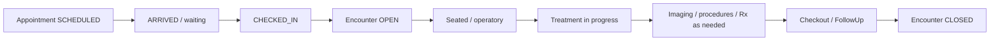

# MEDUI.D5A.1 — Dental & Orthodontics workflows

**Status:** Workflow modeling only — no production UI in D5A.1.

## Dental visit day (ambulatory)

Reuse `Appointment` statuses (`SCHEDULED` … `NO_SHOW`) and ambulatory `Encounter`.  
Do **not** map to `HospitalEpisode` or bed board.

## General dentistry clinical loop

1. Medical + dental history review (shared Patient + clinicalHistoryProfileJson + allergies)
2. Oral examination + odontogram findings (authoritative)
3. Diagnoses (enterprise Diagnosis + dental problem list)
4. Treatment plan draft → present → accept (versioned)
5. Procedures (perform + document; optional OrderItem **CARE** / enterprise procedure catalog)
6. Imaging / photos as needed
7. Prescriptions via outpatient Rx (capability-gated)
8. Consents before invasive care
9. Follow-up / recall
10. Billing estimates/charges (separate from clinical complete)

## Orthodontic longitudinal loop

1. Consultation Encounter → create/link **OrthodonticCase**
2. Records pending (photos, pan/ceph, models)
3. Structured assessment
4. Treatment plan propose → consent → accept (immutable version)
5. Appliance placement / aligner start
6. Recurring progress Encounters (adjustments) linked to case
7. Debond / retainer
8. Retention visits / recall
9. Complete or discontinue / transfer

## Procedure vs billing

| State | Authority |
|---|---|
| Proposed | TreatmentPlanItem |
| Scheduled | Appointment / future schedule block |
| Ordered | Order / OrderItem (when ordered) |
| Performed | DentalProcedureEvent (+ documentation) |
| Billed | BillingEvent / claim path |

Completion ≠ payment.

## Dashboard metrics (role-aware)

Derive from Appointment / Encounter / plan / FollowUp / Order — no anonymous patient names on broad analytics cards:

- appointments today, waiting, in progress, completed, no-shows  
- plans pending acceptance  
- recalls / adjustments due  
- imaging pending, unsigned notes, unbilled completed procedures  

## Cross-specialty facility

One registration; specialty-aware appointments and worklists; shared chart with care-setting labels; capability-driven navigation for users spanning medicine + dental.
