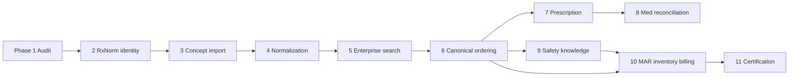

# Medication Intelligence Roadmap

Phased roadmap for Medora-S **Medication Intelligence** — from Phase 1 architecture audit through enterprise certification. Aligns with clinic MVP phase discipline: one Haiti clinic first, lightweight, offline-friendly, French UI.

**Baseline (Phase 1 audit):** [`medication-intelligence-phase-1-architecture-audit.md`](./medication-intelligence-phase-1-architecture-audit.md)
**Prior art:** 150+ documents under [`docs/medications/`](../medications/) (formulary waves M1.5–M1.7, MAR, billing, canonical linkage). Phase 1 **supersedes stale counts** in those docs with live audit tooling measurements.

**Foundations already in repo (do not rebuild):**

- Dual schema: `CatalogMedication` (runtime) + `MedicationConcept/Product/Package` (governance)
- Search: `GET /catalog/medications/search`, `GET /pharmacy/medications/search`
- Governed activation pipeline (formulary → order search → MAR)
- MAR administration, partial pharmacy dispense, billing profile scaffolding

**Explicit truths (carry through all phases):**

- **Complete US/RxNorm catalog is NOT present today** — 0 `rxNormConceptId` values locally.
- **HCPCS is billing metadata**, not a clinical drug dictionary.
- **NDC is package-level** (`MedicationPackage.ndc11`) — not the search primary key.
- **Canonical cutover is NOT SAFE** until Phases 2–6 complete (per existing `docs/medications/*` cutover audits).

---

## Milestone map

| Milestone | User-facing outcome | Phases |
|-----------|---------------------|--------|
| **A. Searchable catalog** | Clinicians find the right drug quickly (EN/FR, aliases, normalized strength/form/route) | 2, 3, 4, 5 |
| **B. Clinical ordering** | Orders bind to canonical identity with structured order sentences | 6 |
| **C. Safety** | Allergy/interaction/duplicate therapy checks (licensed knowledge) | 9 |
| **D. MAR / admin** | Reliable administration, inventory, witness flows | 10 (partial today) |
| **E. Prescribing / pharmacy** | Discharge Rx entity + pharmacy handoff | 7 (+ external integrations later) |
| **F. Inventory / billing** | NDC package truth, HCPCS charge capture hardening | 10 |
| **G. Enterprise certification** | Repeatable certifiers, JSON summaries, production checklist | 11 |

---

## Phase 1 — Architecture audit (this phase)

| Field | Value |
|-------|-------|
| **Objective** | Establish factual baseline: data model, counts, dual identity, gaps, maturity, blockers |
| **Scope** | Read-only audit; local-dev DB measurements; repository evidence; no production changes |
| **Data source** | Prisma schema, API routes, shared manifests, `docs/medications/*`, live local DB queries |
| **Migration likelihood** | None |
| **Seed/import likelihood** | None |
| **Risks** | Stale prior-doc counts mislead planning — mitigated by live audit tooling |
| **Exit criteria** | Audit doc published; decision `MEDICATION_ENGINE_FOUNDATION_REPAIR_REQUIRED`; roadmap approved |
| **Complexity** | **Low** (documentation + measurement) |

**Deliverables:** This audit + roadmap. Maturity score artifact: `medication-maturity-score.json` (tooling output, ~50–55% range).

---

## Phase 2 — Canonical medication identity and RxNorm foundation

| Field | Value |
|-------|-------|
| **Objective** | Establish additive, auditable canonical identity + RxNorm **schema** foundation, dual-layer reconciliation statuses, route permission model, fixture classification, and MAR/billing quantity provenance — **without** bulk RxNorm import or runtime search/order/MAR behavior change |
| **Scope** | Additive Prisma migration; shared identity/fixture/billing helpers; product↔route permission table (unenforced); certification artifacts — **no provider search cutover**, **no bulk RxCUI populate**, **no fuzzy auto-merge** |
| **Data source** | Existing dual-layer schema + Phase 1 audit measurements; NLM RxNorm reserved for Phase 3 scoped import |
| **Migration** | **YES (additive)** — `20261004120000_medication_phase_2_canonical_identity` |
| **Seed/import** | **NO** — `Seed Required: NO`; `RxNormDataImported: NO` |
| **Risks** | Premature route enforcement (mitigated: not enabled); unsafe auto-link (mitigated: status + fuzzy-merge forbid); historical rewrite (forbidden) |
| **Exit criteria** | Phase 2 enterprise certifier PASS; schema/status enums ready; historical snapshot-first identity helper; cutover still NOT SAFE; RxCUI population deferred to Phase 3 |
| **Complexity** | **Medium–High** |
| **Status** | Implemented — see [`medication-intelligence-phase-2-canonical-identity.md`](./medication-intelligence-phase-2-canonical-identity.md) |

**Phase count note:** Roadmap remains **11 phases**. Phase 2 exit criteria were tightened from “≥90% activated RxCUI populated” to “foundation certified without bulk import” so Phase 3 owns scoped RxNorm import without collapsing import into identity-schema work.

**Builds on:** `haiti-canonical-linkage-*`, `canonical-medication-activation-*` docs.

## Phase 3 — Scoped RxNorm reference ingestion, staging, and candidate mapping

| Field | Value |
|-------|-------|
| **Objective** | Controlled, version-aware RxNorm **reference** ingestion into staging — provenance, idempotency, candidate mapping, activation/rollback — **without** clinical search/order/MAR/billing changes |
| **Scope** | `RxNormReferenceRelease`, `RxNormImportJob`, `RxNormStagingConcept`, `RxNormMappingCandidate`, `RxNormImportConflict`; synthetic certification fixture; CLI import modes; Phase 3 certifier |
| **Data source** | Synthetic fixture (`SYNTH*` RxCUIs) for certification; NLM RxNorm **not** committed — operator-supplied path reserved for future licensed import |
| **Migration** | **YES (additive)** — `20261005120000_medication_phase_3_rxnorm_staging` |
| **Seed/import** | **Seed Required: NO**; `RealRxNormDataUsed: NO`; `SyntheticFixtureUsed: YES` |
| **Risks** | Name-match candidate volume (MEDIUM — review-only); accidental clinical wiring (mitigated: CLI isolation + defaults) |
| **Exit criteria** | Phase 3 enterprise certifier PASS; `AutomaticVerificationEnabled=NO`; clinical search/MAR/billing unchanged; rollback preserves history |
| **Complexity** | **High** |
| **Status** | Implemented — see [`medication-intelligence-phase-3-rxnorm-reference-ingestion.md`](./medication-intelligence-phase-3-rxnorm-reference-ingestion.md) |

**Phase count note:** Roadmap remains **11 phases**. Phase 3 owns staged reference ingestion; Phase 4 owns controlled canonical reconciliation / catalog expansion (not authorized by Phase 3 alone).

## Phase 4 — Controlled canonical reconciliation and human-verified RxCUI assignment

| Field | Value |
|-------|-------|
| **Objective** | Human-reviewed mapping decisions from staged RxNorm candidates to synthetic/canonical targets with durable history — **no** auto-verify, **no** clinical activation |
| **Scope** | `RxNormVerifiedMapping`; candidate concurrency/rejection fields; CLI verify/reject/retire; synthetic canonical targets (`SYNTH_MC_*` / `SYNTH_MP_*`); Phase 4 certifier |
| **Data source** | Phase 3 synthetic release only (`RealRxNormDataUsed: NO`) |
| **Migration** | **YES** — `20261006120000_medication_phase_4_canonical_reconciliation` |
| **Seed** | **NO** |
| **Risks** | Synthetic→real leak (mitigated: hard block); concurrent verify (mitigated: reviewVersion); accidental clinical wiring (CLI isolation) |
| **Exit criteria** | Phase 4 certifier PASS; `HumanVerificationRequired=YES`; `SyntheticToRealMappingBlocked=YES`; search/MAR/billing unchanged |
| **Complexity** | **High** |
| **Status** | Implemented — see [`medication-intelligence-phase-4-canonical-reconciliation.md`](./medication-intelligence-phase-4-canonical-reconciliation.md) |

**Phase count note:** Roadmap remains **11 phases**. Phase 5 owns controlled **real** RxNorm ingestion / limited enrichment planning — not started by Phase 4.

## Phase 5 — Controlled real RxNorm reference ingestion and release governance

| Field | Value |
|-------|-------|
| **Objective** | Controlled real/structural RxNorm reference ingestion with manifest integrity, streaming RXNCONSO parse, non-clinical staging, candidate generation — **no** auto-verify, **no** clinical activation |
| **Scope** | Release provenance fields; source governance; RRF streaming parser; real-import CLI; structural fixture certification; Phase 5 certifier |
| **Data source** | Operator-supplied NLM under `.local-data/rxnorm/` (gitignored); CI uses structural `DEV_SAMPLE` fixture |
| **Migration** | **YES** — `20261007120000_medication_phase_5_real_rxnorm_ingestion` |
| **Seed** | **NO** |
| **Risks** | Accidental clinical wiring (mitigated: write guards); mislabeling synthetic as official (boundary asserts); full-release without confirm (blocked) |
| **Exit criteria** | Phase 5 certifier PASS; `RealVerifiedMappingsCreatedByCertification=0`; `SourceFilesCommittedToGit=NO`; search/MAR/billing unchanged |
| **Complexity** | **High** |
| **Status** | Implemented — see [`medication-intelligence-phase-5-controlled-real-rxnorm-ingestion.md`](./medication-intelligence-phase-5-controlled-real-rxnorm-ingestion.md) |

**Phase count note:** Roadmap remains **11 phases**. Phase 6 = governed review operations / admin API-UI / pilot configuration (no clinical activation).

## Phase 6 — Governed RxNorm review operations, admin API/UI, controlled pilot config

| Field | Value |
|-------|-------|
| **Objective** | Authorized reviewers safely approve/reject/defer/retire/supersede mapping candidates via REST + admin UI with full audit and metrics |
| **Scope** | `MEDICATION_REVIEWER` / `MEDICATION_ADMIN` roles; `/medications/review/*` API; reviewer console; defer/assign/bulk; dashboard; EM pilot config (**disabled**, no import) |
| **Data source** | Existing staging + candidates from Phases 3–5; Phase 4 verification service |
| **Migration** | **YES** — `20261008120000_medication_phase_6_governed_review_operations` |
| **Seed** | **YES** for Role rows (`seed-core-roles`) |
| **Risks** | Accidental clinical activation (mitigated: confirm flags + Phase 4 guards); role sprawl (kept to two medication roles) |
| **Exit criteria** | Phase 6 certifier PASS; `AutomaticVerificationEnabled=NO`; `ClinicalActivationEnabled=NO`; `EmPilotImportExecuted=NO`; prior phases still certified |
| **Complexity** | **High** |
| **Status** | Implemented — see [`medication-intelligence-phase-6-governed-review-operations.md`](./medication-intelligence-phase-6-governed-review-operations.md) |

**Depends on:** Phase 5 certification. Does **not** enable clinical search cutover or automatic real RxCUI activation.

### Phase 6.5 — Controlled Emergency Medicine pilot and duplicate-prevention hardening

| Field | Value |
|-------|-------|
| **Objective** | Prove safe ingestion/normalization/dedupe/preview/staging of ~100 EM medications without duplicate creation, auto-verify, or clinical activation |
| **Scope** | Pilot manifest + items; `MedicationDuplicateAssessment`; identity keys + partial uniques; normalization/dedupe engine; CLI dry-run/preview/stage/candidates/rollback; reviewer duplicate filters/metrics |
| **Data source** | Curated EM pilot dataset in `@medora/shared` (not a national catalog import) |
| **Migration** | **YES (additive)** — `20261009120000_medication_phase_6_5_emergency_pilot_duplicate_prevention` |
| **Seed/import** | **NO during certification** — `PilotImportExecutedDuringCertification=NO` |
| **Risks** | False merges / false duplicates (mitigated: classification + human review); accidental clinical activation (forbidden) |
| **Exit criteria** | Phase 6.5 certifier PASS; duplicate prevention certified; rollback validated; clinically active auto-created = 0 |
| **Complexity** | **High** |
| **Status** | Implemented — see [`medication-intelligence-phase-6-5-controlled-emergency-pilot.md`](./medication-intelligence-phase-6-5-controlled-emergency-pilot.md) |

### Phase 7 — Controlled Emergency Medicine batch implementation (Medication Intelligence)

| Field | Value |
|-------|-------|
| **Objective** | Governed EM batch platform: authentic RxNorm extract, ~100 medication families, dedupe/reuse, human verification, inactive catalog prep, rollback — **no** clinical activation |
| **Scope** | `MedicationBatchManifest/Item/Job/Checkpoint/EntityLink`; batch CLI/API; dashboard metrics; platform certifier + operator attestation |
| **Data source** | Authentic NLM under `.local-data/rxnorm/` (operator); CI structural fixtures only |
| **Migration** | **YES (additive)** — `20261010120000_medication_phase_7_controlled_emergency_batch` |
| **Seed/import** | **NO in CI** — `RealBatchExecutedDuringCertification=NO` |
| **Exit criteria** | Phase 7 platform certifier PASS; duplicate prevention operational; clinical activations = 0 |
| **Complexity** | **High** |
| **Status** | Implemented — see [`medication-intelligence-phase-7-controlled-emergency-batch.md`](./medication-intelligence-phase-7-controlled-emergency-batch.md) |

**Note:** This Medication Intelligence Phase 7 (controlled batch) is distinct from the product-roadmap **prescription entity** track below (historically also labeled Phase 7). Do not conflate them.

**Scaled batch readiness (post–Phase 7):** After platform certification **and** staging batch attestation, scale toward Phase 8A (~500–1,000 families). Do **not** jump to a full national catalog.

### Phase 8 — Clinical knowledge foundation (Medication Intelligence)

| Field | Value |
|-------|-------|
| **Objective** | Versioned, provenance-aware clinical knowledge attached to canonical identities — **storage only**, no CDS/alerts/patient dosing |
| **Scope** | `MedicationClinicalProfile` + domain tables; source/version models; admin API/UI; approval lifecycle; emergency-use metadata |
| **Migration** | **YES (additive)** — `20261011120000_medication_phase_8_clinical_knowledge_foundation` |
| **Exit criteria** | Phase 8 certifier PASS; identity separated; human approval required; clinical activation remains disabled; search/order/MAR/billing unchanged |
| **Status** | Implemented — see [`medication-intelligence-phase-8-clinical-knowledge-foundation.md`](./medication-intelligence-phase-8-clinical-knowledge-foundation.md) |

**Note:** Distinct from product-roadmap Phase 8 (medication reconciliation) below.

### Phase 9 — Interaction, allergy, and duplicate-therapy knowledge foundation (Medication Intelligence)

| Field | Value |
|-------|-------|
| **Objective** | Versioned drug–drug, allergy/cross-reactivity, and duplicate-therapy **knowledge storage** on canonical identities — no patient evaluation or alerts |
| **Scope** | Safety source/version models; interaction pair normalization; allergen + cross-reactivity; therapeutic class membership; duplicate-therapy groups/rules; admin API/UI/CLI; approval lifecycle |
| **Migration** | **YES (additive)** — `20261012120000_medication_phase_9_interaction_allergy_duplicate_therapy_knowledge` |
| **Exit criteria** | Phase 9 certifier PASS; identity reused; duplicate knowledge prevented; human/admin approval; clinical activation remains disabled; search/order/MAR/billing/Phase 8 unchanged |
| **Status** | Implemented — see [`medication-intelligence-phase-9-interaction-allergy-duplicate-therapy-knowledge.md`](./medication-intelligence-phase-9-interaction-allergy-duplicate-therapy-knowledge.md) |

**Note:** Distinct from the product-roadmap Phase 9 row below (licensed runtime checking / order-time evaluation), which remains future work after this knowledge foundation.

### Phase 10 — Patient-specific medication safety evaluation (shadow mode)

| Field | Value |
|-------|-------|
| **Objective** | Patient-specific DDI/allergy/duplicate/renal/hepatic/pregnancy evaluation using approved knowledge — **SHADOW only** |
| **Scope** | Evaluation runs, minimized context snapshots, shadow findings, suppression governance, admin validation UI/API/CLI; no provider alerts or order blocking |
| **Migration** | **YES (additive)** — `20261013120000_medication_phase_10_patient_specific_safety_evaluation_shadow_mode` |
| **Exit criteria** | Phase 10 certifier PASS; fail-closed DISABLED/SHADOW modes; shadowOnly enforced; evaluation failure isolated from orders; search/order/MAR/billing unchanged |
| **Status** | Implemented — see [`medication-intelligence-phase-10-patient-specific-safety-evaluation-shadow-mode.md`](./medication-intelligence-phase-10-patient-specific-safety-evaluation-shadow-mode.md) |

**Note:** Distinct from product-roadmap Phase 10 (MAR/inventory/billing hardening) below. Live interruptive CDS remains a future activation phase after shadow analytics.

### Phase 11 — Shadow validation, coverage analytics, pharmacist review, activation readiness

| Field | Value |
|-------|-------|
| **Objective** | Measure coverage, validate shadow findings with pharmacist dual/blind review, analyze FP/FN/gaps, and assess scoped activation readiness — **no clinical activation** |
| **Scope** | Family coverage profiles, validation cases/batches/reference sets, gap registries, readiness policies/assessments/candidates/attestations, admin UI/API/CLI |
| **Migration** | **YES (additive)** — `20261014120000_medication_phase_11_shadow_validation_coverage_activation_readiness` |
| **Exit criteria** | Phase 11 certifier PASS; provider alerts/order blocking/overrides remain off; readiness never emits live activation; search/order/MAR/billing unchanged |
| **Status** | Implemented — see [`medication-intelligence-phase-11-shadow-validation-coverage-activation-readiness.md`](./medication-intelligence-phase-11-shadow-validation-coverage-activation-readiness.md) |

**Note:** Distinct from product-roadmap Phase 11 (enterprise certification packaging) below. Provider-facing pilot remains a later MI activation phase and requires an approved scoped readiness attestation after controlled knowledge population and shadow validation.

### Phase 12 — Controlled Emergency Medicine clinical/safety knowledge population

| Field | Value |
|-------|-------|
| **Objective** | Populate governed clinical and safety knowledge drafts for the controlled 35-family EM batch; human/pharmacist review; shadow eligibility — **no clinical activation** |
| **Scope** | Knowledge population batches/items, manifest + intake schemas, preview/dry-run/draft import, conflicts/duplicates, coverage + shadow eligibility, admin UI/API/CLI |
| **Migration** | **YES (additive)** — `20261015120000_medication_phase_12_controlled_emergency_knowledge_population` |
| **Exit criteria** | Phase 12 certifier PASS; records without sources = 0; import never creates approved records; provider alerts/order blocking/overrides remain off; search/order/MAR/billing unchanged |
| **Status** | Implemented — see [`medication-intelligence-phase-12-controlled-emergency-medication-knowledge-population.md`](./medication-intelligence-phase-12-controlled-emergency-medication-knowledge-population.md) |

**Note:** Distinct from product-roadmap Phase 12 below. Phase 13 MI runs source-backed review and controlled shadow validation — still without provider-facing alerts.

### Phase 13 — Source-backed review, approval-for-shadow, controlled shadow validation

| Field | Value |
|-------|-------|
| **Objective** | Investigate identity blockers, select a narrow Wave 1, enforce source readiness / placeholder rejection, approval-for-shadow gates, and synthetic shadow validation metrics — **no clinical activation** |
| **Scope** | Identity resolution cases, approval waves, source-readiness snapshots, shadow validation runs, unexpected-finding review, engine gaps, admin UI/API/CLI |
| **Migration** | **YES (additive)** — `20261016120000_medication_phase_13_source_backed_review_approval_shadow_validation` |
| **Exit criteria** | Phase 13 certifier PASS; acetaminophen not auto-resolved; scaffolding not approved; draft knowledge not consumed by Phase 10; alerts/blocking/activation remain off |
| **Status** | Implemented — see [`medication-intelligence-phase-13-source-backed-review-approval-controlled-shadow-validation.md`](./medication-intelligence-phase-13-source-backed-review-approval-controlled-shadow-validation.md) |

**Note:** Distinct from product-roadmap Phase 13 below. Phase 14A MI establishes evidence governance and provenance completion for Wave 1 — still without automatic live alerts.

### Phase 14A — Source acquisition, evidence governance, and knowledge completion

| Field | Value |
|-------|-------|
| **Objective** | Populate evidence-governed provenance for Wave 1 medication knowledge; source registration, evidence links, completeness scoring — **no clinical activation** |
| **Scope** | Evidence acquisition batches, source registrations (reuse Phase 8/9 catalogs), knowledge evidence links, completeness scores, admin UI/API/CLI |
| **Migration** | **YES (additive)** — `20261017120000_medication_phase_14a_source_acquisition_evidence_governance_knowledge_completion` |
| **Exit criteria** | Phase 14A certifier PASS; Wave 1 knowledge has provenance links; placeholders retired from Wave 1 drafts; no knowledge without provenance allowed by policy; alerts/blocking/activation/care-workflow control remain off |
| **Status** | Implemented — see [`medication-intelligence-phase-14a-source-acquisition-evidence-governance-knowledge-completion.md`](./medication-intelligence-phase-14a-source-acquisition-evidence-governance-knowledge-completion.md) |

**Note:** Distinct from product-roadmap phases below. Phase 14B MI runs expert review and APPROVED_FOR_SHADOW qualification — still without automatic live alerts.

### Phase 14B — Expert knowledge review, approval-for-shadow, and Wave 1 qualification

| Field | Value |
|-------|-------|
| **Objective** | Expert clinical/safety/consistency review, deterministic quality scoring, rule-based APPROVED_FOR_SHADOW via Phase 13 gates, immutable shadow snapshots — **no clinical activation** |
| **Scope** | Domain reviews, quality scores, shadow qualification, conflicts, snapshots, admin UI/API/CLI |
| **Migration** | **YES (additive)** — `20261018120000_medication_phase_14b_expert_knowledge_review_approval_for_shadow_wave1_qualification` |
| **Exit criteria** | Phase 14B certifier PASS; Wave 1 reviewed and scored; eligible families APPROVED_FOR_SHADOW with snapshots; alerts/blocking/activation/care-workflow control remain off |
| **Status** | Implemented — see [`medication-intelligence-phase-14b-expert-knowledge-review-approval-for-shadow-wave1-qualification.md`](./medication-intelligence-phase-14b-expert-knowledge-review-approval-for-shadow-wave1-qualification.md) |

**Note:** Distinct from product-roadmap phases below. Phase 14B Part 3 executes controlled synthetic shadow evaluation — still without automatic live alerts.

### Phase 14B Part 3 — Controlled synthetic shadow evaluation & gap analysis

| Field | Value |
|-------|-------|
| **Objective** | Execute synthetic shadow evaluation against immutable Wave 1 snapshots via Phase 10; match findings; register gaps; family/batch readiness — **no clinical activation** |
| **Scope** | Evaluation batch/executions, reference cases, finding classification, gap links, admin UI/API/CLI |
| **Migration** | **YES (additive)** — `20261019120000_medication_phase_14b_controlled_synthetic_shadow_evaluation` |
| **Exit criteria** | Phase 14B certifier PASS; CriticalMisses=0; snapshots consumed; acetaminophen identity-blocked; alerts/blocking/activation remain off |
| **Status** | Implemented — see [`medication-intelligence-phase-14b-controlled-synthetic-shadow-evaluation.md`](./medication-intelligence-phase-14b-controlled-synthetic-shadow-evaluation.md) |

### Phase 15 Part 1 — Authoritative source acquisition foundation (Wave 1)

| Field | Value |
|-------|-------|
| **Objective** | Establish Tier-1 source lifecycle governance vocabulary, remediation gap classification, and live Wave 1 baseline from Phase 14B — **no clinical activation** |
| **Scope** | Shared governance + tests, reuse audit, foundation baseline artifact, docs/roadmap |
| **Status** | **Complete** — see [`medication-intelligence-phase-15-authoritative-source-acquisition-tier1-knowledge-completion.md`](./medication-intelligence-phase-15-authoritative-source-acquisition-tier1-knowledge-completion.md) |

### Phase 15 Part 2A — Core remediation / database

| Field | Value |
|-------|-------|
| **Objective** | Remediation program/work items, source lifecycle on Phase 14A registrations, quality recalculation orchestration |
| **Migration** | **YES** — `20261020120000_medication_phase_15_part2a_remediation_source_lifecycle` |
| **Status** | **Complete** |

### Phase 15 Part 2B — Operational API / UI / CLI

| Field | Value |
|-------|-------|
| **Objective** | Secured APIs, admin dashboard/queue, CLI, preview/dry-run, readiness reporting — **no certification** |
| **Scope** | `/medications/remediation/*`, `/app/admin/medication-governance/remediation`, `medication:phase15:*` |
| **Status** | **Complete** — see [`medication-intelligence-phase-15-part2b-operational-api-ui-cli.md`](./medication-intelligence-phase-15-part2b-operational-api-ui-cli.md) |

### Phase 15 Part 2C — Execution / requalification / certification

| Field | Value |
|-------|-------|
| **Objective** | Governed remediation execution, quality recalculation, shadow requalification, synthetic report, readiness, Phase 15 certification, docs, three local commits |
| **Status** | **Complete** — see [`medication-intelligence-phase-15-part2c-execution-certification.md`](./medication-intelligence-phase-15-part2c-execution-certification.md) |
| **Typical live decision** | `MEDICATION_INTELLIGENCE_PHASE_15_CERTIFIED_WITH_GOVERNED_DEFERRALS` when Tier-1 gaps remain openly deferred |

### Phase 16 — Controlled shadow recommendation engine

| Field | Value |
|-------|-------|
| **Objective** | Governed recommendation engine with shadow exposure, analytics, admin/provider read-only UI — **no Pilot/Enterprise Active** |
| **Certification ID** | `MEDUI.MEDICATION_INTELLIGENCE_PHASE_16_CONTROLLED_ACTIVATION_ENTERPRISE_MEDICATION_RECOMMENDATION_ENGINE` |
| **Migration** | **YES** — `20261021120000_medication_phase_16_controlled_recommendation_engine` |
| **Status** | **Complete** — see [`medication-intelligence-phase-16-controlled-recommendation-engine.md`](./medication-intelligence-phase-16-controlled-recommendation-engine.md) |
| **Typical live decision** | `MEDICATION_INTELLIGENCE_PHASE_16_CERTIFIED_SHADOW_ONLY` |

### Phase 17 — Controlled Pilot Qualification & Limited Clinical Advisory

| Field | Value |
|-------|-------|
| **Objective** | Qualify shadow evidence; authorize facility-/provider-/definition-/time-scoped controlled pilot; nonblocking informational advisories; safety monitoring + immediate suspension |
| **Certification ID** | `MEDUI.MEDICATION_INTELLIGENCE_PHASE_17_CONTROLLED_PILOT_QUALIFICATION_SAFETY_MONITORING_LIMITED_CLINICAL_ADVISORY` |
| **Migration** | **YES** — `20261022120000_medication_phase_17_controlled_pilot` |
| **Status** | **Complete** — controlled, limited, reversible, nonblocking, non-ordering; **not** enterprise active |
| **Typical live decision** | `MEDICATION_INTELLIGENCE_PHASE_17_CERTIFIED_PILOT_READY_NOT_ACTIVATED` (or continue shadow-only if qualification fails) |
| **Docs** | [`medication-intelligence-phase-17-controlled-pilot-architecture.md`](./medication-intelligence-phase-17-controlled-pilot-architecture.md) |

### Phase 18 — Operational Safety, Monitoring, Explainability & Regulatory Readiness

| Field | Value |
|-------|-------|
| **Objective** | Operational governance platform: explainability, deterministic replay, version immutability/rollback, drift detection, quality/safety metrics, regulatory *evidence* artifacts — **no autonomy increase** |
| **Certification ID** | `MEDUI.MEDICATION_INTELLIGENCE_PHASE_18_OPERATIONAL_SAFETY_MONITORING_EXPLAINABILITY_REGULATORY_READINESS` |
| **Migration** | **YES** — `20261023120000_medication_phase_18_operational_governance` |
| **Status** | **Complete** — advisory-only; Enterprise Active / Production CDS remain off; no regulatory approval claimed |
| **Typical live decision** | `MEDICATION_INTELLIGENCE_PHASE_18_CERTIFIED_OPERATIONAL_READY` (or governance/monitoring-ready) |
| **Docs** | [`medication-intelligence-phase-18-architecture.md`](./medication-intelligence-phase-18-architecture.md) |

### Medication Knowledge Expansion Wave 2 — Emergency Medicine Catalog Expansion (content)

| Field | Value |
|-------|-------|
| **Objective** | Net-new EM catalog CREATE (CatalogMedication-first + dual-layer link) toward ~750 new concepts; specialty-pack search organization remains complementary |
| **Certification ID** | `MEDUI.MEDICATION_KNOWLEDGE_EXPANSION_WAVE_2_EMERGENCY_MEDICINE_CATALOG` |
| **Migration** | **NO** |
| **Status** | **Complete** — measured net-new generics may be below 750; never padded |
| **Typical live decision** | `MEDICATION_KNOWLEDGE_EXPANSION_WAVE_2_CERTIFIED` or `_CERTIFIED_WITH_REVIEW_ITEMS` |
| **Docs** | [`medication-knowledge-expansion-program.md`](./medication-knowledge-expansion-program.md), [`medication-knowledge-expansion-wave-2-em-catalog-guide.md`](./medication-knowledge-expansion-wave-2-em-catalog-guide.md), [`medication-expansion-roadmap.md`](./medication-expansion-roadmap.md) |
| **Naming** | Distinct from **Enterprise Formulary Wave 2** and from Medication Intelligence Phase 19 (**do not create Phase 19**) |

### Medication Knowledge Expansion Wave 3 — Import-Driven Comprehensive Formulary

| Field | Value |
|-------|-------|
| **Objective** | Reusable import platform + expand toward ~2,000 distinct generic concepts via approved source ingestion (not Phase 19) |
| **Certification ID** | `MEDUI.MEDICATION_KNOWLEDGE_EXPANSION_WAVE_3_IMPORT_DRIVEN_COMPREHENSIVE_FORMULARY` |
| **Migration** | **NO** |
| **Status** | **Complete** — measured final distinct generics 2006; net-new 1048 |
| **Typical live decision** | `MEDICATION_KNOWLEDGE_EXPANSION_WAVE_3_CERTIFIED` |
| **Docs** | [`medication-import-platform-architecture.md`](./medication-import-platform-architecture.md), [`medication-knowledge-expansion-wave-3-certification-report.md`](./medication-knowledge-expansion-wave-3-certification-report.md), [`medication-expansion-roadmap.md`](./medication-expansion-roadmap.md) |
| **Naming** | Distinct from **Enterprise Formulary Wave 3** and from Medication Intelligence Phase 19 (**do not create Phase 19**) |

### Medication Knowledge Expansion Wave 4 — Clinical Medication Library

| Field | Value |
|-------|-------|
| **Objective** | Expand usable clinical library toward ~5,000 distinct generics via Wave 3 import platform (no Phase 19) |
| **Certification ID** | `MEDUI.MEDICATION_KNOWLEDGE_EXPANSION_WAVE_4_CLINICAL_LIBRARY` |
| **Migration** | **NO** |
| **Status** | **Complete** — measured final distinct generics 5206; net-new 3200 |
| **Typical live decision** | `MEDICATION_KNOWLEDGE_EXPANSION_WAVE_4_CERTIFIED` |
| **Docs** | [`medication-knowledge-expansion-wave-4-guide.md`](./medication-knowledge-expansion-wave-4-guide.md), [`medication-expansion-roadmap.md`](./medication-expansion-roadmap.md) |
| **Naming** | Distinct from **Enterprise Formulary Wave 4** and from Medication Intelligence Phase 19 (**do not create Phase 19**) |

### Medication Orderable Catalog Completion — Universal Provider Ordering

| Field | Value |
|-------|-------|
| **Objective** | Make existing clinical catalog medications searchable and orderable for providers (not Phase 19; not an expansion wave) |
| **Certification ID** | `MEDUI.MEDICATION_ORDERABLE_CATALOG_COMPLETION` |
| **Migration** | **NO** |
| **Status** | **Complete** — measured coverage 99.68%; common clinical search 64/64 |
| **Typical live decision** | `MEDICATION_ORDERABLE_CATALOG_COMPLETION_CERTIFIED` |
| **Docs** | [`medication-orderable-catalog-audit.md`](./medication-orderable-catalog-audit.md), [`medication-expansion-roadmap.md`](./medication-expansion-roadmap.md) |

**Note:** Medication Intelligence Phases 15–18 remain complete. Do **not** resolve acetaminophen via catalog expansion. Production CDS / Enterprise Active remain off unless separately certified. Catalog availability ≠ recommendation activation.

### Deferred after Phase 6 — Canonical ordering integration and order sentences

Populate `OrderItem.medicationProductId` / `medicationPackageId` and structured order sentences. Formerly listed as Phase 6; now scheduled after governed review certification (clinical cutover remains separately certified).

---

## Phase 7 (product roadmap) — Prescription entity and discharge prescribing

| Field | Value |
|-------|-------|
| **Objective** | Introduce `Prescription` (or equivalent) for discharge/outpatient meds: sig, quantity, refills, substitution rules, linkage to encounter |
| **Scope** | Prisma model, API, French UI forms, print/PDF handoff — **no external e-prescribing in MVP** |
| **Data source** | Canonical product/package; prescriber identity; facility formulary |
| **Migration likelihood** | **High** — new table + FKs to Order/Encounter/Patient |
| **Seed/import likelihood** | **None** |
| **Risks** | Regulatory scope creep (HIGH — stay clinic discharge Rx, not national e-prescribing) |
| **Exit criteria** | Prescription CRUD with audit; discharge workflow produces Rx record; no PHI in certifiers |
| **Complexity** | **High** |

**Milestone E (partial)** — internal prescribing only; external pharmacy (Surescripts) is **Future Phase** post-MVP.

---

## Phase 8 — Medication reconciliation

| Field | Value |
|-------|-------|
| **Objective** | Admission / transfer / discharge medication reconciliation: home med list, inpatient orders, discrepancies, clinician actions |
| **Scope** | `MedicationReconciliation` entity, workflow UI, link to orders and prescriptions — not import staging reconciliation |
| **Data source** | Patient-reported home meds (manual entry); active `OrderItem`; Phase 7 prescriptions |
| **Migration likelihood** | **High** — new clinical tables |
| **Seed/import likelihood** | **None** |
| **Risks** | Workflow complexity for low-resource clinic (MEDIUM — keep single-screen MVP) |
| **Exit criteria** | Reconciliation status per encounter; continue/hold/change/stop actions audited; TJC-style minimum viable flow |
| **Complexity** | **High** |

Depends on Phase 7 for discharge reconciliation completeness.

---

## Phase 9 (product roadmap) — Medication safety checking at order/MAR time (licensed)

| Field | Value |
|-------|-------|
| **Objective** | Licensed or contractually cleared DDI/allergy/duplicate-therapy **evaluation** at order and MAR time |
| **Scope** | Patient-specific matching against Phase 9 MI knowledge (and/or vendor content); configurable hard-stop vs soft-warning — **not** the MI Phase 9 knowledge foundation above |
| **Data source** | **Licensed vendor** (FDB, Medi-Span, or equivalent) and/or approved Medora safety knowledge |
| **Migration likelihood** | **Medium** — safety check service layer; may cache vendor subset locally for offline planning |
| **Seed/import likelihood** | **High** — vendor knowledge base import (scheduled refresh) |
| **Risks** | License cost (MEDIUM); false positives blocking care (HIGH); offline dependency (MEDIUM — design cache strategy, do not implement full offline sync now) |
| **Exit criteria** | Order-time allergy + major DDI checks with audit; LASA/high-alert hard gates; certifier PASS on test patient scenarios |
| **Complexity** | **Very High** |

Depends on Medication Intelligence Phase 9 knowledge foundation. Runtime evaluation remains deferred (Phase 10+ MI / product safety checking track).

---

## Phase 10 — MAR, inventory, NDC package, and HCPCS billing hardening

| Field | Value |
|-------|-------|
| **Objective** | Harden administration workflows, inventory↔package linkage, NDC truth at dispense, HCPCS charge capture with manual review defaults |
| **Scope** | `InventoryItem.medicationPackageId` population, MAR governance enforcement, controlled witness/waste, infusion billing stop rules, eMAR scheduling (minimal) |
| **Data source** | Package NDC; `MedicationBillingProfile`; local inventory SKUs |
| **Migration likelihood** | **Medium** — inventory FK backfill |
| **Seed/import likelihood** | **Medium** — NDC/HCPCS remediation manifests (`medication-billing-mapping-*`) |
| **Risks** | Revenue integrity errors (HIGH); inventory depletion mismatch (MEDIUM) |
| **Exit criteria** | Activated packages have NDC where required; billing certifier PASS; MAR governance policy enforced at admin time; inventory ≥ pilot threshold |
| **Complexity** | **High** |

**Milestone D + F (partial today → hardened):** MAR admin partial exists (`MedicationAdministration`); this phase closes enforcement and inventory/billing gaps.

**Builds on:** `mar-emar-*`, `medication-inventory-*`, `infusion-billing-governance.md`.

---

## Phase 11 — Enterprise Medication Intelligence certification

| Field | Value |
|-------|-------|
| **Objective** | Repeatable certifier suite + JSON summary artifacts + production readiness checklist (mirror Diagnostic Intelligence Phase 19 pattern) |
| **Scope** | Certifiers: coverage, identity linkage, search ranking, safety probes, billing integrity, activation governance, template/order sentence inventory — **audit-only scripts, no production deploy** |
| **Data source** | Live DB (staging) + static manifests; official RxNorm release pin; vendor KB version pin |
| **Migration likelihood** | **None** |
| **Seed/import likelihood** | **None** (validates existing state) |
| **Risks** | Certification theater without Phase 2–10 substance (HIGH — gate on prior phase exit criteria) |
| **Exit criteria** | All certifiers PASS on staging; `medication-intelligence-enterprise-certification.md` + JSON summaries; known-limitations doc; deployment checklist separate from code PASS |
| **Complexity** | **Medium** |

**Milestone G complete** when Phase 11 exit criteria met.

**Pattern reference:** [`diagnostic-intelligence-enterprise-certification.md`](./diagnostic-intelligence-enterprise-certification.md).

---

## Phase summary table

| Phase | Name | Complexity | Migration | Seed/import | Milestone |
|------:|------|------------|-----------|-------------|-----------|
| 1 | Architecture audit | Low | — | — | Baseline |
| 2 | RxNorm identity foundation | High | Medium | Low | A (start) |
| 3 | Concept catalog import | High | Low | High | A |
| 4 | Normalization + bilingual aliases | Med–High | Medium | High | A |
| 5 | Enterprise search at scale | Medium | Low–Med | Medium | **A** |
| 6 | Governed review ops + admin API/UI | High | High | Low | Governance |
| 7 | Prescription entity | High | High | — | **E** (partial) |
| 8 | Medication reconciliation | High | High | — | Clinical continuity |
| 9 | Licensed safety knowledge | Very High | Medium | High | **C** |
| 10 | MAR / inventory / NDC / HCPCS | High | Medium | Medium | **D**, **F** |
| 11 | Enterprise certification | Medium | — | — | **G** |

---

## Sequencing rules

1. **Do not skip Phase 2–4** before canonical search cutover (M1.5F) — documented NOT SAFE today.
2. **Phase 9 (licensed safety)** requires vendor selection — do not fake DDI from JSON group IDs.
3. **Canonical ordering** (deferred after Phase 6) remains a prerequisite before broad search/order cutover; Phase 7–8 neither replaces it.
4. **Phase 10** partially deliverable in parallel with 6–9 for Haiti pilot inventory subset.
5. **Phase 11** is documentation/certification only — no production deploy implied.

---

## Out of scope (phase lock)

| Topic | Phase | Notes |
|-------|-------|-------|
| Full US RxNorm catalog in production DB | Post-MVP | Curated import only (Phase 3) |
| National e-prescribing / Surescripts | Future | Phase 7 = internal Rx record |
| Full offline vendor KB sync | Phase 4 (planning) | Design cache; do not implement sync now |
| Multi-facility formulary federation | Phase 6+ | Single clinic MVP first |
| Analytics dashboards | Phase 5+ | Not MVP |

---

## Relationship to existing medication program docs

| Existing doc area | Roadmap phase | Notes |
|-------------------|---------------|-------|
| M1.5 Haiti canonical linkage | 2 | Backfill + quarantine |
| M1.5F provider search cutover | 5–6 | NOT SAFE until exit criteria |
| M1.6–M1.7 enterprise formulary waves | 3–5 | Manifest expansion; Phase 1 counts supersede |
| M1.3 MAR / safety governance | 9–10 | Enforcement gap closure |
| Medication billing / HCPCS | 10 | Billing not clinical dictionary |
| Pilot activation (M1.5G) | 5–6 | Tranche pilot after search/ordering foundation |

When Phase 1 live audit counts conflict with older `docs/medications/*` snapshots, **trust Phase 1 audit tooling** and re-run certifiers before activation decisions.

---

## Success criteria (program level)

Medication Intelligence is **enterprise-certified** (Phase 11) when:

- Curated catalog is searchable (EN/FR) with normalized identity (Phases 2–5)
- Governed RxNorm review platform is certified without clinical auto-activation (Phase 6); orders/MAR use canonical package FKs after the deferred ordering integration
- Discharge Rx and med rec exist as first-class entities (Phases 7–8)
- Licensed safety checks run at order time with audit (Phase 9)
- NDC/HCPCS/inventory/MAR governance certifiers PASS (Phase 10)
- JSON certification summaries and known-limitations doc published (Phase 11)

Until then, **`MEDICATION_ENGINE_FOUNDATION_REPAIR_REQUIRED`** remains in effect.
