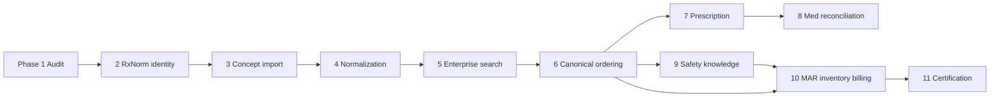

# Medication Intelligence Roadmap

Phased roadmap for Medora-S **Medication Intelligence** — from Phase 1 architecture audit through enterprise certification. Aligns with clinic MVP phase discipline: one Haiti clinic first, lightweight, offline-friendly, French UI.

**Baseline (Phase 1 audit):** [`medication-intelligence-phase-1-architecture-audit.md`](./medication-intelligence-phase-1-architecture-audit.md)
**Prior art:** 150+ documents under [`docs/medications/`](../medications/) (formulary waves M1.5–M1.7, MAR, billing, canonical linkage). Phase 1 **supersedes stale counts** in those docs with live audit tooling measurements.

**Foundations already in repo (do not rebuild):**

- Dual schema: `CatalogMedication` (runtime) + `MedicationConcept/Product/Package` (governance)
- Search: `GET /catalog/medications/search`, `GET /pharmacy/medications/search`
- Governed activation pipeline (formulary → order search → MAR)
- MAR administration, partial pharmacy dispense, billing profile scaffolding

**Explicit truths (carry through all phases):**

- **Complete US/RxNorm catalog is NOT present today** — 0 `rxNormConceptId` values locally.
- **HCPCS is billing metadata**, not a clinical drug dictionary.
- **NDC is package-level** (`MedicationPackage.ndc11`) — not the search primary key.
- **Canonical cutover is NOT SAFE** until Phases 2–6 complete (per existing `docs/medications/*` cutover audits).

---

## Milestone map

| Milestone | User-facing outcome | Phases |
|-----------|---------------------|--------|
| **A. Searchable catalog** | Clinicians find the right drug quickly (EN/FR, aliases, normalized strength/form/route) | 2, 3, 4, 5 |
| **B. Clinical ordering** | Orders bind to canonical identity with structured order sentences | 6 |
| **C. Safety** | Allergy/interaction/duplicate therapy checks (licensed knowledge) | 9 |
| **D. MAR / admin** | Reliable administration, inventory, witness flows | 10 (partial today) |
| **E. Prescribing / pharmacy** | Discharge Rx entity + pharmacy handoff | 7 (+ external integrations later) |
| **F. Inventory / billing** | NDC package truth, HCPCS charge capture hardening | 10 |
| **G. Enterprise certification** | Repeatable certifiers, JSON summaries, production checklist | 11 |

---

## Phase 1 — Architecture audit (this phase)

| Field | Value |
|-------|-------|
| **Objective** | Establish factual baseline: data model, counts, dual identity, gaps, maturity, blockers |
| **Scope** | Read-only audit; local-dev DB measurements; repository evidence; no production changes |
| **Data source** | Prisma schema, API routes, shared manifests, `docs/medications/*`, live local DB queries |
| **Migration likelihood** | None |
| **Seed/import likelihood** | None |
| **Risks** | Stale prior-doc counts mislead planning — mitigated by live audit tooling |
| **Exit criteria** | Audit doc published; decision `MEDICATION_ENGINE_FOUNDATION_REPAIR_REQUIRED`; roadmap approved |
| **Complexity** | **Low** (documentation + measurement) |

**Deliverables:** This audit + roadmap. Maturity score artifact: `medication-maturity-score.json` (tooling output, ~50–55% range).

---

## Phase 2 — Canonical medication identity and RxNorm foundation

| Field | Value |
|-------|-------|
| **Objective** | Establish additive, auditable canonical identity + RxNorm **schema** foundation, dual-layer reconciliation statuses, route permission model, fixture classification, and MAR/billing quantity provenance — **without** bulk RxNorm import or runtime search/order/MAR behavior change |
| **Scope** | Additive Prisma migration; shared identity/fixture/billing helpers; product↔route permission table (unenforced); certification artifacts — **no provider search cutover**, **no bulk RxCUI populate**, **no fuzzy auto-merge** |
| **Data source** | Existing dual-layer schema + Phase 1 audit measurements; NLM RxNorm reserved for Phase 3 scoped import |
| **Migration** | **YES (additive)** — `20261004120000_medication_phase_2_canonical_identity` |
| **Seed/import** | **NO** — `Seed Required: NO`; `RxNormDataImported: NO` |
| **Risks** | Premature route enforcement (mitigated: not enabled); unsafe auto-link (mitigated: status + fuzzy-merge forbid); historical rewrite (forbidden) |
| **Exit criteria** | Phase 2 enterprise certifier PASS; schema/status enums ready; historical snapshot-first identity helper; cutover still NOT SAFE; RxCUI population deferred to Phase 3 |
| **Complexity** | **Medium–High** |
| **Status** | Implemented — see [`medication-intelligence-phase-2-canonical-identity.md`](./medication-intelligence-phase-2-canonical-identity.md) |

**Phase count note:** Roadmap remains **11 phases**. Phase 2 exit criteria were tightened from “≥90% activated RxCUI populated” to “foundation certified without bulk import” so Phase 3 owns scoped RxNorm import without collapsing import into identity-schema work.

**Builds on:** `haiti-canonical-linkage-*`, `canonical-medication-activation-*` docs.

## Phase 3 — Scoped RxNorm reference ingestion, staging, and candidate mapping

| Field | Value |
|-------|-------|
| **Objective** | Controlled, version-aware RxNorm **reference** ingestion into staging — provenance, idempotency, candidate mapping, activation/rollback — **without** clinical search/order/MAR/billing changes |
| **Scope** | `RxNormReferenceRelease`, `RxNormImportJob`, `RxNormStagingConcept`, `RxNormMappingCandidate`, `RxNormImportConflict`; synthetic certification fixture; CLI import modes; Phase 3 certifier |
| **Data source** | Synthetic fixture (`SYNTH*` RxCUIs) for certification; NLM RxNorm **not** committed — operator-supplied path reserved for future licensed import |
| **Migration** | **YES (additive)** — `20261005120000_medication_phase_3_rxnorm_staging` |
| **Seed/import** | **Seed Required: NO**; `RealRxNormDataUsed: NO`; `SyntheticFixtureUsed: YES` |
| **Risks** | Name-match candidate volume (MEDIUM — review-only); accidental clinical wiring (mitigated: CLI isolation + defaults) |
| **Exit criteria** | Phase 3 enterprise certifier PASS; `AutomaticVerificationEnabled=NO`; clinical search/MAR/billing unchanged; rollback preserves history |
| **Complexity** | **High** |
| **Status** | Implemented — see [`medication-intelligence-phase-3-rxnorm-reference-ingestion.md`](./medication-intelligence-phase-3-rxnorm-reference-ingestion.md) |

**Phase count note:** Roadmap remains **11 phases**. Phase 3 owns staged reference ingestion; Phase 4 owns controlled canonical reconciliation / catalog expansion (not authorized by Phase 3 alone).

## Phase 4 — Controlled canonical reconciliation and human-verified RxCUI assignment

| Field | Value |
|-------|-------|
| **Objective** | Human-reviewed mapping decisions from staged RxNorm candidates to synthetic/canonical targets with durable history — **no** auto-verify, **no** clinical activation |
| **Scope** | `RxNormVerifiedMapping`; candidate concurrency/rejection fields; CLI verify/reject/retire; synthetic canonical targets (`SYNTH_MC_*` / `SYNTH_MP_*`); Phase 4 certifier |
| **Data source** | Phase 3 synthetic release only (`RealRxNormDataUsed: NO`) |
| **Migration** | **YES** — `20261006120000_medication_phase_4_canonical_reconciliation` |
| **Seed** | **NO** |
| **Risks** | Synthetic→real leak (mitigated: hard block); concurrent verify (mitigated: reviewVersion); accidental clinical wiring (CLI isolation) |
| **Exit criteria** | Phase 4 certifier PASS; `HumanVerificationRequired=YES`; `SyntheticToRealMappingBlocked=YES`; search/MAR/billing unchanged |
| **Complexity** | **High** |
| **Status** | Implemented — see [`medication-intelligence-phase-4-canonical-reconciliation.md`](./medication-intelligence-phase-4-canonical-reconciliation.md) |

**Phase count note:** Roadmap remains **11 phases**. Phase 5 owns controlled **real** RxNorm ingestion / limited enrichment planning — not started by Phase 4.

## Phase 5 — Controlled real RxNorm reference ingestion and release governance

| Field | Value |
|-------|-------|
| **Objective** | Controlled real/structural RxNorm reference ingestion with manifest integrity, streaming RXNCONSO parse, non-clinical staging, candidate generation — **no** auto-verify, **no** clinical activation |
| **Scope** | Release provenance fields; source governance; RRF streaming parser; real-import CLI; structural fixture certification; Phase 5 certifier |
| **Data source** | Operator-supplied NLM under `.local-data/rxnorm/` (gitignored); CI uses structural `DEV_SAMPLE` fixture |
| **Migration** | **YES** — `20261007120000_medication_phase_5_real_rxnorm_ingestion` |
| **Seed** | **NO** |
| **Risks** | Accidental clinical wiring (mitigated: write guards); mislabeling synthetic as official (boundary asserts); full-release without confirm (blocked) |
| **Exit criteria** | Phase 5 certifier PASS; `RealVerifiedMappingsCreatedByCertification=0`; `SourceFilesCommittedToGit=NO`; search/MAR/billing unchanged |
| **Complexity** | **High** |
| **Status** | Implemented — see [`medication-intelligence-phase-5-controlled-real-rxnorm-ingestion.md`](./medication-intelligence-phase-5-controlled-real-rxnorm-ingestion.md) |

**Phase count note:** Roadmap remains **11 phases**. Phase 6 = governed review operations / admin API-UI / pilot configuration (no clinical activation).

## Phase 6 — Governed RxNorm review operations, admin API/UI, controlled pilot config

| Field | Value |
|-------|-------|
| **Objective** | Authorized reviewers safely approve/reject/defer/retire/supersede mapping candidates via REST + admin UI with full audit and metrics |
| **Scope** | `MEDICATION_REVIEWER` / `MEDICATION_ADMIN` roles; `/medications/review/*` API; reviewer console; defer/assign/bulk; dashboard; EM pilot config (**disabled**, no import) |
| **Data source** | Existing staging + candidates from Phases 3–5; Phase 4 verification service |
| **Migration** | **YES** — `20261008120000_medication_phase_6_governed_review_operations` |
| **Seed** | **YES** for Role rows (`seed-core-roles`) |
| **Risks** | Accidental clinical activation (mitigated: confirm flags + Phase 4 guards); role sprawl (kept to two medication roles) |
| **Exit criteria** | Phase 6 certifier PASS; `AutomaticVerificationEnabled=NO`; `ClinicalActivationEnabled=NO`; `EmPilotImportExecuted=NO`; prior phases still certified |
| **Complexity** | **High** |
| **Status** | Implemented — see [`medication-intelligence-phase-6-governed-review-operations.md`](./medication-intelligence-phase-6-governed-review-operations.md) |

**Depends on:** Phase 5 certification. Does **not** enable clinical search cutover or automatic real RxCUI activation.

### Deferred after Phase 6 — Canonical ordering integration and order sentences

Populate `OrderItem.medicationProductId` / `medicationPackageId` and structured order sentences. Formerly listed as Phase 6; now scheduled after governed review certification (clinical cutover remains separately certified).

---

## Phase 7 — Prescription entity and discharge prescribing

| Field | Value |
|-------|-------|
| **Objective** | Introduce `Prescription` (or equivalent) for discharge/outpatient meds: sig, quantity, refills, substitution rules, linkage to encounter |
| **Scope** | Prisma model, API, French UI forms, print/PDF handoff — **no external e-prescribing in MVP** |
| **Data source** | Canonical product/package; prescriber identity; facility formulary |
| **Migration likelihood** | **High** — new table + FKs to Order/Encounter/Patient |
| **Seed/import likelihood** | **None** |
| **Risks** | Regulatory scope creep (HIGH — stay clinic discharge Rx, not national e-prescribing) |
| **Exit criteria** | Prescription CRUD with audit; discharge workflow produces Rx record; no PHI in certifiers |
| **Complexity** | **High** |

**Milestone E (partial)** — internal prescribing only; external pharmacy (Surescripts) is **Future Phase** post-MVP.

---

## Phase 8 — Medication reconciliation

| Field | Value |
|-------|-------|
| **Objective** | Admission / transfer / discharge medication reconciliation: home med list, inpatient orders, discrepancies, clinician actions |
| **Scope** | `MedicationReconciliation` entity, workflow UI, link to orders and prescriptions — not import staging reconciliation |
| **Data source** | Patient-reported home meds (manual entry); active `OrderItem`; Phase 7 prescriptions |
| **Migration likelihood** | **High** — new clinical tables |
| **Seed/import likelihood** | **None** |
| **Risks** | Workflow complexity for low-resource clinic (MEDIUM — keep single-screen MVP) |
| **Exit criteria** | Reconciliation status per encounter; continue/hold/change/stop actions audited; TJC-style minimum viable flow |
| **Complexity** | **High** |

Depends on Phase 7 for discharge reconciliation completeness.

---

## Phase 9 — Medication safety knowledge (allergies, interactions — licensed)

| Field | Value |
|-------|-------|
| **Objective** | Licensed or contractually cleared DDI/allergy/duplicate-therapy checking at order and MAR time |
| **Scope** | Replace `interactionGroupIds` JSON-only storage with evaluated rules; patient allergy cross-check; configurable hard-stop vs soft-warning |
| **Data source** | **Licensed vendor** (FDB, Medi-Span, or equivalent) — not inferred from RxNorm alone |
| **Migration likelihood** | **Medium** — safety check service layer; may cache vendor subset locally for offline planning |
| **Seed/import likelihood** | **High** — vendor knowledge base import (scheduled refresh) |
| **Risks** | License cost (MEDIUM); false positives blocking care (HIGH); offline dependency (MEDIUM — design cache strategy, do not implement full offline sync now) |
| **Exit criteria** | Order-time allergy + major DDI checks with audit; LASA/high-alert hard gates; certifier PASS on test patient scenarios |
| **Complexity** | **Very High** |

**Milestone C complete** when Phase 9 exit criteria met.

---

## Phase 10 — MAR, inventory, NDC package, and HCPCS billing hardening

| Field | Value |
|-------|-------|
| **Objective** | Harden administration workflows, inventory↔package linkage, NDC truth at dispense, HCPCS charge capture with manual review defaults |
| **Scope** | `InventoryItem.medicationPackageId` population, MAR governance enforcement, controlled witness/waste, infusion billing stop rules, eMAR scheduling (minimal) |
| **Data source** | Package NDC; `MedicationBillingProfile`; local inventory SKUs |
| **Migration likelihood** | **Medium** — inventory FK backfill |
| **Seed/import likelihood** | **Medium** — NDC/HCPCS remediation manifests (`medication-billing-mapping-*`) |
| **Risks** | Revenue integrity errors (HIGH); inventory depletion mismatch (MEDIUM) |
| **Exit criteria** | Activated packages have NDC where required; billing certifier PASS; MAR governance policy enforced at admin time; inventory ≥ pilot threshold |
| **Complexity** | **High** |

**Milestone D + F (partial today → hardened):** MAR admin partial exists (`MedicationAdministration`); this phase closes enforcement and inventory/billing gaps.

**Builds on:** `mar-emar-*`, `medication-inventory-*`, `infusion-billing-governance.md`.

---

## Phase 11 — Enterprise Medication Intelligence certification

| Field | Value |
|-------|-------|
| **Objective** | Repeatable certifier suite + JSON summary artifacts + production readiness checklist (mirror Diagnostic Intelligence Phase 19 pattern) |
| **Scope** | Certifiers: coverage, identity linkage, search ranking, safety probes, billing integrity, activation governance, template/order sentence inventory — **audit-only scripts, no production deploy** |
| **Data source** | Live DB (staging) + static manifests; official RxNorm release pin; vendor KB version pin |
| **Migration likelihood** | **None** |
| **Seed/import likelihood** | **None** (validates existing state) |
| **Risks** | Certification theater without Phase 2–10 substance (HIGH — gate on prior phase exit criteria) |
| **Exit criteria** | All certifiers PASS on staging; `medication-intelligence-enterprise-certification.md` + JSON summaries; known-limitations doc; deployment checklist separate from code PASS |
| **Complexity** | **Medium** |

**Milestone G complete** when Phase 11 exit criteria met.

**Pattern reference:** [`diagnostic-intelligence-enterprise-certification.md`](./diagnostic-intelligence-enterprise-certification.md).

---

## Phase summary table

| Phase | Name | Complexity | Migration | Seed/import | Milestone |
|------:|------|------------|-----------|-------------|-----------|
| 1 | Architecture audit | Low | — | — | Baseline |
| 2 | RxNorm identity foundation | High | Medium | Low | A (start) |
| 3 | Concept catalog import | High | Low | High | A |
| 4 | Normalization + bilingual aliases | Med–High | Medium | High | A |
| 5 | Enterprise search at scale | Medium | Low–Med | Medium | **A** |
| 6 | Governed review ops + admin API/UI | High | High | Low | Governance |
| 7 | Prescription entity | High | High | — | **E** (partial) |
| 8 | Medication reconciliation | High | High | — | Clinical continuity |
| 9 | Licensed safety knowledge | Very High | Medium | High | **C** |
| 10 | MAR / inventory / NDC / HCPCS | High | Medium | Medium | **D**, **F** |
| 11 | Enterprise certification | Medium | — | — | **G** |

---

## Sequencing rules

1. **Do not skip Phase 2–4** before canonical search cutover (M1.5F) — documented NOT SAFE today.
2. **Phase 9 (licensed safety)** requires vendor selection — do not fake DDI from JSON group IDs.
3. **Canonical ordering** (deferred after Phase 6) remains a prerequisite before broad search/order cutover; Phase 7–8 neither replaces it.
4. **Phase 10** partially deliverable in parallel with 6–9 for Haiti pilot inventory subset.
5. **Phase 11** is documentation/certification only — no production deploy implied.

---

## Out of scope (phase lock)

| Topic | Phase | Notes |
|-------|-------|-------|
| Full US RxNorm catalog in production DB | Post-MVP | Curated import only (Phase 3) |
| National e-prescribing / Surescripts | Future | Phase 7 = internal Rx record |
| Full offline vendor KB sync | Phase 4 (planning) | Design cache; do not implement sync now |
| Multi-facility formulary federation | Phase 6+ | Single clinic MVP first |
| Analytics dashboards | Phase 5+ | Not MVP |

---

## Relationship to existing medication program docs

| Existing doc area | Roadmap phase | Notes |
|-------------------|---------------|-------|
| M1.5 Haiti canonical linkage | 2 | Backfill + quarantine |
| M1.5F provider search cutover | 5–6 | NOT SAFE until exit criteria |
| M1.6–M1.7 enterprise formulary waves | 3–5 | Manifest expansion; Phase 1 counts supersede |
| M1.3 MAR / safety governance | 9–10 | Enforcement gap closure |
| Medication billing / HCPCS | 10 | Billing not clinical dictionary |
| Pilot activation (M1.5G) | 5–6 | Tranche pilot after search/ordering foundation |

When Phase 1 live audit counts conflict with older `docs/medications/*` snapshots, **trust Phase 1 audit tooling** and re-run certifiers before activation decisions.

---

## Success criteria (program level)

Medication Intelligence is **enterprise-certified** (Phase 11) when:

- Curated catalog is searchable (EN/FR) with normalized identity (Phases 2–5)
- Governed RxNorm review platform is certified without clinical auto-activation (Phase 6); orders/MAR use canonical package FKs after the deferred ordering integration
- Discharge Rx and med rec exist as first-class entities (Phases 7–8)
- Licensed safety checks run at order time with audit (Phase 9)
- NDC/HCPCS/inventory/MAR governance certifiers PASS (Phase 10)
- JSON certification summaries and known-limitations doc published (Phase 11)

Until then, **`MEDICATION_ENGINE_FOUNDATION_REPAIR_REQUIRED`** remains in effect.
