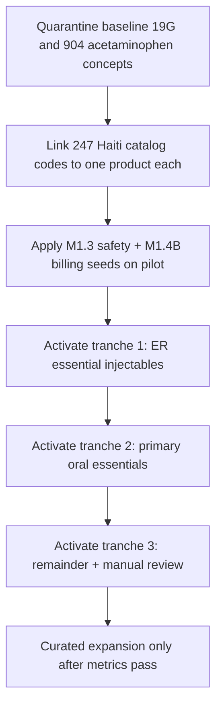

# Canonical Medication Activation Strategy (M1.5B)

**Program:** Canonical Medication Activation & Linkage Audit  
**Phase:** M1.5B — strategy only  
**Date:** 2026-06-02  
**Audit basis:** [canonical-medication-activation-audit.md](./canonical-medication-activation-audit.md) · [canonical-medication-linkage-audit.md](./canonical-medication-linkage-audit.md)

---

## Strategic question

**Does Medora need medication expansion or activation first?**

**Answer: Activation and linkage first** — against the **existing Haiti `CatalogMedication` (247 clinical rows)**, not against the **993** canonical rows as they sit today.

The canonical database is **volume-rich but clinically misaligned**: **904** acetaminophen test concepts, **0** Haiti code matches, **81%** legacy catalog unlinked. Adding more medications before linkage would increase drift and search risk.

---

## Options evaluated

| Option | Description | Assessment |
|--------|-------------|------------|
| **A** | Activate all “safe” canonical products (**786** `ACTIVATION_APPROVED`) | **Reject** — activates baseline noise; **CRITICAL** duplicate/search risk (R01–R02) |
| **B** | Activate by specialty | **Partial** — good tranche shape after Haiti link exists; premature today |
| **C** | Activate by formulary tier (ED / essential / favorite) | **Partial** — aligns with Haiti `isEssential`; needs linkage first |
| **D** | **Hybrid:** quarantine baseline → link Haiti → activate by tier → expand | **Recommend** |

---

## Recommended option: **D — Hybrid**

### Rationale

1. **M1.5A** showed enterprise readiness **51** — expansion without linkage does not raise orderability safely.  
2. **M1.5B** proves canonical ≠ Haiti: **0** code/generic matches; **945** rows are test/baseline duplicates.  
3. Provider search already serves **256** meds via **legacy bypass**; wrong activation hurts more than helps.  
4. Activation gates (`evaluateProviderOrderSearchGate`) require **formulary + runtime flags + active product** — not just `ACTIVATION_APPROVED`.  
5. Haiti billable injectables already have **M1.4B** manifest; linkage connects billing/safety to canonical packages.

---

## Phase sequence (implementation — future, not M1.5B)

### Step 0 — Preconditions (ops + clinical)

| Task | Gate |
|------|------|
| Production read-only count replay | R14 closed |
| Rule: **no** bulk `isActive=true` on `baselineAvailable` products without dedupe | R01 closed |
| Clinical sign-off: Haiti codes are source of truth for tranche 1 | — |

### Step 1 — Quarantine (Option D / hygiene)

| Action | Scope |
|--------|-------|
| Exclude `19G1-ACET-*` from provider search | **69** baseline catalog rows |
| Do not activate `PRI_ER_ACETAMINOPHEN_*` / `19G2-*` products | **~951** products |
| Merge or retire **48** insulin hash concepts to ≤3 SKUs | R11 |

### Step 2 — Linkage (Option D / core)

| Action | Target |
|--------|--------|
| For each **247** Haiti-style `CatalogMedication.code`, ensure **one** `MedicationProduct` with `legacyCatalogMedicationId` | **247** links |
| Product `code` policy: align to catalog `code` or stable map table | 0 collisions |
| Unlink incorrect **60** baseline acetaminophen links | Replace with Haiti rows |

**Success metric:** ≥**90%** Haiti codes linked; **0** catalog codes with **>1** legacy product.

### Step 3 — Activate by formulary tier (Option C within D)

| Tranche | Tier | Est. rows | Criteria |
|---------|------|-----------|----------|
| **T1** | ER / controlled / high-alert injectables | ~40–60 | `isEssential` + injectable route + governance APPLY |
| **T2** | Primary oral essentials | ~80–120 | `isEssential` oral |
| **T3** | Remaining Haiti catalog | ~100+ | Manual review queue |

Per product activation checklist (existing 19G workflow):

1. `governanceStatus` → `ACTIVATION_APPROVED` (already on many)  
2. `isActive` product + concept  
3. `FacilityFormularyItem.isOnFormulary`  
4. Runtime `orderSearchEnabled` in `governanceNotes`  
5. Safety profile for concept (controlled/HA/LASA)  
6. Billing profile or `BillingCatalog` for billable IV  

### Step 4 — Expansion (deferred)

Only after:

- Provider-search visible ≈ Haiti linked count  
- No acetaminophen duplicate groups in top search results  
- Billing map ≥95% billable injectables on **linked** packages  

Then execute **M1.5A Option D** curated formulary adds (warfarin, enoxaparin, vaccines policy).

---

## Projected outcomes (realistic)

| Metric | Current | After Step 2–3 (target) |
|--------|---------|-------------------------|
| Provider-search visible | **256** | **~247–316** |
| Canonical products clinically usable | **~48** (insulin noise) | **~247** linked |
| Safe bulk activation count | **0** | **~40–60** T1, then phased |
| Enterprise readiness (catalog) | **51** | **~65–70** (est.) |

**Do not** target **993** orderable medications — target **one canonical chain per Haiti code**.

---

## What not to do

| Anti-pattern | Why |
|--------------|-----|
| Activate all **786** approved products | R01 CRITICAL |
| Expand catalog before linkage | Worsens dual-catalog gap |
| Use canonical search instead of legacy without link | 0 Haiti matches today |
| Skip formulary + runtime flags | Gate keeps products hidden or unsafe |

---

## Decision linkage

| Audit verdict | Strategy |
|---------------|----------|
| **CANONICAL LAYER NOT READY FOR ACTIVATION** (bulk) | Follow **Option D** |
| **NOT SAFE** bulk activate | Quarantine + link Haiti first |
| **SAFE (conditional)** | T1 ER tranche on pilot after preconditions |

---

## References

- [enterprise-medication-expansion-strategy.md](./enterprise-medication-expansion-strategy.md) (M1.5A)  
- [medication-product-activation-gates.util.ts](../../apps/api/src/medication-master/medication-product-activation-gates.util.ts)  
- [canonical-medication-risk-register.md](./canonical-medication-risk-register.md)
