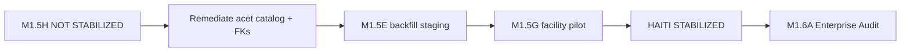

# Enterprise Formulary Expansion Readiness (M1.6A gate)

**Date:** 2026-06-02  
**Gate:** Post M1.5H Haiti canonical stabilization  
**Decision:** **NOT READY** for M1.6A — Enterprise Formulary Expansion Audit

---

## Purpose

M1.6A is the **next** program phase: audit whether Medora can expand beyond the Haiti 247-code clinic formulary toward enterprise medication catalog scale **without** breaking provider search, billing, governance, or MAR.

M1.5H must pass **operational** stabilization before M1.6A begins.

---

## M1.5H gate results (prerequisites)

| Prerequisite | Required | M1.5H status |
|--------------|----------|----------------|
| Haiti linkage manifest + validation (M1.5D) | Complete | **PASS** |
| Clean linkage backfill (M1.5E) on target DB | ≥192 links, 0 quarantine violations | **FAIL** (not run locally) |
| Provider search cutover audit (M1.5F) | Legacy authoritative; no cutover | **PASS** (design) |
| T1 activation pilot (M1.5G) | Staged + rollback tested | **PASS** (code); **not run** on DB |
| Stabilization audit (M1.5H) | Documented decision | **NOT STABILIZED** |
| Acetaminophen / baseline pollution | 0 searchable clone rows | **FAIL** (73 catalog rows) |
| Wrong `legacyCatalogMedicationId` | 0 | **FAIL** (64) |

**Gate:** **NOT READY**

---

## What M1.6A should cover (future audit scope)

When READY, M1.6A should audit **read-only**:

1. **Catalog scale** — multi-facility formulary overlays vs single Haiti catalog.  
2. **Search index strategy** — legacy catalog vs canonical hybrid at enterprise row counts.  
3. **Billing at scale** — M1.4B manifest coverage %, NDC collisions, J-code governance.  
4. **Governance at scale** — controlled substance policy across facilities.  
5. **Performance** — provider search p95 with 1k–10k catalog rows.  
6. **Offline-readiness** — formulary bundle size for future sync (design only).  
7. **Regulatory** — Haiti vs enterprise SKU policy (explicit scope).

**Out of scope for M1.6A until Haiti STABILIZED:** national deployment, multi-country formularies, real-time sync fleets.

---

## Enterprise readiness scorecard (informational)

| Dimension | Score (0–100) | Notes |
|-----------|---------------|-------|
| Architecture completeness (M1.5D–G) | **85** | Manifest, gates, pilot, rollback shipped |
| Data integrity (audited DB) | **35** | Baseline acet links + missing M1.5E |
| Provider search | **55** | PARTIAL — alias matrix mostly PASS |
| Billing | **80** | Stable code; prod seed unverified |
| Governance | **70** | Manifests strong; DB profiles sparse on noise |
| Operational pilot evidence | **20** | No facility pilot run |
| **Enterprise expansion readiness** | **42** | **NOT READY** |

---

## Recommended sequence

1. **Remediate** R-H1, R-H2 (risk register).  
2. **M1.5E** on staging/production candidate.  
3. **M1.5G** pilot + metrics.  
4. Re-run M1.5H checklist → **STABILIZED**.  
5. Open **M1.6A** (audit only).

---

## SAFE / NOT SAFE

| Action | Verdict |
|--------|---------|
| Start M1.6A enterprise formulary expansion **audit** | **NOT SAFE** / **NOT READY** today |
| Continue Haiti clinic MVP on 247-code catalog | **SAFE (conditional)** after acet catalog remediation |
| Multi-facility formulary productization | **NOT SAFE** — Phase 6; defer |

---

## Sign-off required before M1.6A

| Role | Item |
|------|------|
| Engineering lead | M1.5H checklist green on staging |
| Pharmacy informatics | Search alias matrix PASS; no clone rows |
| Medical director | MANUAL_REVIEW row disposition (55 + 19 pilot deferred) |
| Billing lead | M1.4B coverage report on staging |

---

## References

- [canonical-medication-stabilization-audit.md](./canonical-medication-stabilization-audit.md)
- [canonical-medication-stabilization-readiness.md](./canonical-medication-stabilization-readiness.md)
- [canonical-medication-stabilization-risk-register.md](./canonical-medication-stabilization-risk-register.md)
- [provider-search-canonical-cutover-audit.md](./provider-search-canonical-cutover-audit.md) (M1.5F)
- [canonical-medication-activation-pilot.md](./canonical-medication-activation-pilot.md) (M1.5G)
