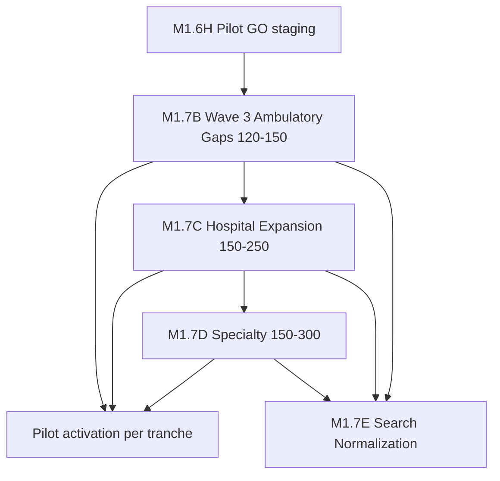

# Enterprise Formulary Roadmap — 600 / 800 / 1000+ Medications

**Date:** 2026-06-03  
**Phase:** M1.7A planning  
**Current state:** 134 enterprise + 247 Haiti ≈ **325 unique** governed/legacy codes

---

## Readiness projection

| Milestone | Enterprise codes | Union unique (est.) | Cumulative phase | Primary focus |
|-----------|-----------------:|--------------------:|------------------|---------------|
| **Today (M1.6H)** | 134 | ~325 | M1.6 complete | W1 anticoag/vaccine/chronic + W2 multi-specialty |
| **After Wave 3 (M1.7B)** | ~254–284 | **~450–500** | +120–150 | Nephro, derm, rheum, neuro, psych, pulm depth |
| **After Wave 4 (M1.7C)** | ~454–534 | **~650–750** | +200 | Hospitalist, ICU, ER protocols, IV electrolytes, infusions |
| **After Wave 5 (M1.7D)** | ~654–834 | **~850–1050** | +200–300 | Oncology, HIV, immunology, biologics (governed) |
| **After M1.7E search norm** | — | Quality ↑ | M1.7E | Alias dedupe, RxNorm-style normalization (no row count) |

### Target attainment

| Goal | Expected reach | Confidence |
|------|----------------|------------|
| **600 medications** | End of **Wave 3** or early **Wave 4** | HIGH |
| **800 medications** | Mid **Wave 4** | MEDIUM |
| **1000+ medications** | End of **Wave 5** + Haiti harmonization | MEDIUM |

---

## Recommended phase sequence (Part 10)

| Phase ID | Name | Est. meds | Risk | Activation policy |
|----------|------|----------:|------|-----------------|
| **M1.7B** | Enterprise Formulary Wave 3 | 100–150 | HIGH (psych/DMARD) | Pilot tranche after seed; no bulk |
| **M1.7C** | Hospital Formulary Expansion | 150–250 | HIGH (IV/high-alert) | Facility policy per unit |
| **M1.7D** | Specialty Formulary Expansion | 150–300 | **CRITICAL** (onc/HIV) | Committee + dual verification |
| **M1.7E** | Enterprise Search Normalization | — | MEDIUM | No catalog count change |

**Parallel track (unchanged):** M1.6F/G pilot activation on **existing** Tranche A before Wave 3 seed in production.

---

## Wave 4 — Hospital Expansion (M1.7C planning summary)

**Target:** 150–250 medications

| Module | Est. rows | Examples (planning) |
|--------|----------:|---------------------|
| ICU sedation / analgesia | 25 | Propofol, dexmedetomidine, fentanyl IV, midazolam IV |
| Paralytics / neuro-muscular | 10 | Rocuronium, vecuronium, cisatracurium |
| Vasopressors / inotropes | 15 | Norepinephrine, epinephrine drip, dopamine, dobutamine |
| Electrolyte / resuscitation | 30 | KCl, MgSO4, Ca gluconate, bicarbonate, albumin |
| Antibiotic IV hospital | 40 | Pip-tazo, cefepime, vancomycin IV enrich, metronidazole IV |
| Antiemetic / GI hospital | 20 | Metoclopramide IV, pantoprazole IV |
| Thrombolytics / ACS (policy) | 8 | Alteplase, tenecteplase (restricted) |
| Insulin hospital protocols | 12 | Regular insulin IV, sliding scale kits |
| Observation / hospitalist oral | 40 | Enoxaparin treatment dose, DOAC inpatient bridge |

---

## Wave 5 — Specialty Expansion (M1.7D planning summary)

**Target:** 150–300 medications

| Module | Est. rows | Notes |
|--------|----------:|-------|
| Oncology chemo common | 60 | Carboplatin, paclitaxel, cisplatin, doxorubicin — **CRITICAL governance** |
| Oncology supportive | 25 | Palonosetron, filgrastim, dexamethasone protocols |
| Oncology biologics / IO | 20 | Rituximab, trastuzumab, pembrolizumab — manual review mandatory |
| HIV ART | 30 | Tenofovir, dolutegravir, bictegravir combinations |
| Rheumatology biologics | 15 | Adalimumab, etanercept — prior auth |
| Immunology | 15 | Omalizumab, etc. |
| Transplant baseline | 10 | Tacrolimus, MMF — likely post-1000 |

---

## Haiti harmonization note

247 Haiti rows overlap **56** enterprise codes. Long-term 1000+ plan should:

- ENRICH Haiti rows vs duplicate CREATE  
- Soft-retire duplicate legacy codes only with migration plan  
- Preserve French display names and essential medicine flags  

---

## Out of scope (all waves until explicit phase)

- M1.5F provider search cutover  
- Billing engine redesign (M1.4 architecture **extends**, not replaces)  
- National multi-facility deployment  
- Offline sync implementation  
- Automatic pilot activation  

---

## Success metrics per wave

| Metric | Wave 3 | Wave 4 | Wave 5 |
|--------|--------|--------|--------|
| Manifest + billing parity | 100% | 100% | 100% |
| `requiresManualReview` | 100% | 100% | 100% |
| Active without governance | 0 | 0 | 0 |
| Pilot marker before committee | 0 | 0 | 0 |
| Staging validation SQL pack | Required | Required | Required |
