# Enterprise Medication Expansion Strategy (M1.5A)

**Program:** Enterprise Medication Catalog Completion Audit  
**Phase:** M1.5A — strategy only (no implementation)  
**Date:** 2026-06-02  
**Audit basis:** [enterprise-medication-catalog-completion-audit.md](./enterprise-medication-catalog-completion-audit.md)

---

## Options considered

| Option | Description | Fit for Medora-S Phase 1 |
|--------|-------------|--------------------------|
| **A** | Expose existing canonical concepts/products (activation + legacy link) | **High** — 1003 concepts already staged |
| **B** | Import additional 1000+ medications | **Low** — duplicates drift, governance overload |
| **C** | Curated phased expansion by clinical category | **High** — aligns with Haiti priorities |
| **D** | Hybrid A + C with billing/safety gates | **Best** |

---

## Recommended option

### **Option D — Hybrid (A + C)**

**Rationale**

1. **Inventory already exists** in canonical tables (**1003** concepts, **993** products) but **0** active products — expansion should **activate and link**, not re-import blindly.  
2. **Haiti seed (269 rows)** covers primary care + ER injectables well; gaps are **targeted** (warfarin, enoxaparin, vaccines, optional opioids), not a 1000-row dump.  
3. **M1.4B manifest** achieves **100%** billable injectable HCPCS in source — operational gap is **seed application**, not net-new codes.  
4. **Safety manifests (M1.3C–E)** are ready; persistence to `MedicationSafetyProfile` must precede large catalog growth.  
5. Phase-lock: avoid national formulary / enterprise analytics scope.

**Not recommended now:** **Option B** (1000+ import) — would worsen dual-catalog drift, alias collisions, and governance queue without reconciliation.

---

## Suggested phase sequence

```mermaid
flowchart LR
  subgraph prep [Pre-expansion]
    P1[Production read-only counts]
    P2[M1.4B billing seed on pilot]
    P3[M1.3C-E governance seed on pilot]
  end
  subgraph wave1 [Wave 1 - Link and activate]
    W1[Legacy link backfill Haiti codes]
    W2[Activation policy for ER/high-alert subset]
  end
  subgraph wave2 [Wave 2 - Curated adds]
    W3[Anticoagulants warfarin enoxaparin]
    W4[Controlled policy tramadol benzo oral]
  end
  subgraph wave3 [Wave 3 - Search and quality]
    W5[Alias governance RSI sedation]
    W6[Route form normalization]
  end
  prep --> wave1 --> wave2 --> wave3
```

### Phase 0 — Preconditions (1–2 weeks ops + clinical)

| Step | Owner | Output |
|------|-------|--------|
| Production SQL replay | Ops | Count matrix verified |
| Pilot: M1.4B remediation seed | Ops/Dev | `BillingCatalog` ≈ manifest size; `billingCodeDefault` on billable rows |
| Pilot: M1.3C–E governance seeds | Ops/Clinical | `MedicationSafetyProfile` populated for APPLY manifest rows |
| Sign-off | Clinical | Controlled schedule + HA list for Haiti |

### Phase 1 — Expose canonical (Option A)

| Action | Scope | Success metric |
|--------|-------|----------------|
| Backfill `legacyCatalogMedicationId` for Haiti-derived codes | ~269 codes | ≥90% Haiti codes linked |
| Activate **ER / high-alert** product subset only | ~40–60 products | Provider search gate allows linked rows |
| Keep legacy catalog as order identity | MVP | No order workflow regression |

### Phase 2 — Curated category expansion (Option C)

| Tranche | Medications | Gate |
|---------|-------------|------|
| **T1 Anticoagulation** | Warfarin, enoxaparin (+ heparin profile) | HA + billing map + controlled/witness rules |
| **T2 Controlled policy** | Oral diazepam/lorazepam flags; tramadol decision | M1.3C APPLY after sign-off |
| **T3 Vaccines** | Clinic immunization set (if in scope) | Separate admin workflow review |
| **T4 Optional opioids** | Oxycodone/hydrocodone only if Haiti policy approves | Controlled II + LASA |

**Do not** add T4 without clinical and legal review.

### Phase 3 — Search & consolidation (M1.5 / M1.6)

- Resolve alias collisions (`rsi`, `sédation`).  
- Retire or fix **69** baseline rows missing route.  
- Evaluate canonical-first orders (future; not MVP blocker).

---

## Expansion guardrails

| Guardrail | Reason |
|-----------|--------|
| No bulk import >50 rows per tranche | Governance review capacity |
| Every new row requires `code` + `genericName` + route + form | Orderability |
| Billable injectable requires manifest or `MANUAL_REVIEW` billing status | Revenue integrity (M1.4B/C) |
| Controlled / HA requires manifest APPLY before `isActive` promotion | Patient safety |
| Idempotent seeds only | Offline/pilot repeatability |

---

## Decision linkage

Until Phase 0–1 complete, maintain audit verdict:

**Enterprise Medication Catalog NOT READY FOR EXPANSION** · **NOT SAFE** for large-scale add; **SAFE (conditional)** for Haiti MVP legacy catalog operations.

After Phase 0–1 on pilot with verified metrics:

- Re-audit may support **READY FOR EXPANSION (curated tranches only)** with **SAFE (conditional)**.

---

## References

- [enterprise-medication-catalog-inventory.md](./enterprise-medication-catalog-inventory.md)  
- [medication-billing-mapping-remediation.md](./medication-billing-mapping-remediation.md)  
- [medication-production-readiness.md](./medication-production-readiness.md)  
- [medication-program-roadmap.md](./medication-program-roadmap.md)
