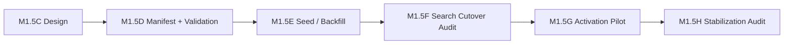

# Haiti Canonical Linkage Remediation Roadmap (M1.5C)

**Program:** Haiti Canonical Linkage Remediation  
**Phase:** M1.5C — roadmap design only  
**Date:** 2026-06-02  

**Decision (M1.5C):** **HAITI CANONICAL LINKAGE DESIGN READY** · **SAFE (conditional)**

---

## Sequence overview

**Guiding principle:** Linkage creates canonical chains; **activation** and **search cutover** are separate, gated phases.

---

## M1.5C — Haiti Canonical Linkage Remediation Audit & Design

| Item | Detail |
|------|--------|
| **Objective** | Quarantine rules, matching rules, manifest schema, validation design, tranches |
| **Migration** | None |
| **Seed** | None |
| **Risk** | **LOW** (docs only) |
| **Deliverables** | This roadmap + remediation audit + manifest design + validation design |
| **Status** | **Complete** (2026-06-02) |

---

## M1.5D — Haiti Canonical Linkage Manifest Implementation

| Item | Detail |
|------|--------|
| **Objective** | Implement `haitiCanonicalMedicationLinkageManifest.ts` (247 entries), validation module, unit tests, optional codegen from Haiti seed |
| **Migration** | **Unlikely** — uses existing Phase 19B schema |
| **Seed** | **No** — manifest only |
| **Risk** | **LOW** |
| **Deliverables** | Shared manifest + `assertHaitiCanonicalLinkageManifest()` + tests; clinical review CSV export script (read-only) |
| **Exit criteria** | Validation pass; **0** quarantine-target links; T1–T5 cover **247** codes |

---

## M1.5E — Haiti Canonical Linkage Seed / Backfill

| Item | Detail |
|------|--------|
| **Objective** | Idempotent create `MedicationConcept` / `MedicationProduct` / `MedicationPackage`; set `legacyCatalogMedicationId`; default package; optional `MedicationBillingProfile` stub from M1.4B |
| **Migration** | **Unlikely** |
| **Seed** | **Yes** — new helper e.g. `seed-haiti-canonical-linkage.ts` wired in dev/pilot only |
| **Risk** | **HIGH** — wrong target = duplicate search / billing errors |
| **Deliverables** | Seed helper + result counters (`created`, `skipped`, `duplicateProtected`, `manualReviewSkipped`) |
| **Phasing** | Apply **T1** only on first pilot run; T2→T5 after validation |
| **Preconditions** | M1.5D pass; quarantine deny-list enforced; M1.4B billing seed on pilot; unlink **60** baseline wrong links |

---

## M1.5F — Provider Search Canonical Cutover Audit

| Item | Detail |
|------|--------|
| **Objective** | Read-only audit: after M1.5E, verify **one** search result per Haiti code; alias collisions; French/English display; gate behavior when product linked but inactive vs active |
| **Migration** | None |
| **Seed** | None |
| **Risk** | **MEDIUM** — premature cutover duplicates rows |
| **Deliverables** | `provider-search-canonical-cutover-audit.md`; PASS/FAIL for enabling `orderSearchEnabled` |
| **Rule** | No search code change unless audit PASS |

---

## M1.5G — Canonical Medication Activation Pilot

| Item | Detail |
|------|--------|
| **Objective** | Pilot **T1** (82 IV/ER): `isActive`, facility formulary, runtime `orderSearchEnabled`, M1.3 safety profiles — **not** full 247 |
| **Migration** | None |
| **Seed** | **Maybe** — governance seeds M1.3C–E on linked concepts only |
| **Risk** | **HIGH** |
| **Deliverables** | Pilot runbook + activation audit; metrics: visible search count, billing map %, MAR capture sample |
| **Success** | **82** linked + **≤316** visible search rows (no duplication) |

---

## M1.5H — Medication Catalog Stabilization Audit

| Item | Detail |
|------|--------|
| **Objective** | Post-pilot inventory: drift, quarantine retirement candidates, expansion readiness vs M1.5A |
| **Migration** | **Unlikely** |
| **Seed** | None |
| **Risk** | **LOW** |
| **Deliverables** | Stabilization audit; update enterprise readiness scores; go/no-go for curated expansion (warfarin, vaccines) |

---

## Phase comparison table

| Phase | Code | Seed | Migration | Risk | Depends on |
|-------|------|------|-----------|------|------------|
| M1.5C | No | No | No | LOW | M1.5A, M1.5B |
| M1.5D | Yes | No | Unlikely | LOW | M1.5C |
| M1.5E | Yes | Yes | Unlikely | HIGH | M1.5D, M1.4B |
| M1.5F | No | No | No | MEDIUM | M1.5E |
| M1.5G | Yes | Maybe | No | HIGH | M1.5E, M1.5F PASS, M1.3 |
| M1.5H | No | No | No | LOW | M1.5G |

---

## Clinical tranche rollout (linkage + activation)

| Tranche | Rows | Link (M1.5E) | Activate (M1.5G) |
|---------|------|--------------|------------------|
| **T1** | 82 | Pilot wave 1 | Pilot wave 1 |
| **T2** | ~65 | Wave 2 | After T1 audit |
| **T3** | 9+ HA | Wave 3 + sign-off | After safety seed |
| **T4** | 122 | Wave 4 | Staged |
| **T5** | 43 | Wave 5 | Staged |

---

## What not to do between phases

| Anti-pattern | Phase risk |
|--------------|------------|
| Link Haiti rows to existing **904** acetaminophen products | M1.5E **CRITICAL** |
| Enable `orderSearchEnabled` in same PR as linkage seed | M1.5F/G conflation |
| Skip M1.5D validation | M1.5E data corruption |
| Bulk activate **786** `ACTIVATION_APPROVED` noise products | M1.5G **CRITICAL** |
| Expand formulary before **247** linked | M1.5A regression |

---

## Production verification (all phases)

Before M1.5E on production:

- [ ] Haiti active catalog count = **247** (± seed drift documented)  
- [ ] **0** Haiti rows with wrong `19G` legacy link  
- [ ] M1.4B `BillingCatalog` MEDICATION count ≈ manifest **83**  
- [ ] Clinical sign-off on `MANUAL_REVIEW` CSV  

---

## References

- [haiti-canonical-linkage-remediation-audit.md](./haiti-canonical-linkage-remediation-audit.md)  
- [haiti-canonical-linkage-manifest-design.md](./haiti-canonical-linkage-manifest-design.md)  
- [haiti-canonical-linkage-validation-design.md](./haiti-canonical-linkage-validation-design.md)  
- [canonical-medication-activation-strategy.md](./canonical-medication-activation-strategy.md) (M1.5B)
