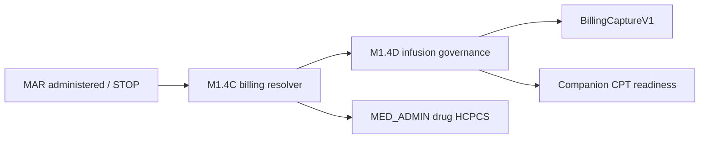

# Infusion Billing Governance (M1.4D)

**Program:** Enterprise Medication Billing & Revenue Integrity  
**Phase:** M1.4D — Infusion Billing Governance  
**Date:** 2026-06-02  
**Scope:** Infusion classification, duration pairing, administration CPT companion readiness, capture metadata — **no** production deployment, catalog expansion, claim engine redesign, pharmacy queue, barcode, or eMAR scheduling.

**Builds on:** M1.4A · M1.4B · M1.4C · M1.3F.4–F.8

---

## Executive summary

| Capability | Status |
|------------|--------|
| Infusion event classification | **Implemented** (`classifyInfusionBillingEvent`) |
| START/STOP duration pairing | **Implemented** (`computeInfusionDurationFromMarRows`) |
| Administration CPT companion readiness | **PARTIAL** — suggestions only (96372/96374/96365/96366/96360/96361) |
| Capture metadata enrichment | **Implemented** via M1.4C resolver extension |
| Payer-final claim coding | **Deferred** — all suggestions require manual review |
| **SAFE / NOT SAFE** | **SAFE (conditional)** |

---

## Part 1 — Infusion architecture audit (baseline)

### Data model (existing)

| Entity / field | Role |
|----------------|------|
| `MedicationAdministration.infusionPhase` | `INFUSION_START` \| `INFUSION_STOP` |
| `MedicationAdministration.infusionSessionKey` | Pairs START/STOP with order session |
| `MedicationAdministration.administeredAt` | Documented billing time (not `effectiveAdministeredAt`) |
| `InfusionSession` | Schema present; **not wired to runtime billing** in M1.4D |
| `billingCaptureJson` infusion fields | Duration, suggestion, review decision (pre-existing) |

### Billing path (after M1.4D)

### Pre-M1.4D gaps (addressed)

| Gap | M1.4D fix |
|-----|-----------|
| No unified infusion billing category | `InfusionBillingEventCategory` on capture |
| Duration only on STOP via service evidence | DB sibling MAR pairing + enrichment |
| Admin CPT from route only | Infusion-aware companion suggestions |
| Package profiles unused for infusion | Unchanged for drug HCPCS; infusion metadata separate |

### Safe boundary

| In scope | Out of scope |
|----------|--------------|
| Read-only MAR pairing queries | MAR workflow changes |
| Capture JSON metadata | Claim export logic changes |
| CPT **readiness** suggestions | Payer-specific unit math / auto-claim |
| High-alert compatibility validation | EDOC.8 implementation |

---

## Part 2 — Event classification

Categories (`packages/shared/src/medication/infusionBillingGovernance.ts`):

| Category | When |
|----------|------|
| `NON_INFUSION_ADMINISTRATION` | Oral / non-infusion injectable |
| `IV_PUSH` | Route push/bolus/IVP |
| `IV_INFUSION_START` | `INFUSION_START` phase, therapeutic |
| `IV_INFUSION_STOP` | `INFUSION_STOP` / terminal note |
| `IV_INFUSION_CONTINUOUS` | Infusion candidate without START/STOP phase |
| `HYDRATION_START` / `HYDRATION_STOP` | Infusion phase + `HYDRATION` billing class |
| `MEDICATION_INFUSION_UNKNOWN` | Infusion candidate, class unclear |
| `MANUAL_REVIEW_REQUIRED` | Non-administered MAR action |

Uses existing fields only — **no MAR behavior change**.

---

## Part 3 — Duration calculation

Pairing key: `encounterId` + `orderItemId` + `infusionSessionKey` + `catalogMedicationId`.

| Outcome | Behavior |
|---------|----------|
| Valid START/STOP | `durationMinutes`, initial/additional hour hints |
| Missing STOP (START row) | `MISSING_INFUSION_STOP` |
| Missing START (STOP row) | `MISSING_INFUSION_START` |
| Negative duration | `NEGATIVE_INFUSION_DURATION` |
| Multiple eligible STARTs | `AMBIGUOUS_INFUSION_PAIR` |
| Ambiguous / incomplete | **No auto-bill** — manual review flags |

Policy: initial hour if ≥31 min; additional hour segments if ≥91 min (aligned with existing `suggestInfusionBilling`).

---

## Part 4 — Administration CPT companion readiness

| CPT | Readiness use |
|-----|---------------|
| 96372 | IM/SQ injection |
| 96374 | IV push |
| 96365 | Therapeutic infusion initial hour |
| 96366 | Therapeutic infusion additional hour |
| 96360 | Hydration initial |
| 96361 | Hydration additional |

Captured on `BillingCaptureItem`:

- `suggestedAdministrationCodes[]` — code, type, source, `manualReviewRequired`, rationale
- `procedureCode` — first companion suggestion (distinct from drug `hcpcsCode`)

**NOT payer-final.** M1.4D does not emit claims.

---

## Part 5 — Capture enrichment

Extended M1.4C resolver (`medication-administration-billing-resolve.util.ts`):

| Field | Source |
|-------|--------|
| `infusionBillingCategory` | Classification |
| `infusionStartedAt` / `infusionStoppedAt` | Duration pairing |
| `infusionDurationMinutes` | Computed or existing |
| `suggestedAdministrationCodes` | CPT readiness |
| `infusionManualReviewReasons` | Manual review enum |
| `infusionBillingReady` | true when non-payer blockers clear |
| `infusionDurationBillingManualReview` | true when not ready |

Drug HCPCS (`hcpcsCode`) and administration CPT (`procedureCode`) remain **separate slots**.

---

## Part 6 — High-alert infusion governance

| Medication class | Billing blocked? | Result |
|------------------|------------------|--------|
| Heparin infusion | No | **PASS** |
| Norepinephrine infusion | No | **PASS** |
| Amiodarone infusion | No | **PASS** |
| Insulin (push) | No | **PASS** |

Governance verifications (double-check, LASA, pharmacy, witness) unchanged — billing uses administered facts only.

---

## Part 7 — Manual review reasons

`InfusionManualReviewReason`:

- `MISSING_INFUSION_STOP`
- `MISSING_INFUSION_START`
- `AMBIGUOUS_INFUSION_PAIR`
- `NEGATIVE_INFUSION_DURATION`
- `INFUSION_TYPE_UNKNOWN`
- `ADMINISTRATION_CODE_UNCERTAIN`
- `HYDRATION_VS_MEDICATION_UNCLEAR`
- `CONTINUOUS_INFUSION_INSUFFICIENT_TIMING`
- `PAYER_VERIFICATION_REQUIRED` (always appended)

---

## Deferred (future phases)

- Payer-specific infusion unit calculation and auto-claim
- `InfusionSession` canonical runtime wiring
- Full infusion billing rule engine automation
- Waste billing linkage
- EDOC.8 smart infusion documentation enforcement

---

## Rollback

Revert `infusionBillingGovernance.ts`, `infusion-billing-governance-resolve.util.ts`, and M1.4C resolver infusion extension. Capture JSON fields are additive.

See [infusion-billing-validation.md](./infusion-billing-validation.md).
