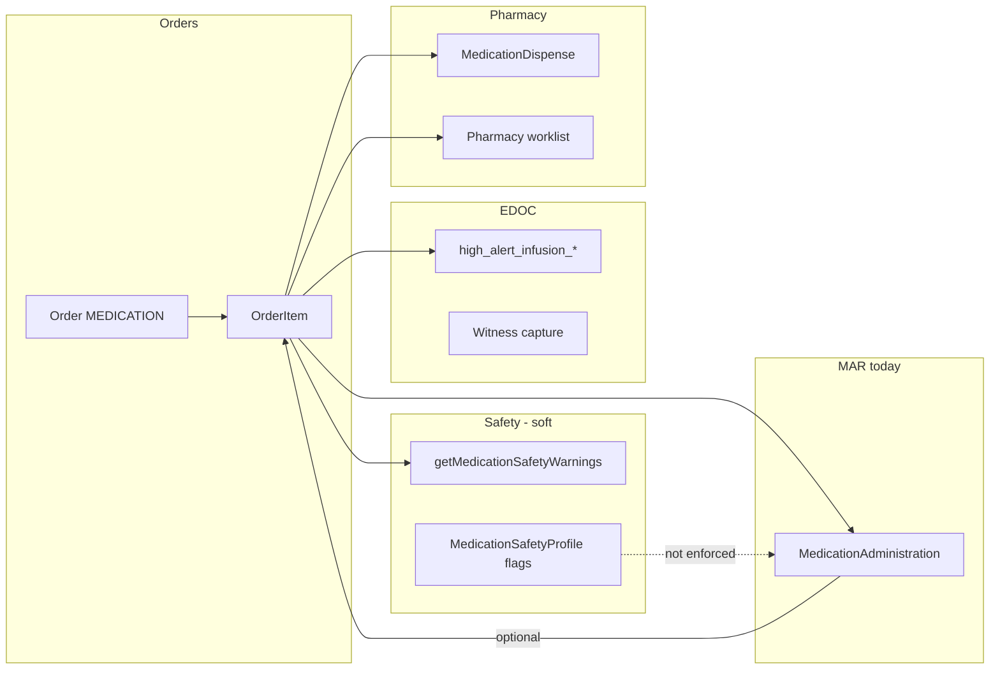

# MAR / eMAR Architecture Audit (M1.3F)

**Phase:** M1.3F (audit + design only)  
**Date:** 2026-05-31  
**Authority:** M1.1A, M1.1B, M1.3A–M1.3E  

---

## Executive summary

Medora has a **functional bedside MAR log** (`MedicationAdministration`) tied to medication `OrderItem` rows, with infusion START/STOP, effective-time correction, soft safety warnings, and EDOC.8 high-alert infusion verification. There is **no scheduled eMAR engine**, **no barcode BCMA**, **no pharmacy verification state machine**, **no controlled-substance waste/witness MAR fields**, and **no medication reconciliation module**. M1.3C–E governance data exists on catalog/safety profiles but is **not enforced** at administration time.

| Layer | Status |
|-------|--------|
| Medication orders | **IMPLEMENTED** |
| MAR documentation | **PARTIAL** |
| eMAR (due/scheduling) | **NOT IMPLEMENTED** |
| Pharmacy verification | **PARTIAL** (dispense + worklist only) |
| Governance enforcement (M1.3C–E) | **NOT IMPLEMENTED** at MAR |
| EDOC med safety | **PARTIAL** (infusion HA cards) |
| Legal chart MAR visibility | **IMPLEMENTED** (chart export) |

---

## Part 1 — Inventory

### 1.1 Prisma models

| Model | Purpose | MAR/eMAR relevance | Status |
|-------|---------|-------------------|--------|
| `Order` | Parent order (`type` = MEDICATION) | Order header, cancel, audit | **IMPLEMENTED** |
| `OrderItem` | Medication line (`catalogItemType` = MEDICATION) | Dose/route/strength snapshot, `intendedAdministrationAt`, lifecycle | **IMPLEMENTED** |
| `OrderItemLifecycleState` | ORDERED → ACKNOWLEDGED → IN_PROGRESS → COMPLETED → REVIEWED / CANCELLED | Not med-specific schedule states | **PARTIAL** |
| `OrderStatus` | PENDING, IN_PROGRESS, COMPLETED, CANCELLED, etc. | Coarse order state | **IMPLEMENTED** |
| `MedicationAdministration` | Append-only MAR rows | Core MAR | **IMPLEMENTED** |
| `MedicationMarAction` | administered, refused, not_available, md_changed | Limited outcome enum | **PARTIAL** |
| `MedicationAdministrationInfusionPhase` | INFUSION_START, INFUSION_STOP | Infusion MAR | **IMPLEMENTED** |
| `MedicationMarWorkflow` | SINGLE_DOSE, INFUSION_SESSION, PRN, CONTINUOUS | On `MedicationAdministrationProfile` only | **PARTIAL** (schema; weak runtime) |
| `MedicationDispense` | Pharmacy dispense record | Outpatient / PHARMACY_DISPENSE intent | **IMPLEMENTED** |
| `MedicationSafetyProfile` | isHighAlert, highAlertCategories, lasaGroupId, controlled flags | M1.3C–E target | **PARTIAL** (data only) |
| `MedicationAdministrationProfile` | defaultMarWorkflow, infusion flags | Canonical product layer | **PARTIAL** (schema; not primary path) |
| `InfusionSession` | Canonical infusion session | Schema only — **not wired to runtime** | **NOT IMPLEMENTED** (runtime) |
| `CatalogMedication` | Legacy catalog + controlled/witness flags | Order search + M1.3C catalog flags | **IMPLEMENTED** |
| `EncounterClinicalDocumentationEntry` | EDOC cards | Witness / HA verification | **IMPLEMENTED** |
| `AuditLog` | Facility audit | Generic actions; few med-specific | **PARTIAL** |
| `OrderEvent` | Order lifecycle stream | Infusion events, metadata | **IMPLEMENTED** |

**Not found:** `MedicationReconciliation`, `PharmacyVerification`, `MedicationWaste`, `MarSchedule`, `BarcodeScan`, `WitnessSignature` (med-specific).

### 1.2 API — medication administration

| Endpoint | Module | Status |
|----------|--------|--------|
| `GET /encounters/:id/medication-administrations` | `medication-administration.controller.ts` | **IMPLEMENTED** |
| `POST /encounters/:id/medication-administrations` |同上 | **IMPLEMENTED** |
| `PATCH .../medication-administrations/:id/effective-administered-time` |同上 | **IMPLEMENTED** |
| Order create/cancel/infusion start-stop | `orders.service.ts` + `medication-administration.service.ts` | **IMPLEMENTED** |

**Not found:** pharmacy verify API, waste API, witness API, BCMA scan API, MAR schedule API.

### 1.3 API — pharmacy / queues

| Endpoint / service | Purpose | Status |
|--------------------|---------|--------|
| `GET /pharmacy/patients/:id/summary` | `pharmacy-dispense.controller.ts` | **IMPLEMENTED** |
| `GET /pharmacy/encounters/:id/dispense-context` |同上 | **IMPLEMENTED** |
| `GET /queues/pharmacy/queue` | `queues.controller.ts` | **IMPLEMENTED** |
| `getPharmacyWorklist` | `worklists.service.ts` — med orders PHARMACY_DISPENSE intent | **IMPLEMENTED** |
| `pharmacy-inventory/*` | Inventory catalog/items | **IMPLEMENTED** (inventory, not verify) |

**Not found:** pharmacist “verify order” mutation, contraindication check API, auto-verify rules engine.

### 1.4 Shared / client safety (soft)

| Artifact | Path | Status |
|----------|------|--------|
| `getMedicationSafetyWarnings` | `packages/shared/src/medicationSafetyWarnings.ts` | **IMPLEMENTED** (non-blocking) |
| `medicationWarningsRequireMarHighRiskAck` | shared | **IMPLEMENTED** (UI ack) |
| Advanced medication safety | `advancedMedicationSafety.ts` | **PARTIAL** |
| M1.3B classifiers | `medicationSafetyClassifiers.ts` | **IMPLEMENTED** (vocabulary) |
| M1.3C–E manifests + seed | `controlledSubstance*`, `highAlert*`, `lasa*` | **IMPLEMENTED** (data layer only) |

### 1.5 UI — MAR / nursing

| Component | Path | Status |
|-----------|------|--------|
| `MedicationAdministrationTab` | `apps/web/.../MedicationAdministrationTab.tsx` | **IMPLEMENTED** (primary MAR UI) |
| `MedicationAdministrationClockButton` | clock-in MAR actions | **IMPLEMENTED** |
| `MedicationAdministrationEffectiveTimeModal` | time correction | **IMPLEMENTED** |
| `MedicationAdministrationInfusionPhaseChip` | START/STOP display | **IMPLEMENTED** |
| `ErMedicationMarSummaryCard` | ER summary | **IMPLEMENTED** |
| `AdvancedMedicationSafetyPanel` / `MedicationSoftSafetyPanel` | warnings | **IMPLEMENTED** |
| `ClinicalDocumentationWitnessSearchModal` | EDOC witness | **IMPLEMENTED** (EDOC, not MAR) |
| High-alert / controlled / LASA badges on MAR grid | — | **NOT IMPLEMENTED** (governance flags not surfaced) |

**Not found:** eMAR due grid, barcode scanner UI, waste modal, shift count UI, pharmacy verify banner on encounter.

### 1.6 EDOC — medication-related

| Card / capability | Status |
|-----------------|--------|
| `high_alert_infusion_verification` | **IMPLEMENTED** |
| `high_alert_infusion_initiation` / `titration` | **IMPLEMENTED** |
| Witness policy (`DEFAULT_WITNESS_REQUIRED_CARD_IDS`) | **IMPLEMENTED** |
| Blood product verification (model for med witness) | **IMPLEMENTED** |
| Controlled substance waste card | **MISSING** |
| Medication refusal / held EDOC templates | **PARTIAL** (generic nursing cards) |

### 1.7 Tests

| Area | Spec files (sample) | Status |
|------|---------------------|--------|
| MAR create / effective time | `medication-administration-*.spec.ts` | **IMPLEMENTED** |
| Infusion MAR | `medication-administration-infusion-start.spec.ts` | **IMPLEMENTED** |
| Shared MAR time | `packages/shared/src/mar/*.test.ts` | **IMPLEMENTED** |
| M1.3C–E governance seed | `medication-safety/*.spec.ts` | **IMPLEMENTED** (seed only) |
| eMAR / BCMA / waste / verify | — | **NOT IMPLEMENTED** |

### 1.8 Medication reconciliation

| Capability | Status |
|------------|--------|
| Admission med reconciliation workflow | **NOT IMPLEMENTED** |
| Formulary import `reconciliationStatus` | **IMPLEMENTED** (catalog staging only — not bedside MAR) |

---

## Architecture diagram (as-built)

---

## Gap vs M1.3C–E governance

| Governance | Persisted (M1.3C–E) | Enforced at MAR |
|------------|---------------------|-----------------|
| Controlled schedule + double-sign | Catalog + profile (when profile exists) | **NO** |
| High-alert class + safety requirements | `highAlertCategories` JSON | **NO** (soft warnings only) |
| LASA group | `lasaGroupId` + JSON | **NO** (soft pair warnings only) |

---

## Part 1 verdict

**MAR/eMAR architecture status:** **PARTIAL** — strong documentation log and infusion patterns; missing enterprise scheduling, BCMA, pharmacy verify, and governance enforcement.
