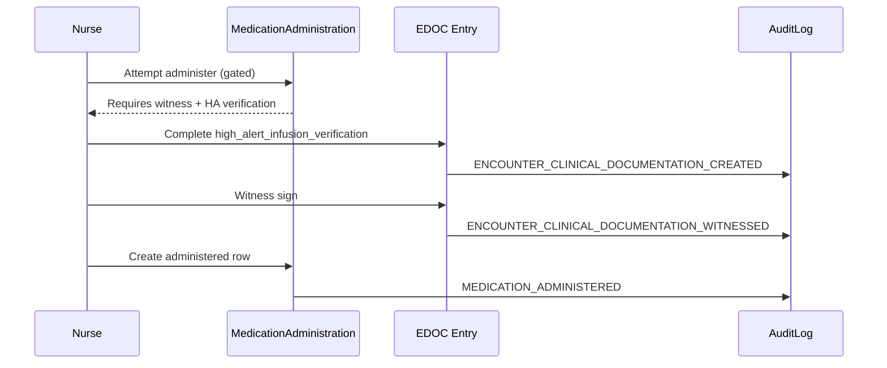

# MAR / eMAR — EDOC Integration Design (M1.3F)

**Phase:** M1.3F (audit + design only)  
**Date:** 2026-05-31  
**Prior art:** [medication-edoc-integration-audit.md](./medication-edoc-integration-audit.md) (M1.3A)

---

## Part 8 — EDOC integration for medication administration

EDOC is the **structured legal-chart documentation** layer. MAR is the **administration event log**. M1.3F requires explicit **cross-links** (`orderItemId`, `medicationProductId`, `medicationLabelSnapshot`) without merging the two stores.

---

## Integration matrix

| Medication governance domain | EDOC artifact | Witness policy | MAR link field | Current | Target (Phase 1) |
|-----------------------------|---------------|----------------|----------------|---------|-------------------|
| Dual signature | Witness on verification card | `DEFAULT_WITNESS_REQUIRED_CARD_IDS` | `orderItemId` in payload | **PARTIAL** | Required when `requiresDoubleSign` |
| Witness workflows | `ClinicalDocumentationWitnessSearchModal` | 8B immediate witness | Same | **SUPPORTED** | Extend to controlled admin |
| Cosign | `ENCOUNTER_NOTE_COSIGNED` | N/A (notes) | N/A | **SUPPORTED** | Optional order cosign (non-EDOC) |
| Medication waste | *Proposed:* `controlled_substance_waste` card | Witness required | `orderItemId`, waste amount | **MISSING** | New card M1.3F.4 |
| Override documentation | *Proposed:* `medication_administration_override` | Author only | reason code, orderItemId | **MISSING** | Audit + EDOC |
| Refusal documentation | Nursing refusal templates | Optional witness | marAction=refused | **PARTIAL** | Bind to MAR row id |
| Held medication | Nursing hold templates | Optional | *new HELD state* | **MISSING** | EDOC + MAR |
| Patient education | `patient_education` cards | No | N/A | **SUPPORTED** | Unchanged |
| High-alert administration | `high_alert_infusion_verification` | Yes (verification) | medicationType enum | **SUPPORTED** | Map `highAlertClass` from profile JSON |
| Controlled waste | *Backlog* EDOC.8B candidate | Witness | waste qty | **MISSING** | M1.3F.4 |
| Legal chart visibility | `EncounterClinicalDocumentationEntry` | Signed entries | category=MEDICATION | **SUPPORTED** | Cross-ref MAR id in metadata |
| Immutable audit | `ENCOUNTER_CLINICAL_DOCUMENTATION_CREATED` | N/A | entry id | **SUPPORTED** | Add med-specific actions |

---

## Card catalog (proposed additions)

| cardId | Category | Witness default | Trigger (profile / MAR) |
|--------|----------|-----------------|-------------------------|
| `high_alert_infusion_verification` | MEDICATION | Yes | HA class + infusion route (exists) |
| `high_alert_infusion_initiation` | MEDICATION | Configurable | HA + infusion start |
| `high_alert_infusion_titration` | MEDICATION | If second checker | Titration events |
| `controlled_substance_waste` | MEDICATION | Yes | `REQUIRES_WASTE_DOCUMENTATION` |
| `controlled_substance_administration` | MEDICATION | If Schedule II/III | Controlled + administered |
| `medication_administration_override` | MEDICATION | No | Override audit flag |
| `medication_refusal_documentation` | MEDICATION | Optional | marAction=refused |
| `medication_hold_documentation` | MEDICATION | Optional | state=HELD |

---

## Field mapping — safety profile → EDOC.8

| M1.3D / profile source | EDOC.8 field | Notes |
|------------------------|--------------|-------|
| `highAlertCategories.highAlertClass` | `medicationType` | Map enum → insulin / anticoagulant / vasopressor / … |
| `REQUIRES_INDEPENDENT_DOUBLE_CHECK` | `independentDoubleCheckPerformed` | Verification card |
| `REQUIRES_WITNESS` | Witness capture (EDOC.8B) | Before finalize |
| M1.3C `requiresDoubleSign` | Witness or dual sign policy | Schedule II opioids |
| M1.3E `lasaSeverity` | *Proposed* `lasaAcknowledged` | New field on override card |

---

## Facility policy extension (JSON)

Extend `Facility.clinicalDocumentationWitnessPolicyJson`:

```json
{
  "witnessRequiredMedicationClasses": [
    "HIGH_ALERT_INSULIN",
    "HIGH_ALERT_VASOPRESSOR",
    "HIGH_ALERT_ANTICOAGULANT"
  ],
  "controlledWasteWitnessRequired": true,
  "controlledScheduleRequiringWitness": ["II", "III"],
  "highAlertInfusionTypesRequiringWitness": [
    "insulin",
    "vasopressor",
    "anticoagulant",
    "sedative"
  ],
  "lasaHighRequiresSecondRead": true
}
```

---

## EDOC ↔ MAR sequence (controlled opioid example)



---

## Out of scope (EDOC)

- Smart pump library verification (EDOC.8A backlog)
- National e-prescribing (EPCS) — separate program
- Pharmacy verification queue UI (Part 10 — non-EDOC)

---

## Part 8 verdict

| Area | Status |
|------|--------|
| HA infusion EDOC | **SUPPORTED** |
| Witness infrastructure | **SUPPORTED** |
| Controlled waste / override | **MISSING** |
| MAR↔EDOC linkage | **PARTIAL** — design required in M1.3F.3+ |
