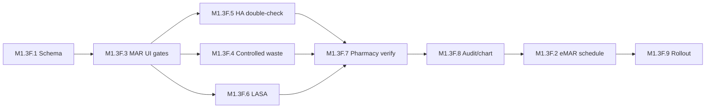

# MAR / eMAR — Implementation Roadmap (M1.3F)

**Phase:** M1.3F (audit + design only)  
**Date:** 2026-05-31  

---

## Part 13 — Recommended future phases

| Phase | Objective | Risk if skipped | Migration likely? | Seed likely? | Dependencies |
|-------|-----------|-----------------|-------------------|--------------|--------------|
| **M1.3F.1** | MAR/eMAR schema design — verify table, waste fields, MAR states, audit enum | Cannot enforce governance | **Yes** — `PharmacyVerification`, optional `MedicationAdministration` extensions | **No** (runtime flags) | M1.3C–E profiles |
| **M1.3F.2** | MAR scheduling engine — due times, MISSED/DUE | Wrong-time errors persist | **Maybe** — `MedicationAdministrationSchedule` table | **No** | M1.3F.1 |
| **M1.3F.3** | Medication administration documentation — gates, badges, hold/refuse | Flags invisible to nurses | **Minimal** — use existing MAR | **No** | M1.3F.1, web i18n |
| **M1.3F.4** | Controlled substance waste & witness workflow | Regulatory exposure | **Maybe** — waste linkage table | **No** | M1.3C, EDOC cards |
| **M1.3F.5** | High-alert double-check workflow | INSULIN/heparin incidents | **Minimal** | **No** | M1.3D, EDOC.8 |
| **M1.3F.6** | LASA warning workflow | Look-alike errors | **Minimal** | **No** | M1.3E |
| **M1.3F.7** | Pharmacy verification queue | Unverified high-risk orders | **Yes** — verify record | **No** | Pharmacy worklist |
| **M1.3F.8** | Legal chart / audit integration | Incomplete legal record | **Maybe** — audit enum | **No** | Chart export |
| **M1.3F.9** | Production rollout — training, SOP, pilot metrics | Governance unused | N/A | Optional backfill verify | All above |

---

## Suggested sequencing

**Rationale:** Deliver **visible nurse value** (F3 badges + gates) before **eMAR scheduling** (F2). Haiti MVP may defer F2 until inpatient ward scale requires it.

---

## Per-phase deliverables (summary)

### M1.3F.1 — Schema design
- ERD: OrderItem ↔ Verify ↔ MAR ↔ Waste
- Migration proposal doc (no apply in design phase)
- Map M1.3C–E fields to runtime gates

### M1.3F.2 — Scheduling engine
- Due list API + `MEDICATION_ADMINISTRATION_SCHEDULED` audit
- PRN vs scheduled rules

### M1.3F.3 — Administration documentation
- French UI badges (HA / controlled / LASA)
- Block or warn on `MedicationAdministration` create
- Hold/refuse reason codes

### M1.3F.4 — Controlled waste & witness
- EDOC `controlled_substance_waste` card
- MAR WASTED state + witness user id (schema TBD)
- Link to M1.3C schedule

### M1.3F.5 — High-alert double-check
- Enforce `REQUIRES_INDEPENDENT_DOUBLE_CHECK` via EDOC or inline second RN
- Map `highAlertCategories` to EDOC medicationType

### M1.3F.6 — LASA workflow
- `LASA_WARNING_ACKNOWLEDGED` before administer when `lasaGroupId` set
- Group banner in MAR grid

### M1.3F.7 — Pharmacy verification
- Verify mutation + worklist column
- ED override with audit

### M1.3F.8 — Audit / legal chart
- Extend `AuditAction` or metadata convention
- Chart export governance summary section

### M1.3F.9 — Production rollout
- Pilot checklist (Haiti clinic)
- Metrics: % verified, % HA double-check, % waste documented
- **NOT SAFE** for enterprise until metrics green

---

## Relationship to M1.3G+ (prior roadmap)

| Prior doc phase | M1.3F mapping |
|-----------------|---------------|
| M1.3F (old roadmap: EDOC enablement) | Split into F4, F5, EDOC integration doc |
| M1.3G (audit actions) | **M1.3F.8** |
| M1.3H (production) | **M1.3F.9** |

---

## Authorization

| Item | M1.3F |
|------|-------|
| Implementation | **Not authorized** (design only) |
| Next authorized implementation | **M1.3F.1** after stakeholder sign-off |
