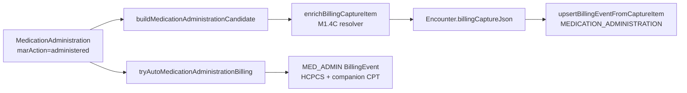

# Medication Administration Charge Capture Hardening (M1.4C)

**Program:** Enterprise Medication Billing & Revenue Integrity  
**Phase:** M1.4C — Medication Administration Charge Capture Hardening  
**Date:** 2026-06-02  
**Scope:** MAR → billing capture reliability using M1.4B mappings — **no** production deployment, catalog expansion, claim engine redesign, infusion rule engine, pharmacy queue, barcode, or eMAR scheduling.

**Authority:** M1.4A audit · M1.4B mapping remediation · M1.3F governance workflows (unchanged)

---

## Executive summary

| Area | Before M1.4C | After M1.4C |
|------|--------------|-------------|
| MAR billing source resolution | Ad hoc: `BillingCatalog` loop in auto-billing; catalog `billingCodeDefault` only in enrichment | **Unified resolver** with documented priority |
| Capture HCPCS / NDC on `MEDICATION_ADMINISTRATION` | Partial enrichment (catalog default only) | Resolver applies HCPCS, NDC, quantity unit, revenue code, source metadata |
| Non-administered MAR billing | Guarded in auto-billing | Shared `isMedicationAdministrationBillableMarAction` + resolver returns null |
| Package / product billing profiles | Seeded in M1.4B, unused at runtime | **Read** as priority 3–4 fallback |
| Duplicate capture | `upsertBillingCaptureItem` by `(sourceType, sourceId)` | Unchanged + `appendBillingEventIfNotExists` for `MED_ADMIN` ledger |
| **SAFE / NOT SAFE** | Conditional | **SAFE (conditional)** |

---

## Part 1 — Charge capture audit (baseline)

### Runtime billing path (administered MAR)

### Files

| Role | Path |
|------|------|
| MAR write + capture candidate | `apps/api/src/medication-administration/medication-administration.service.ts` |
| Capture append + idempotency | `apps/api/src/billing/billing-capture.append.util.ts` |
| Capture enrichment | `apps/api/src/billing/billing-capture.enrichment.ts` |
| **M1.4C resolver** | `apps/api/src/billing/medication-administration-billing-resolve.util.ts` |
| Auto catalog billing | `apps/api/src/billing/billing-auto-append.util.ts` |
| Catalog map lookup | `apps/api/src/billing/billing-map-from-event.util.ts` |
| Admin CPT companion | `apps/api/src/billing/medication-admin-cpt.util.ts` |
| Capture builders | `packages/shared/src/billingCaptureV1.ts` |
| MAR billable guard | `packages/shared/src/medication/medicationAdministrationMarBilling.ts` |
| Ledger sync | `apps/api/src/billing/billing-ledger.sync.ts` |
| Export | `apps/api/src/billing/external-billing-export.service.ts` |

### Pre-M1.4C gaps (addressed)

| Gap | M1.4C fix |
|-----|-----------|
| Enrichment ignored package/product profiles | Resolver reads `MedicationBillingProfile` |
| Auto-billing and enrichment used different logic | Both call `resolveMedicationAdministrationBilling` |
| No capture metadata for mapping source | `medicationBillingSource`, `medicationBillingManualReviewReason` on capture JSON |
| NDC only from catalog in enrichment | MAR snapshot → package → catalog chain |

### Safe implementation boundary

| In scope | Out of scope |
|----------|--------------|
| Resolver + enrichment + auto-billing wiring | Claim generation / export logic changes |
| Read-only profile / catalog joins | Catalog or seed writes |
| Capture JSON metadata | Governance workflow changes |
| Tests + docs | Infusion billing rule engine (M1.4D) |

---

## Part 2 — MAR → billing capture hardening

When `marAction === administered` (and not `skipBillingCaptureCandidate`):

1. `buildMedicationAdministrationCandidate` creates `MEDICATION_ADMINISTRATION` capture row (idempotent upsert).
2. `enrichBillingCaptureItem` runs M1.4C resolver → sets HCPCS, NDC, billing metadata.
3. `upsertBillingEventFromCaptureItem` syncs ledger (best-effort).
4. `tryAutoMedicationAdministrationBilling` creates `MED_ADMIN` catalog line when mapped (idempotent).

**Not billed:** `refused`, `not_available`, `md_changed`, infusion START rows (`skipBillingCaptureCandidate`), governance-only rows.

---

## Part 3 — Billing source resolution priority

Implemented in `resolveMedicationAdministrationBilling`:

| Priority | Source | `medicationBillingSource` |
|----------|--------|---------------------------|
| 1 | `CatalogMedication.billingCodeDefault` | `CATALOG_BILLING_CODE_DEFAULT` |
| 2 | `BillingCatalog` (`triggerSource: MEDICATION`) via M1.4B keys | `BILLING_CATALOG_MEDICATION` |
| 3 | Linked `MedicationPackage` → active `MedicationBillingProfile` | `MEDICATION_PACKAGE_PROFILE` |
| 4 | `MedicationProduct` default package profile | `MEDICATION_PRODUCT_PROFILE` |
| 5 | Unmapped | `MANUAL_REVIEW` + reason on capture |

**NDC chain:** MAR `ndc11Snapshot` → package → product default package → catalog.

No invented codes. Unmapped → `UNMAPPED` internal line on `MED_ADMIN` auto path only (existing fallback).

---

## Part 4 — Administration CPT companion readiness

| Capability | Status |
|------------|--------|
| IM / SC (`96372`) via route text | **READY** — `inferMedicationAdministrationCpt` |
| IV push / bolus (`96374`) | **READY** |
| IV infusion initial / additional hour | **NOT READY** — deferred M1.4D |
| Hydration administration codes | **PARTIAL** — drug HCPCS only; hydration admin CPT deferred |
| Vaccine administration | **READY** — separate `VACCINE_ADMINISTRATION` path (unchanged) |

Companion CPT attached to `MED_ADMIN` auto line when drug mapping is HCPCS.

---

## Part 5 — Waste billing readiness

| Finding | Handling |
|---------|----------|
| `MedicationWasteDocumentation` exists (M1.3F) | **No auto-bill** in M1.4C |
| Waste vs administration | Administration charge from MAR `administered` only |
| Waste billing policy | **PASS WITH OBSERVATIONS** — document manual review; future phase |

Waste must not duplicate administration capture (different source types / no waste hook added).

---

## Part 6 — Governance-sensitive billing

Governance workflows (witness, double-check, LASA, pharmacy verify) **unchanged**. Billing uses administered medication facts after governance gates pass.

| Check | Result |
|-------|--------|
| Governance blocks billing capture append | **No** |
| Non-administered governance paths bill | **No** |
| Controlled / high-alert administered injectables resolve HCPCS | **Yes** (via M1.4B + resolver) |

**Verdict:** **PASS**

---

## Part 7 — Rollback considerations

- Revert `medication-administration-billing-resolve.util.ts` and enrichment/auto-billing wiring.
- Capture JSON fields `medicationBillingSource` / `medicationBillingManualReviewReason` are additive — old readers ignore them.
- No migration. No seed changes.

---

## Part 8 — Next phase

**M1.4D — Infusion Billing Governance** — infusion hour CPT, duration rules, hydration vs therapeutic automation (deferred from M1.4C).

---

## Validation

See [medication-charge-capture-validation.md](./medication-charge-capture-validation.md).
