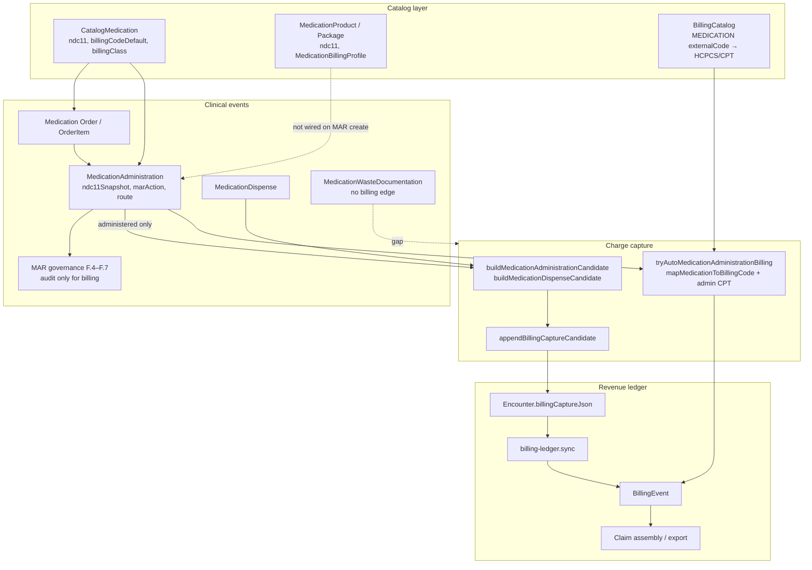

# Medication Billing & Coding Audit (M1.4A)

**Program:** Enterprise Medication Billing & Revenue Integrity  
**Phase:** M1.4A — audit only  
**Date:** 2026-06-02  
**Constraints:** No migrations, seeds, production writes, catalog changes, or code changes.

**Related:** [medication-revenue-integrity-audit.md](./medication-revenue-integrity-audit.md) · [medication-billing-readiness.md](./medication-billing-readiness.md) · [medication-governance-production-rollout-audit.md](./medication-governance-production-rollout-audit.md)

---

## Executive summary

| Part | Topic | Verdict |
|------|-------|---------|
| 1 | Billing architecture inventory | **PASS** |
| 2 | NDC | **PARTIAL** |
| 3 | HCPCS & J-code | **PARTIAL** |
| 4 | Medication administration billing | **PARTIAL** |
| 5 | Infusion billing | **PARTIAL** |
| 6 | Pharmacy billing | **PARTIAL** |
| 7 | Controlled substance billing | **PARTIAL** |
| 8 | Revenue leakage | **MEDIUM** risk |
| 9 | Enterprise readiness | See readiness doc |
| 10 | Foundation decision | **VERIFIED (clinic MVP)** / **NOT VERIFIED (enterprise)** |
| 11 | Next phase | **M1.4B — Medication Billing Mapping Remediation** |

---

## Part 1 — Billing architecture inventory

### Inventory table

| Capability | Status | Primary implementation |
|------------|--------|----------------------|
| Medication billing services | **Present** | `billing-auto-append.util.ts` (`tryAutoMedicationAdministrationBilling`) |
| Charge capture services | **Present** | `billing-capture.append.util.ts`, `buildMedicationAdministrationCandidate`, `buildMedicationDispenseCandidate` |
| BillingCaptureV1 integration | **Present** | `packages/shared/src/billingCaptureV1.ts`; encounter `billingCaptureJson` |
| Revenue capture workflows | **Present** | Capture candidates → `billing-ledger.sync.ts` → `BillingEvent` |
| NDC infrastructure | **Present** | `normalizeNdc`, catalog/MAR/dispense snapshots, `MedicationPackage.ndc11` |
| HCPCS infrastructure | **Present** | `BillingCatalog` (trigger `MEDICATION`), `billingCodeDefault`, `MedicationBillingProfile.hcpcsCodeSuggested` |
| J-code infrastructure | **Partial** | HCPCS J-codes via same fields; no separate J-code engine |
| Medication administration billing | **Present** | MAR create → capture + auto catalog map |
| Infusion billing | **Partial** | START/STOP MAR, duration evidence, `suggestInfusionBilling`; manual review default on STOP |
| Pharmacy billing | **Partial** | Dispense → `MEDICATION_DISPENSE` capture; no dispensing fee codes |
| Waste billing | **Absent** | `MedicationWasteDocumentation` (M1.3F) — no billing hook |
| Controlled-substance billing | **Partial** | Same as MAR; schedule not on billing lines |
| MAR/eMAR billing hooks | **Partial** | MAR administered only; no eMAR schedule billing |
| Billing map layer | **Present** | `billing-map-from-event.util.ts` → `BillingCatalog` |
| CPT administration companion | **Present** | `medication-admin-cpt.util.ts` (96372/96374) with HCPCS lines |
| Claim / export | **Present** | `claim-builder.service.ts`, `external-billing-export.service.ts` |
| Governance ↔ billing | **Decoupled** | M1.3F governance does not block or enrich billing (by design in F phases) |

**Part 1: PASS** — architecture exists end-to-end for clinic MVP; several enterprise lanes are stubs.

### Architecture diagram

---

## Part 2 — NDC audit

### Fields & tables

| Layer | NDC support | Evidence |
|-------|-------------|----------|
| `CatalogMedication` | `ndc11`, `ndcDisplay`, `billingUnitType` | `schema.prisma` |
| `MedicationPackage` | `ndc11`, `ndcDisplay` | Phase 19B master |
| `MedicationAdministration` | `ndc11Snapshot`, `ndcDisplaySnapshot` | ER-3 migration |
| `MedicationDispense` | `ndc11Snapshot`, `ndcDisplaySnapshot` | ER-3 migration |
| Normalization | `normalizeNdc` (`@medora/shared`) | MAR create accepts optional `ndc` on DTO |
| MAR resolution order | User NDC → catalog `ndc11` | `medication-administration.service.ts` |
| Billing capture | `ndc11` / `ndcDisplay` on candidates | `billingCaptureV1.ts` |
| Enrichment backfill | From catalog if missing on item | `billing-capture.enrichment.ts` |

### Integration

| Workflow | NDC on clinical row | NDC on billing candidate |
|----------|--------------------|-------------------------|
| Order create | Optional on catalog only | No |
| MAR administer | Snapshot at create | Yes (from snapshot) |
| Pharmacy dispense | Snapshot on dispense | Yes |
| Product/package pick | Schema ready | **Not wired** to MAR (`medicationProductId` null at runtime) |

### Coverage estimate (code + seed design, not production SQL)

| Metric | Estimate | Basis |
|--------|----------|--------|
| Haiti catalog rows with NDC in seed data | **Partial** | `medication-ndc-mappings.ts` + coverage report script (operator-run) |
| MAR rows with `ndc11Snapshot` | **Low–medium** | Depends on catalog NDC + nurse entry |
| Package-level NDC | **Schema only** until product activation | 19B master |

### Issues

| Issue | Severity |
|-------|----------|
| Dual catalog: legacy `CatalogMedication` vs `MedicationPackage` | Medium |
| No automatic NDC from `MedicationPackage` on MAR | Medium |
| Orphan: package NDC without legacy catalog link | Low (future) |

**Part 2: PARTIAL**

---

## Part 3 — HCPCS & J-code audit

### Support model

- **HCPCS** = primary drug code path (`BillingCatalog.system = HCPCS`, capture `hcpcsCode`).
- **J-codes** = subset of HCPCS (`Jxxxx` in seed examples); no separate J-code validator or unit calculator.
- **Administration CPT** = companion on HCPCS lines via `inferMedicationAdministrationCpt` (push/IM/SQ only).

### Coverage matrix

| Dimension | Status | Notes |
|-----------|--------|-------|
| J-codes present in seed | **Yes (sample)** | `MED_CODE_TO_HCPCS` — **4** explicit medication mappings in `billing-catalog-common.ts` |
| J-codes mapped via `BillingCatalog` | **Partial** | Requires `seed-billing-catalog` + catalog `code` match |
| `billingCodeDefault` on catalog | **Field exists** | Not populated in Haiti seed helper (grep: no assignment in `seed-haiti-medication-catalog`) |
| `MedicationBillingProfile.hcpcsCodeSuggested` | **Schema** | Per package; `requiresManualReview` default true |
| Injectable billing | **Partial** | Route-based CPT companion; infusion CPT not auto-assigned |
| Infusion drug HCPCS | **Manual** | Infusion STOP flags manual payer review |
| Administration billing | **Partial** | 96372/96374 when route explicit |
| Revenue linkage | **Yes** | `BillingEvent` + ledger sync |

### J-code gaps

- ~260 Haiti medications vs **4** seeded HCPCS map keys → **~98%+ unmapped** in auto engine without remediation.
- Catalog `billingCodeDefault` not systematically backfilled.
- No J-code **unit** math (e.g. per-10-mg) in capture — `units` often null on med lines.

**Part 3: PARTIAL**

---

## Part 4 — Medication administration billing audit

### Event → billing capability

| Clinical event | Billing capture candidate | Auto `BillingEvent` | Notes |
|----------------|---------------------------|---------------------|-------|
| Medication ordered | **No** | **No** | Med orders do not use `buildOrderItemCandidate` (CARE only) |
| Medication administered | **Yes** | **Yes** (if map/fallback) | `marAction === administered` |
| Medication refused / held / N/A | **No** | **No** | Correct — no administration charge |
| Medication wasted | **No** | **No** | Waste documented in M1.3F; **no billing path** |
| Medication infused (START) | **No** | **No** | `skipBillingCaptureCandidate` on START |
| Medication infused (STOP) | **Yes** | **Optional** | Duration + `suggestInfusionBilling`; manual review flag |
| Medication discontinued | **No** | **No** | Order cancel — no med-specific charge |
| Governance override | **No** | **No** | Audit only |
| Pharmacy verified | **No** | **No** | Verification is clinical gate, not billable event |
| eMAR scheduled dose | **N/A** | **N/A** | eMAR not implemented |

### Dual pipeline (important)

On each **administered** MAR:

1. `appendBillingCaptureCandidate` → `MEDICATION_ADMINISTRATION` item on encounter JSON.
2. `tryAutoMedicationAdministrationBilling` → `MED_ADMIN` `BillingEvent` from `BillingCatalog`.

Both can exist; idempotency keys differ (`administrationId` per module). Reviewers may see duplicate **needs_review** lines — operational nuance, not missing capture.

**Part 4: PARTIAL**

---

## Part 5 — Infusion billing audit

| Capability | Status | Evidence |
|------------|--------|----------|
| IV push route CPT | **Partial** | Route contains `push`/`bolus` → 96374 |
| IV infusion session | **Yes** | `infusionSessionKey`, START/STOP MAR phases |
| Continuous infusion | **Partial** | Duration on STOP; no automatic 96365/96366/96367 selection |
| Weight-based infusion | **No** | No weight-based unit engine |
| High-alert infusion | **Clinical** | EDOC + MAR governance; billing uses generic infusion rules |
| Blood products | **No** | No blood-product billing class |
| Chemotherapy readiness | **No** | No chemo infusion billing program |
| Time-based billing | **Evidence only** | `infusionDurationMinutes` on capture item |
| Unit-based billing | **No** | `suggestInfusionBilling` suggests units object; not auto-applied to codes |
| Start/stop capture | **Yes** | `orders.service` infusion events + MAR |
| Revenue capture readiness | **Manual review** | `infusionDurationBillingManualReview` on STOP |

**Part 5: PARTIAL**

---

## Part 6 — Pharmacy billing audit

| Workflow | Charge support | Evidence |
|----------|----------------|----------|
| Dispense (inventory) | **Capture candidate** | `pharmacy-inventory.service` → `buildMedicationDispenseCandidate` |
| Dispense from order item | **Capture candidate** | `recordDispenseFromOrderItem` |
| Pharmacy verification | **No charge** | Clinical governance only (M1.3F.7) |
| Pharmacy queue | **Operational** | Not a billing module |
| Fulfillment / replacement / return | **Partial / none** | Dispense path only |
| Medication waste (pharmacy) | **No** | — |
| Future dispensing fee | **Schema hint** | `MedicationBillingProfile`; not runtime |
| Future inventory billing | **Inventory transactions** | Separate from charge capture |

**Part 6: PARTIAL**

---

## Part 7 — Controlled substance billing audit

| Dimension | Billing distinction | Verdict |
|-----------|---------------------|---------|
| Schedule II–IV on catalog | `controlledSchedule` | Clinical/governance only |
| Controlled administration | Bills as standard MAR if administered | **No schedule on line** |
| Waste | Documented, not billed | **Gap** |
| Witness / double-sign | Audit + governance tables | **Not on claim line** |
| Override | Audit | **Not on claim line** |
| Administered vs wasted vs returned vs cancelled | **Only administered** generates capture | Cannot distinguish waste $ on claim |

**Part 7: PARTIAL**

---

## Part 8 — Revenue leakage assessment

**Overall risk: MEDIUM** (HIGH for enterprise drug revenue; LOW–MEDIUM for clinic MVP with manual review).

### Leakage register

| # | Leakage point | Risk | Mechanism |
|---|---------------|------|-----------|
| 1 | Administered MAR with no `BillingCatalog` match | **High** | Fallback `UNMAPPED` / needs_review — easy to miss in busy clinic |
| 2 | No NDC on snapshot | **Medium** | Claim drug identity weak |
| 3 | Waste documented, never billed | **Medium** | `wastageBillable` on profile unused |
| 4 | Infusion START never billed | **Low** | By design; STOP should capture |
| 5 | Infusion STOP without automated HCPCS/CPT | **Medium** | Manual review only |
| 6 | Medication order placed, never administered | **Low** | Correct (no admin fee) |
| 7 | Pharmacy verify without dispense/MAR | **Low** | No fee model |
| 8 | Duplicate capture + auto event | **Low** | Review burden, not pure leakage |
| 9 | `billingCodeDefault` empty on most catalog rows | **High** | Enrichment cannot fill HCPCS |
| 10 | Product/package billing profile not wired | **High** | Enterprise path dormant |
| 11 | Refused/held documented as non-administered | **Low** | Correct |
| 12 | Manual MAR without `orderItemId` | **Medium** | Weaker catalog lookup |
| 13 | eMAR future | **N/A** | Scheduled doses not billed when due |

---

## Part 9 — Enterprise billing readiness

See [medication-billing-readiness.md](./medication-billing-readiness.md) for scores.

| Setting | Medication billing | Infusion billing | Pharmacy billing | Revenue integrity |
|---------|-------------------|------------------|------------------|-------------------|
| Clinic MVP (Haiti) | **62** | **48** | **55** | **58** |
| Urgent care | **58** | **45** | **52** | **55** |
| ER | **65** | **52** | **50** | **60** |
| Observation | **60** | **50** | **50** | **58** |
| Hospital / inpatient | **42** | **40** | **45** | **45** |
| Infusion center | **38** | **35** | **40** | **40** |
| Specialty clinic | **45** | **38** | **48** | **48** |

**Enterprise readiness (weighted): ~52/100 — Partial**

---

## Part 10 — Final audit decision

| Statement | Result |
|-----------|--------|
| **Medication Billing Foundation VERIFIED** | **Yes — clinic MVP scope** |
| **Medication Billing Foundation NOT VERIFIED** | **Yes — enterprise / payer-ready scope** |

### SAFE / NOT SAFE

| Scope | Verdict |
|-------|---------|
| Continue clinical + governance program on current billing hooks | **SAFE (conditional)** |
| Enterprise revenue integrity sign-off | **NOT SAFE** |
| Payer submission without manual coding review | **NOT SAFE** |

**Conditions:** Billing catalog remediation, NDC backfill, waste billing policy, infusion code rules, package/product wiring.

---

## Part 11 — Recommended next phase

### **M1.4B — Medication Billing Mapping Remediation** (recommended)

**Why before 4C/4D:**

1. **Highest leakage** is unmapped HCPCS/J-codes (~4 seed keys vs full Haiti catalog).
2. `billingCodeDefault` and `MedicationBillingProfile` exist but are not populated end-to-end.
3. Administration capture (4C) is already implemented; hardening without maps repeats `needs_review` noise.
4. Infusion governance (4D) depends on reliable drug + admin code pairs.

**M1.4C** (administration charge capture hardening) — second: dedupe capture vs `BillingEvent`, refuse-path clarity, chart billing display.

**M1.4D** (infusion billing governance) — third: automated infusion CPT/HCPCS rules after catalog maps stable.

---

## Verification method

- Static code trace: `apps/api/src/billing/**`, `medication-administration.service.ts`, `pharmacy-inventory.service.ts`, `packages/shared/src/billingCaptureV1.ts`, `infusionBillingRules.ts`
- Schema: `apps/api/prisma/schema.prisma`
- Seed design: `seed-billing-catalog.ts`, `billing-catalog-common.ts`, `seed-catalogs.ts` (not executed)
- No production DB queries in this audit
