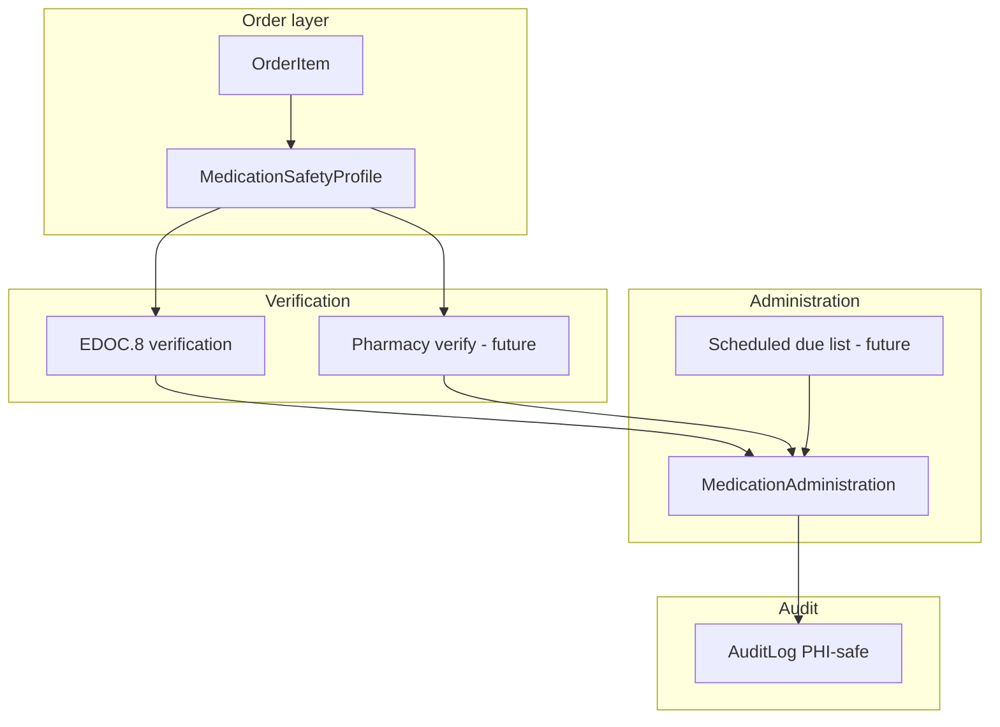
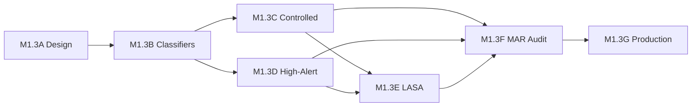

# Medication Governance Roadmap (M1.3A)

**Phase:** M1.3A (design only)  
**Date:** 2026-05-31  
**Authorization:** [medication-governance-authorization.md](./medication-governance-authorization.md)

---

## Part 8 — MAR / eMAR governance design

### 8.1 Current workflow audit

| Capability | Status | Notes |
|------------|--------|-------|
| Medication orders | **IMPLEMENTED** | `OrderItem` + catalog search |
| Medication administration | **IMPLEMENTED** | `MedicationAdministration` append-only |
| MAR | **PARTIAL** | `MedicationMarAction`: administered, refused, not_available, md_changed |
| eMAR | **NOT IMPLEMENTED** | No scheduled administration times / due list |
| Verification workflows | **PARTIAL** | EDOC.8 verification; no pharmacy verify queue |
| Infusion governance | **PARTIAL** | START/STOP phases, `infusionSessionKey` |
| Effective time correction | **IMPLEMENTED** | `effectiveAdministeredAt` + audit |

### 8.2 Future governance requirements by tier

| Requirement | MVP (now) | Phase 1 (M1.3 program) | Enterprise target |
|-------------|-----------|------------------------|-------------------|
| Catalog-backed orders | Yes | + safety profile flags | Canonical product primary |
| Dose/route on MAR | Yes (structured dose fields) | + max dose from profile | Hard stop on exceed |
| Frequency / PRN | No | Document in notes only | Structured sig |
| Scheduled eMAR due times | No | No | Yes |
| Pharmacy verification | No | Flag only (`requiresPharmacyVerification`) | Queue + audit |
| Independent double-check | EDOC.8 only | Profile-driven EDOC routing | MAR + EDOC |
| Controlled waste doc | No | EDOC card enabled | Inventory tie-in |
| Shift count | No | Flag only | Inventory module |
| LASA order warning | Soft only | Acknowledgment required | Block without override |
| High-alert override audit | No | `HIGH_ALERT_OVERRIDE` | Supervisor workflow |
| Med reconciliation | Home meds entry | Flag on profile | Full module |

### 8.3 MAR / eMAR architecture (target)

---

## Part 9 — Audit & legal record design

### 9.1 Proposed audit events

| Event | Required metadata (PHI-safe) | PHI guidance |
|-------|------------------------------|--------------|
| **MEDICATION_ORDER_CREATED** | `orderId`, `orderItemId`, `catalogCode` or `productCode`, `facilityId`, `encounterId`, `userId`, `controlledClass`, `highAlertClass` | No drug free-text labels |
| **MEDICATION_ORDER_MODIFIED** | Same + `changeType`, `fieldNames[]` | No before/after labels |
| **MEDICATION_ADMINISTERED** | `administrationId`, `marAction`, `orderItemId`, `conceptCode`, `routeCode`, `doseUnit` | No patient name |
| **MEDICATION_HELD** | `orderItemId`, `reasonCode` | Reason enum not free PHI |
| **MEDICATION_REFUSED** | `administrationId`, `marAction=refused` | — |
| **MEDICATION_WASTED** | `inventoryTransactionId`, `quantity`, `wasteReasonCode`, `witnessUserId` | — |
| **CONTROLLED_SUBSTANCE_OVERRIDE** | `overrideReasonCode`, `supervisorUserId`, `conceptCode`, `policyGate` | Required for bypass |
| **HIGH_ALERT_OVERRIDE** | Same pattern | — |
| **PHARMACY_VERIFIED** | `orderItemId`, `pharmacistUserId`, `verifiedAt` | Future |
| **MAR_ENTRY_CREATED** | `administrationId`, `infusionPhase` | Distinct from generic CREATE |
| **EMAR_ENTRY_CREATED** | `scheduledDoseId`, `administrationId` | Future |

### 9.2 Enum strategy

Extend `AuditAction` in a **single migration** during M1.3F (not M1.3A). Until then, map to `CREATE` / `UPDATE` with `metadata.eventType` (interim pattern used elsewhere).

### 9.3 Retention

- Append-only `MedicationAdministration` (existing).
- Append-only `EncounterClinicalDocumentationEntry` (existing).
- Audit logs facility-scoped with existing `AuditLog` model.

---

## Part 11 — Implementation roadmap (M1.3B–G)

### Phase sequence

| Phase | Name | Objective | Code | Migration | Seed/backfill |
|-------|------|-----------|------|-----------|---------------|
| **M1.3A** | Audit & design | Architecture only | No | No | No |
| **M1.3B** | Safety classifier implementation | Shared enums + validation at boundaries | Yes | Unlikely | No |
| **M1.3C** | Controlled substance implementation | Manifest + profile/catalog sync + gates | Yes | Maybe | Yes |
| **M1.3D** | High-alert implementation | HA manifest + badges + EDOC routing | Yes | Unlikely | Yes |
| **M1.3E** | LASA implementation | Groups, pairs, soft→persisted warnings | Yes | Maybe | Yes |
| **M1.3F** | MAR/eMAR governance architecture | Audit events, waste card, profile→workflow | Yes | Yes (audit enum) | No |
| **M1.3G** | Safety production rollout | Production validation + operator runbook | No* | No | Deploy only |

\*Scripts and read-only validation allowed.

### Sequencing rationale

1. **M1.3B first** — classifiers are shared dependencies for C/D/E.
2. **M1.3C before M1.3D** — controlled substances have regulatory priority; opioids overlap HA.
3. **M1.3D** — populates profiles and unlocks EDOC/search badges.
4. **M1.3E** — depends on stable concept IDs from C/D.
5. **M1.3F** — audit + MAR/EDOC wiring after flags exist.
6. **M1.3G** — production proof; no new features.

**Parallel track:** M1.5 search/alias can run after M1.3D without blocking C.

### Part 13 — Recommended immediate next phase

**M1.3B — Medication Safety Classifier Implementation**

Justification: M1.3A produced classifier specs but no shared constants or validation; B unblocks C and D without data migration risk.

---

## Dependency diagram

---

## Related program phases (outside M1.3)

| Phase | Relationship |
|-------|--------------|
| M1.2 Taxonomy | Route/form normalization — feeds MAR accuracy |
| M1.5 Search | Alias disambiguation — parallel after M1.3D |
| M1.6 Architecture consolidation | Legacy↔canonical cutover — after M1.3G |
