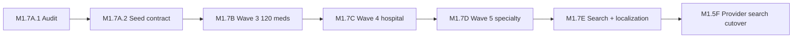

# Medication Localization Roadmap (M1.7A.1)

**Date:** 2026-06-03  
**Decision:** **Separate localization before Wave 3 at the contract level; full DB separation before 600+ medications**

---

## Recommendation summary

| Approach | Verdict | Timing |
|----------|---------|--------|
| **Audit only** | ✅ Complete (M1.7A.1) | Now |
| **Partial remediation (seed contract)** | ✅ **Required before M1.7B** | M1.7A.2 (proposed) |
| **Full separation (localization table + search)** | ✅ **Required before M1.5F cutover** | **M1.7E** |
| **Defer all separation** | ❌ Not recommended | — |

---

## Relative timing vs formulary waves



| Phase | Relationship to localization |
|-------|------------------------------|
| **M1.7A.1** | Audit — **this document set** |
| **M1.7A.2** (proposed) | Manifest validator: required `displayNameEn`/`Fr`, alias `language`, no EN←FR copy |
| **M1.7B** | Wave 3 seeds **must** follow contract (Option A) |
| **M1.7C** | Hospital IV rows: EN labels for MAR/pharmacy; FR for product UI |
| **M1.7D** | Specialty/onc: bilingual display critical for consent forms |
| **M1.7E** | **Full separation** + search normalization (parallel to early Wave 4 OK) |
| **M1.5F** | **Blocked** until concept + catalog localization stable |

---

## M1.7A.2 — Proposed partial remediation (no Wave 3 yet)

Deliverables (planning):

1. `enterpriseFormularyLocalizationContract.ts` — shared validation  
2. Extend Wave 1/2 manifest checks in CI  
3. Document alias language rules in seed helpers  
4. Optional: split `searchText` builder into `buildMedicationSearchText({ en, fr })`  
5. Read-only audit script: flag rows where `displayNameEn` equals `displayNameFr` AND contains French diacritics/words  

**No Prisma migration in M1.7A.2.**

---

## M1.7E — Full separation scope

| Work item | Effort |
|-----------|--------|
| `MedicationCatalogLocalization` table (or equivalent) | Medium |
| Backfill 364 active + enterprise 134 | Medium |
| API: locale param on medication search | Medium |
| Ranking: locale-first match tier | Low |
| Concept localization | Medium |
| Deprecate web French→English patch map | Low |

---

## Migration impact estimate

| Inventory | Rows | Localization debt if no contract |
|-----------|-----:|----------------------------------|
| Current active catalog | 364 | Medium (EN/FR display exist; search mixed) |
| Wave 3 | +120 | **High if uncontrolled** |
| Wave 4 | +200 | Very high |
| Wave 5 | +250 | Critical |
| **Total ~1000** | ~1000 | **Full migration 3–5× cost vs doing contract at 325** |

**Migration required eventually?** **YES** for Option B/C.  
**Seed required for remediation?** **YES** for backfill and alias language normalization — **not** in M1.7A.1.

---

## GO / NO-GO for Wave 3

| Gate | Required |
|------|----------|
| M1.7A.1 audit complete | ✅ |
| M1.7A.2 seed contract in CI | **Before M1.7B implementation** |
| Full localization table | **Before 600 codes OR before M1.5F** |

**Wave 3 may proceed** after **M1.7A.2 contract only** — full table migration can trail by one wave if search builders are bilingual-aware.

---

## Validation (M1.7A.1)

| Command | Result |
|---------|--------|
| `pnpm --filter @medora/api exec prisma validate` | PASS |
| `pnpm --filter @medora/api run build` | PASS |
| `pnpm verify:web` | PASS |

---

## Git commands (docs only)

```bash
git add \
  docs/medications/medication-localization-audit.md \
  docs/medications/medication-localization-risk-register.md \
  docs/medications/medication-localization-target-architecture.md \
  docs/medications/medication-localization-roadmap.md

git commit -m "$(cat <<'EOF'
Document M1.7A.1 medication localization separation audit and target architecture.

Recommend localization seed contract before Wave 3 and full separation by M1.7E to avoid compounding mixed searchText across 600–1000+ medications.
EOF
)"

git push origin HEAD
```
