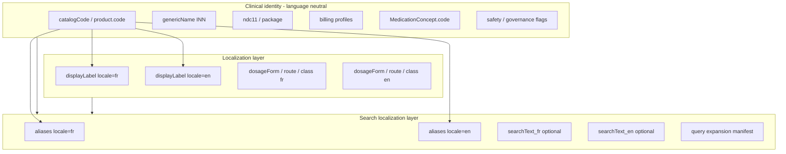

# Medication Localization — Target Architecture (M1.7A.1)

**Status:** Design only — **not implemented**  
**Goal:** Align medication with imaging separation: **clinical identity** vs **localization** vs **search localization**

---

## Layer model



---

## Option A — Minimal (M1.7B seed contract, no migration)

**Keep** `CatalogMedication` table; enforce:

| Rule | Requirement |
|------|-------------|
| `code` + `genericName` | Required; language-neutral |
| `displayNameFr` | Required for Haiti-facing product |
| `displayNameEn` | Required for enterprise CREATE |
| `name` | Set `= displayNameFr` for compat only |
| `searchText` | Build from **both** locales explicitly: `searchText_en`, merged legacy `searchText` = concat for backward compat OR split columns later |
| `MedicationAlias` | Every alias **must** set `language` ∈ `{fr, en}` |
| Wave 3 seed | No French copied into `displayNameEn` |

**Pros:** No migration; unblocks Wave 3 quickly.  
**Cons:** `searchText` still mixed; concept layer still single `displayName`.

---

## Option B — Catalog localization table (recommended medium-term)

New table (name illustrative):

```prisma
model MedicationCatalogLocalization {
  id                  String            @id @default(uuid())
  catalogMedicationId String
  locale              String            @db.VarChar(8)  // fr | en
  displayName         String
  dosageFormLabel     String?
  routeLabel          String?
  therapeuticClassLabel String?
  searchText          String?
  catalogMedication   CatalogMedication @relation(...)

  @@unique([catalogMedicationId, locale])
}
```

`CatalogMedication` retains identity + billing fields only.  
Deprecate `displayNameFr` / `displayNameEn` / `name` over time (read-through view).

**Pros:** Clean separation; matches `TermClassifierLabel` mental model.  
**Cons:** Migration for 364+ rows; API mapper updates.

---

## Option C — Full separation (M1.7E)

Option B plus:

| Addition | Purpose |
|----------|---------|
| `MedicationConceptLocalization` | Split concept `displayName` by locale |
| `MedicationSearchAlias` policy | `language` required; search filters by user locale + fallback EN |
| Locale-aware `matchTierForQuery` | Prefer matches in active UI locale |
| Remove web `FRENCH_TO_ENGLISH_MEDICATION_LABELS` hack | Data carries EN metadata labels |
| RxNorm / normalization manifest | Shared `enterpriseMedicationSearchNormalization.ts` |

---

## Search localization rules (target)

1. **Query expansion** — locale-specific manifest slices (EN brands, FR common names).  
2. **Alias lookup** — `WHERE language IN (userLocale, 'en')` with fallback.  
3. **Ranking** — tier match on locale-appropriate `displayName` first; then cross-locale.  
4. **No duplicate rows** — one catalog ID per result (unchanged).  
5. **Provider search cutover (M1.5F)** — canonical read returns locale labels from concept localization.

---

## API contract (target DTO)

`CatalogSearchItemDto` already has `displayNameFr`, `displayNameEn`. Target:

- Server selects `primaryDisplayLabel` by `Accept-Language` or `?locale=fr` (optional query param).  
- Client simplification: single `displayLabel` + `locale` echo.  
- **Backward compatible:** keep both fields through M1.7D.

---

## Wave seed template (M1.7B+)

```typescript
// Identity (neutral)
catalogCode, genericName, ndc11, administrationType, billingClass

// Localization
displayNameFr: "Amlodipine"   // product French
displayNameEn: "Amlodipine"   // INN English
dosageFormFr / dosageFormEn OR localization table

// Search
aliases: [
  { text: "Norvasc", language: "en", type: "BRAND" },
  { text: "amlodipine", language: "en", type: "GENERIC" },
]
searchTextEn: "amlodipine norvasc 5 mg tablet oral"
searchTextFr: "amlodipine 5 mg comprimé orale"
```

---

## What NOT to localize

- `catalogCode` / `product.code`  
- `genericName` (INN)  
- NDC, HCPCS, CVX (vaccines)  
- Governance markers, pilot markers  
- `legacyCatalogMedicationId`  
- Billing math units  

---

## Recommended path

| Phase | Deliverable |
|-------|-------------|
| **M1.7A.1** | This audit (complete) |
| **M1.7A.2** (proposed) | Localization seed contract + linter on manifests |
| **M1.7B** | Wave 3 with Option A rules |
| **M1.7E** | Option B/C + search locale ranking |
| **M1.5F** | Provider search cutover only after concept localization |
