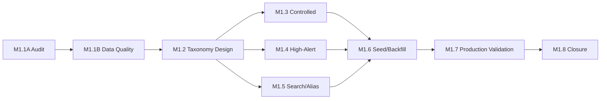

# Medication Program Roadmap — Phase M1.1A

**Program:** Enterprise Medication Inventory & Architecture Audit  
**Phase:** M1.1A defines roadmap only (no implementation)  
**Date:** 2026-05-31  
**Prerequisite audit:** [medication-inventory-architecture-audit.md](./medication-inventory-architecture-audit.md)

---

## Program objective

Establish **enterprise medication governance** for Medora-S Haiti clinic MVP without disrupting Phase 1 clinical workflows. Reuse the existing **263-row Haiti seed** and **CatalogMedication** runtime path; evolve canonical master (`MedicationConcept` / `MedicationProduct`) deliberately.

---

## Phase overview

| Phase | Name | Risk | Code | Migration likely | Seed/backfill likely |
|-------|------|------|------|------------------|----------------------|
| **M1.1A** | Inventory & Architecture Audit | Low | No | No | No |
| **M1.1B** | Medication Data Quality Audit | Medium | No* | No | No |
| **M1.2** | Medication Taxonomy Design | Medium | No* | Maybe (design) | No |
| **M1.3** | Controlled Substance Governance | High | Yes | Maybe | Yes |
| **M1.4** | High-Alert Medication Governance | High | Yes | Maybe | Yes |
| **M1.5** | Medication Alias/Search Governance | Medium | Yes | Unlikely | Yes |
| **M1.6** | Medication Seed/Backfill Implementation | High | Yes | Maybe | Yes |
| **M1.7** | Production Validation | Medium | No* | No | Maybe (deploy only) |
| **M1.8** | Program Closure | Low | No | No | No |

\*Scripts and read-only SQL allowed without product code changes.

---

## M1.1A — Inventory & Architecture Audit ✅

**Objective:** Inventory catalog, architecture, seed, search, orders; decide reuse vs rebuild.

**Deliverables:**

- [medication-inventory-architecture-audit.md](./medication-inventory-architecture-audit.md)
- [medication-source-inventory.md](./medication-source-inventory.md)
- [medication-governance-gap-analysis.md](./medication-governance-gap-analysis.md)
- [medication-program-roadmap.md](./medication-program-roadmap.md)

**Outcome:** Reuse existing directory; seed architecture **SAFE (conditional)**.

---

## M1.1B — Medication Data Quality Audit

**Objective:** Production (and staging) read-only metrics: row counts, duplicate groups, missing generic/EN, controlled coverage, alias coverage, import drift vs `HAITI_MEDICATION_CATALOG`.

**Deliverables:**

- Data quality report with severity-ranked findings
- Duplicate candidate list (code vs generic+strength+form+route)
- Production vs seed diff manifest

**Risk:** Medium — wrong conclusions if production not queried.

**Code:** No product changes; SQL/scripts only.

**Migration:** No.

**Seed/backfill:** No.

---

## M1.2 — Medication Taxonomy Design

**Objective:** Design unified taxonomy: therapeutic class hierarchy, generic→product→package, route/form/unit enums, retire/successor rules, legacy↔canonical mapping.

**Deliverables:**

- Taxonomy schema design doc (align with imaging taxonomy pattern)
- Migration plan draft (additive-first)
- Bilingual label governance rules

**Risk:** Medium — over-scoping breaks MVP simplicity.

**Code:** Design only unless explicitly approved.

**Migration:** Likely in later M1.6 (not in M1.2).

**Seed/backfill:** No.

---

## M1.3 — Controlled Substance Governance

**Objective:** Authoritative controlled list for Haiti; align `isControlled`, schedule, witness/double-sign on catalog and `MedicationSafetyProfile`.

**Deliverables:**

- Controlled substance manifest (clinical sign-off)
- Seed/import update spec
- Order/MAR enforcement checklist

**Risk:** High — regulatory and patient safety.

**Code:** Yes — validation, search badges, MAR guards.

**Migration:** Maybe — enum/constraint tightening.

**Seed/backfill:** Yes.

**Sign-off:** Required before production seed.

---

## M1.4 — High-Alert Medication Governance

**Objective:** Populate `MedicationSafetyProfile.isHighAlert`, categories, LASA groups; wire badges and documentation requirements.

**Deliverables:**

- High-alert + LASA manifest (ISMP-aligned subset for Haiti)
- Backfill plan for concepts linked to legacy catalog
- UI/rule test matrix

**Risk:** High — false negatives if profiles stay empty.

**Code:** Yes — safety profile seed, search enrichment, MAR/documentation hooks.

**Migration:** Unlikely if JSON categories suffice.

**Seed/backfill:** Yes.

---

## M1.5 — Medication Alias/Search Governance

**Objective:** Expand alias coverage; reduce FAIL on misspellings; document brand↔generic map; optional fuzzy tier.

**Deliverables:**

- Alias governance workbook
- Expanded `MEDICATION_SEARCH_QUERY_ALIASES` / DB alias policy
- Search acceptance test list (PASS/PARTIAL/FAIL)

**Risk:** Medium — alias collision and wrong drug selection.

**Code:** Yes — search util + alias seed.

**Migration:** No.

**Seed/backfill:** Yes (aliases).

---

## M1.6 — Medication Seed/Backfill Implementation

**Objective:** Execute approved taxonomy, controlled, high-alert, and alias changes; link legacy catalog to canonical products where missing.

**Deliverables:**

- Idempotent seed/backfill scripts
- Staging validation report
- Rollback notes per `code`

**Risk:** High — inventory and open orders reference catalog IDs.

**Code:** Yes.

**Migration:** Maybe — new FKs, indexes.

**Seed/backfill:** Yes.

---

## M1.7 — Production Validation

**Objective:** Post-deploy read-only verification: counts, search spot-checks, order entry smoke, controlled/HA flags, no duplicate codes.

**Deliverables:**

- Production validation checklist (signed)
- Search regression results
- Operator runbook entry

**Risk:** Medium.

**Code:** No (verification only).

**Migration:** No.

**Seed/backfill:** Deploy existing approved seeds only.

---

## M1.8 — Program Closure

**Objective:** Freeze medication governance program; document known gaps deferred to Phase 2+.

**Deliverables:**

- Closure memo
- Gate status (OPEN/CLOSED)
- Deferred items list (frequency/sig, full eMAR, med reconciliation)

**Risk:** Low.

**Code:** No.

---

## Dependency graph



---

## Immediate next steps (post M1.1A)

1. **Approve** documentation commit (user-controlled).
2. Run **M1.1B** with production read-only SQL (operator `DATABASE_URL`).
3. **Do not** rebuild catalog from screenshots.
4. Clinical sign-off queue for M1.3/M1.4 manifests before any seed change.

---

## Git (deferred)

When approved:

```bash
git add docs/medications/medication-inventory-architecture-audit.md \
  docs/medications/medication-source-inventory.md \
  docs/medications/medication-governance-gap-analysis.md \
  docs/medications/medication-program-roadmap.md

git commit -m "Audit enterprise medication catalog architecture"
```

Push only when explicitly requested.
