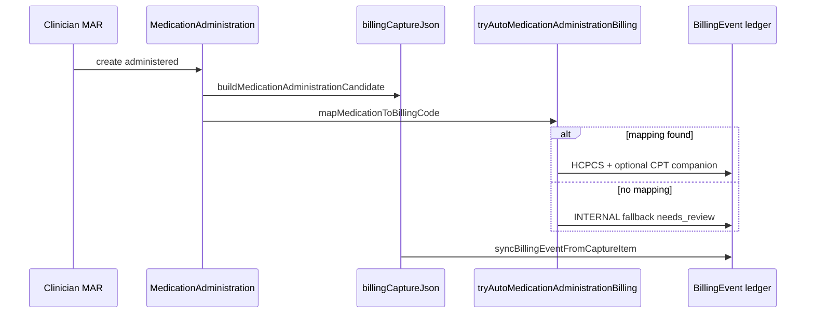

# Medication Revenue Integrity Audit (M1.4A)

**Program:** Enterprise Medication Billing & Revenue Integrity  
**Phase:** M1.4A  
**Date:** 2026-06-02  

Companion to [medication-billing-coding-audit.md](./medication-billing-coding-audit.md).

---

## Purpose

Assess whether medication-related clinical actions produce **complete, traceable, and auditable** revenue capture — and where integrity breaks before enterprise expansion.

---

## Revenue integrity model (as implemented)

**Integrity strengths**

- Idempotent `BillingEvent` per `(facilityId, sourceModule, sourceRecordId)`.
- NDC snapshots on MAR/dispense for drug identity.
- Infusion STOP carries duration evidence and explicit manual-review flag.
- Billing failures are best-effort (clinical write never blocked).

**Integrity weaknesses**

- Two parallel lines per MAR (capture + auto) increase review variance.
- Governance completion (witness, pharmacy) does not create or gate billing lines.
- Waste has clinical record but **zero** revenue line.
- Catalog mapping coverage far below catalog breadth.

---

## Integrity by revenue stream

| Stream | Capture trigger | Code source | Identity (NDC) | Governance tie-in | Integrity grade |
|--------|-----------------|-------------|----------------|-------------------|-----------------|
| MAR administration | Administered MAR | `BillingCatalog` / fallback | Snapshot optional | None | **C+** |
| MAR infusion STOP | Terminal MAR + duration | Suggestion only | Same as MAR | None | **C** |
| Pharmacy dispense | Dispense row | Enrichment / manual | Snapshot | None | **C** |
| Medication order | None | — | — | Pharmacy verify | **N/A** |
| Waste | None | — | — | Witness documented | **F** |
| Controlled substance | Same as MAR | No schedule on claim | Same | Witness/audit | **C** |
| High-alert / LASA | Same as MAR | Same | Same | Double-check audit | **C** |
| Vaccine (ref) | Separate module | `billingCodeDefault` | N/A | N/A | **B-** (out of scope) |

Grades reflect **automation completeness**, not clinical safety.

---

## Leakage severity matrix

| Leakage | Likelihood | Revenue impact | Detectability | Priority |
|---------|------------|----------------|---------------|----------|
| Unmapped HCPCS for common ED drugs | **High** | **High** | Medium (needs_review queue) | **P0** |
| Missing NDC on claim | **Medium** | **Medium** | Low without report | **P1** |
| Waste not billed | **Medium** (policy-dependent) | **Medium** | Low | **P1** |
| Infusion minutes not coded | **Medium** | **High** (infusion-heavy sites) | Medium (manual flag) | **P1** |
| Duplicate MAR billing rows | **Low** | Low (over-capture risk) | High | **P2** |
| Package profile unused | **High** (future) | **High** | Low | **P0** (enterprise) |

---

## Alignment with medication governance (M1.3B–F.8)

| Governance event | Revenue record? | Gap |
|------------------|-----------------|-----|
| Witness completed | No | Acceptable — not typically billable |
| Waste documented | **No** | **Revenue gap** if payer allows waste J-code |
| Pharmacy verified | No | Acceptable unless dispensing fee added |
| Double-check / LASA | No | Acceptable |
| Override | No | Should appear in billing **review** UI (future) |

Governance and billing are **correctly decoupled** for safety; **revenue integrity** requires explicit bridges (e.g. waste → charge) in a later phase.

---

## Claim / export path

| Step | Medication support |
|------|-------------------|
| `billingCaptureJson` items | `MEDICATION_ADMINISTRATION`, `MEDICATION_DISPENSE`, `MED_ADMIN` ledger |
| Enrichment | Fills HCPCS from `billingCodeDefault` when present |
| External export | Includes med dispense and administration source types |
| Claim builder | Recognizes `MED_ADMIN` / `MEDICATION_ADMINISTRATION` |

**Risk:** Export can emit lines with `UNMAPPED` or null HCPCS — payer rejection without coder review.

---

## Controls recommended (no implementation in M1.4A)

1. **Mapping coverage dashboard** — % catalog with `BillingCatalog` + `billingCodeDefault`.
2. **NDC coverage report** — reuse `generate-billing-coverage-report.ts` in CI or quarterly ops.
3. **Waste billing policy** — clinical + revenue sign-off before enabling `wastageBillable`.
4. **Infusion coding playbook** — link `infusionBillingSuggestion` to approved code pairs.
5. **Review queue SLA** — all `needs_review` medication lines before encounter finalize (workflow).

---

## Revenue integrity verdict

| Metric | Value |
|--------|-------|
| **Leakage risk** | **MEDIUM** |
| **Clinic MVP manual-review acceptable?** | **Yes** |
| **Enterprise auto-adjudication ready?** | **No** |

**SAFE / NOT SAFE:** **SAFE (conditional)** for pilot clinic with mandatory billing review; **NOT SAFE** for unattended revenue integrity.
