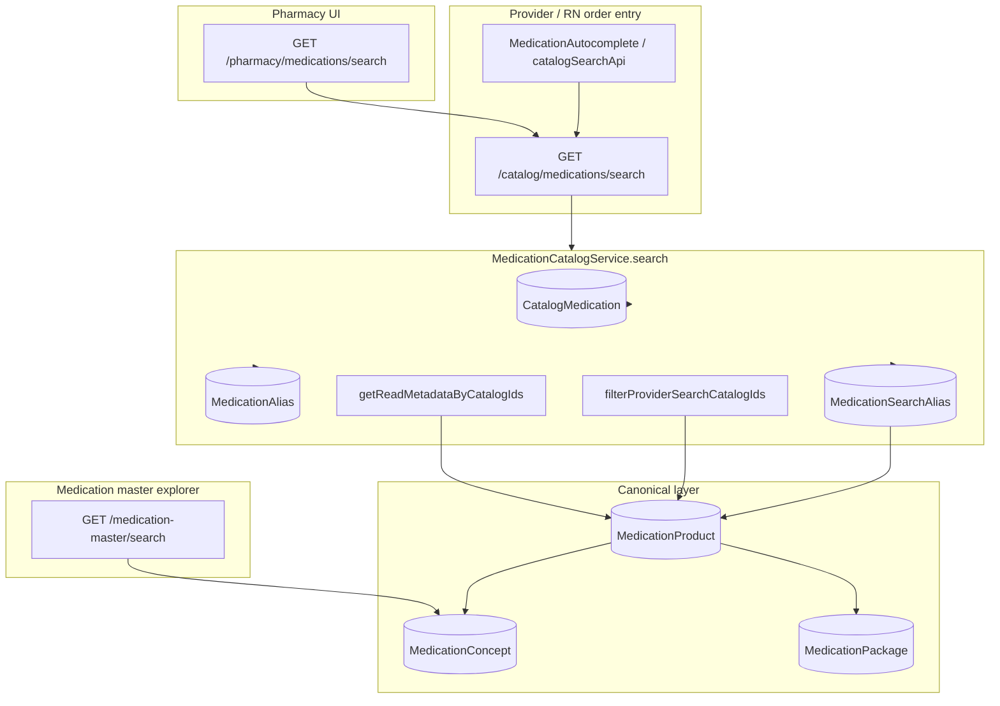

# Provider Search Canonical Cutover Audit (M1.5F)

**Program:** Haiti Canonical Linkage Remediation  
**Phase:** M1.5F — audit + design only  
**Date:** 2026-06-02  
**Constraints:** No code, seeds, migrations, DB writes, search changes, activation, or billing changes.

**Data sources:** Local dev DB counts from M1.5A/M1.5B (2026-06-02) · M1.5D manifest · M1.5E backfill design · static code review of `apps/api` search paths  
**Production:** NOT VERIFIED

**Companion:** [provider-search-canonical-readiness.md](./provider-search-canonical-readiness.md) · [provider-search-canonical-risk-register.md](./provider-search-canonical-risk-register.md) · [provider-search-canonical-rollout-strategy.md](./provider-search-canonical-rollout-strategy.md)

---

## Executive summary

| Question | Answer |
|----------|--------|
| Can canonical search **replace** legacy search today? | **No** |
| Can legacy and canonical **coexist**? | **Yes** (already hybrid; legacy is authoritative for orders/MAR) |
| Is provider search cutover **ready**? | **No** |
| **SAFE / NOT SAFE** | **NOT SAFE** for cutover or canonical-only search; **SAFE (conditional)** to continue legacy search and plan phased activation (M1.5G) |

Provider medication search is **implemented on `CatalogMedication`**, not on a canonical product index. Canonical data **enriches** results and may **supplement** via `MedicationSearchAlias`, but only when an **active** linked product exists. **993** canonical products are import noise; **M1.5E** creates clean Haiti chains (up to **192** linkable rows) while **preserving** legacy visibility via the M1.5E linkage-only gate marker until intentional cutover.

---

## Part 1 — Current search inventory (architecture map)

### 1.1 Provider order entry search (primary)

| Attribute | Detail |
|-----------|--------|
| **Endpoint** | `GET /catalog/medications/search` (`OrderCatalogController`) |
| **Alias** | `GET /pharmacy/medications/search` (`MedicationCatalogController` — same `MedicationCatalogService`) |
| **Web** | `catalogSearchApi.ts` → `MedicationAutocomplete` |
| **Source tables** | `CatalogMedication` (primary), `MedicationAlias`, `MedicationSearchAlias` (supplemental) |
| **Filters** | `CatalogMedication.isActive = true`; text/alias match; `purpose=order` applies activation gate |
| **Activation gate** | `MedicationProductActivationGovernanceService.filterProviderSearchCatalogIds` — excludes catalog IDs linked to products failing `evaluateProviderOrderSearchGate` |
| **M1.5E exception** | `linkageOnlyHaitiM15e` + `HAITI_M15E_CANONICAL_LINKAGE_ONLY` in `governanceNotes` preserves catalog eligibility while product remains inactive |
| **Canonical participation** | **Read-only enrich** (`CatalogCanonicalReadService.getReadMetadataByCatalogIds` — badges/aliases); **no canonical row as search hit** |
| **Legacy participation** | **100%** of returned `id` values are `CatalogMedication.id` |

### 1.2 MAR medication lookup

| Attribute | Detail |
|-----------|--------|
| **Path** | Orders carry `catalogMedicationId` / snapshots; `MedicationAdministrationService` loads `catalogMedication` by ID |
| **Source tables** | `CatalogMedication`, optional `MedicationProduct` via governance utils (`legacyCatalogMedicationId`) |
| **Search** | **No autocomplete** on MAR chart path — uses order line catalog reference |
| **Canonical participation** | Governance read via linked product (`controlledSubstanceMarGovernance`, `highAlertMarGovernance`, `lasaMarGovernance`, `pharmacyMarGovernance`) |
| **Cutover impact** | MAR remains catalog-keyed; canonical cutover does not change MAR ID source without order schema migration |

### 1.3 Pharmacy search / inventory

| Attribute | Detail |
|-----------|--------|
| **Dispense / inventory lists** | `catalogMedication.findMany` by `catalogItemId` on inventory/dispense rows — **not** typeahead search |
| **Autocomplete** | Same as provider — `/catalog/medications/search` per `MedicationAutocomplete` |
| **Canonical participation** | None on list paths |

### 1.4 Catalog search (unified order catalog)

Same as §1.1 — medications share ranking utilities with lab/imaging in `order-catalog` module but **medication-specific** service.

### 1.5 Medication master search (canonical-native)

| Attribute | Detail |
|-----------|--------|
| **Endpoint** | `GET /medication-master/search` |
| **Service** | `MedicationMasterExplorerService.search` |
| **Source tables** | `MedicationConcept` → `MedicationProduct` → `MedicationPackage`, `MedicationSearchAlias`, optional `FacilityFormularyItem` |
| **Filters** | Default `activeOnly` (concept + product active); optional `baselineOnly` (PRIORITY_ER baseline) |
| **Activation gate** | **None** for provider order search — separate admin/explorer surface |
| **Legacy participation** | `legacyCatalogMedicationId` exposed in DTO only — **not** used as search key |
| **Provider visibility** | **Not wired** to order entry UI today |

### 1.6 Alias search (dual paths)

| Path | Table | Gate |
|------|-------|------|
| Legacy clinical aliases | `MedicationAlias` → `catalogMedicationId` | Catalog must be `isActive` |
| Canonical aliases | `MedicationSearchAlias` → product/concept → `legacyCatalogMedicationId` | Product must be **`isActive`** and legacy FK set (`findCatalogIdsViaCanonicalAlias`) |

### 1.7 Billing medication lookup

| Attribute | Detail |
|-----------|--------|
| **Path** | `medication-administration-billing-resolve.util.ts` |
| **Source** | `CatalogMedication` by order/admin context; HCPCS from `billingCodeDefault` / `BillingCatalog` / package profile via `MedicationProduct` when linked |
| **Search** | **No user-facing search** — resolve at documentation/capture time |
| **Cutover risk** | Low if catalog codes and IDs remain stable (see Part 6) |

---

## Part 2 — Legacy vs canonical coverage

### 2.1 Legacy `CatalogMedication` (local dev baseline — M1.5A/M1.5B)

| Metric | Count | Notes |
|--------|-------|-------|
| Total rows | **316+** (316 active in audit) | Haiti seed produces **247** unique codes; local may include ER extensions |
| Searchable (`isActive`) | **316** | All active rows hit `CatalogMedication` text search |
| Hidden (inactive) | **0** in audit | |
| Linked (`MedicationProduct.legacyCatalogMedicationId`) | **60** (pre-M1.5E) | All **19G1-ACET** baseline links — **LINKED_INACTIVE** |
| Unlinked | **256** (**81%**) | Bypass provider activation gate (no linked product) |

### 2.2 Canonical layer (local dev baseline)

| Entity | Total | Active |
|--------|-------|--------|
| `MedicationConcept` | **1003** | **5** |
| `MedicationProduct` | **993** | **0** |
| `MedicationPackage` | **993** | **5** |

### 2.3 Classification buckets (products)

| Bucket | Count (local) | Provider search today? |
|--------|---------------|-------------------------|
| **SAFE_TO_ACTIVATE** (Haiti-aligned, clean chain post-M1.5E) | **0** pre-pilot · up to **192** post-backfill | No — inactive until M1.5G |
| **REVIEW_REQUIRED** | **157** + Haiti **55** manifest | No |
| **QUARANTINED** (acetaminophen/insulin/blocked/baseline/import) | **~945** products | **No** — not in catalog index |
| **INACTIVE** | **993/993** products | No |
| **SEARCH_BLOCKED** (gate: inactive linked without M1.5E marker) | **60** legacy-linked baseline | **Yes** — excludes linked catalog from order search |
| **SEARCH_ALLOWED** (M1.5E marker, inactive link) | **0** until M1.5E run | **Yes** — preserves legacy catalog row |

### 2.4 Post-M1.5E expected (design; run not verified on production)

| Metric | Expected |
|--------|----------|
| New `HAITI_*` concepts | ≤ **~150** unique INNs |
| New Haiti products/packages | **192** (MISSING_CANONICAL_TARGET processed) |
| `legacyCatalogMedicationId` set | **192** |
| `skippedManualReview` | **55** |
| Provider search row count change | **0** (M1.5E preservation gate) |

---

## Part 3 — Duplicate risk analysis

| Category | Severity | Evidence |
|----------|----------|----------|
| **Brand vs generic display** (Tylenol/Acetaminophen, Lasix/Furosemide, Rocephin/Ceftriaxone, etc.) | **HIGH** | Single catalog row per Haiti code today; cutover + parallel canonical aliases could surface **two hits** if canonical search added without dedupe |
| **Shared clinical alias collisions** (rsi, sedation, acetaminophen, ativan, …) | **HIGH** | `HAITI_SHARED_ALIAS_COLLISIONS` in M1.5D — **MANUAL_REVIEW** on affected manifest rows |
| **Duplicate catalog codes** | **LOW** | **0** duplicates (M1.5A) |
| **Duplicate `legacyCatalogMedicationId`** | **LOW** | Unique constraint enforced |
| **Duplicate generic groups** (multi-strength SKUs) | **MEDIUM** | **61** groups expected — intentional variants, not duplicates if one row per strength |
| **Duplicate NDC clusters** | **MEDIUM** | Known duplicate NDC set in quarantine — **MANUAL_REVIEW** |
| **Duplicate displayNameEn groups** | **MEDIUM** | **62** groups (M1.5A) |
| **904 acetaminophen canonical concepts** | **CRITICAL** if ever activated/searchable | Quarantined; must never enter provider index |

---

## Part 4 — Search pollution audit

| Source | In provider search today? | After naive cutover? | Bypass gate? |
|--------|---------------------------|----------------------|--------------|
| **904 acetaminophen clones** | **No** — not `CatalogMedication` rows | **No** unless activated + formulary | Canonical master search with `baselineOnly` could expose — **not** provider path |
| **48 insulin clones** | **No** | **No** | Same |
| **51 blocked-med tests** | **No** | **No** | Same |
| **19G baseline products (60 linked)** | **Partial** — linked catalogs **excluded** from order search by gate | Risk if gate disabled | Gate applies when `legacyCatalogMedicationId` set |
| **Orphan canonical products** | **No** | **No** on current provider API | N/A |
| **Haiti M1.5E inactive links** | **No** (preserved by M1.5E marker) | **Yes** if marker removed without activation discipline | Marker is explicit bypass |

**Finding:** Pollution is **contained** today because provider search never queries `MedicationProduct` directly. **CRITICAL** risk emerges if cutover enables `orderSearchEnabled` on noise rows or adds canonical-first search without Haiti-only filters.

---

## Part 5 — M1.5E linkage quality audit

**Local DB:** M1.5E backfill is **optional** (`MEDORA_ENABLE_HAITI_CANONICAL_LINKAGE_BACKFILL=1`). Counts below are **design-time** unless backfill was executed on your environment.

| Check | Pre-M1.5E (local) | Post-M1.5E (expected) |
|-------|-------------------|------------------------|
| Haiti catalog rows with clean `legacyCatalogMedicationId` | **0** | **192** |
| `MANUAL_REVIEW` skipped | — | **55** |
| Multiple products per catalog | **0** (unique FK) | **0** |
| Multiple catalogs per product | **0** | **0** |
| Missing package on Haiti product | N/A | **0** (helper creates default package) |
| Quarantine target link | **60** wrong baseline links | Must **not** increase |

**Linkage integrity score:** **42/100** pre-backfill · **78/100** post-backfill (if validation passes and no quarantine violations)

**Invalid chains to remediate before cutover:** Unlink **60** `19G1-ACET-*` baseline products from clinical Haiti catalog rows (M1.5B recommendation) — separate from M1.5E Haiti chain creation.

---

## Part 6 — Billing impact (M1.4B / M1.4C / M1.4D)

| Area | Cutover risk | Notes |
|------|--------------|-------|
| HCPCS / J-code on catalog | **LOW** | Search returns catalog IDs; `billingCodeDefault` unchanged |
| `BillingCatalog` externalCode | **LOW** | Keyed by catalog code |
| NDC on package profile | **LOW** | M1.5E mirrors to package when missing; conflicts fail closed |
| M1.4C charge capture | **LOW** | Resolves from administration + catalog code |
| M1.4D infusion billing | **LOW** | Route/administrationType on catalog + product profile |
| **Risk if catalog ID changes** | **HIGH** | Not proposed — cutover must not replace catalog IDs |

**Billing cutover risk:** **LOW** (conditional on catalog ID stability)

---

## Part 7 — Governance impact (M1.3C–F)

| Domain | Search cutover risk | Notes |
|--------|---------------------|-------|
| Controlled substances (M1.3C) | **MEDIUM** | Catalog flags authoritative for MAR today; canonical `MedicationSafetyProfile` often empty |
| High alert (M1.3D) | **MEDIUM** | Same — **0** persisted high-alert profiles locally |
| LASA (M1.3E) | **MEDIUM** | Manifest exists; DB profiles sparse |
| Witness / double-sign | **LOW** for search-only | Enforced on administration paths from catalog |
| Pharmacy verification | **LOW** | Uses catalog + optional product link |
| MAR governance | **LOW** if catalog remains order key | **HIGH** if orders switch to `medicationProductId` without migration plan |

**Governance cutover risk:** **MEDIUM** — activation must apply M1.3 seeds to **Haiti concepts** before T3 tranche search enablement

---

## Part 8 — Performance impact

| Pattern | Queries (typical) | Join depth | Latency risk |
|---------|-------------------|------------|--------------|
| **Legacy provider search** | 2–3× `catalogMedication` + 1× `medicationAlias` + 0–1× `medicationSearchAlias` + 1× gate (`medicationProduct` + packages + formulary) + 1× metadata | Moderate | **Baseline** — bounded `limit×3` |
| **Canonical-only search** (not implemented) | Would require formulary + product + concept + alias index | High | **Unknown** — new endpoint + indexes on `MedicationSearchAlias.normalizedAlias` |
| **Hybrid (current)** | Legacy + metadata map | Moderate | **~10–20%** overhead vs legacy-only — acceptable for Railway if limits stay ≤50 |

**Index notes:** Existing indexes on `legacyCatalogMedicationId`, `CatalogMedication.code`, alias tables. Canonical cutover at scale should add composite index review on `(facilityId, packageId)` formulary — not blocking pilot.

**Goal:** No degradation beyond current latency — **achievable** for phased pilot (T1 ≤82 rows) if gate query stays batched.

---

## Part 9 — Cutover strategy comparison

| Strategy | Safety | Complexity | Risk | Performance | Rollback |
|----------|--------|------------|------|-------------|----------|
| **A — Legacy only** | Highest | Lowest | Lowest | Best known | N/A |
| **B — Canonical only** | **Unacceptable** | High | **CRITICAL** | Unknown | Hard |
| **C — Hybrid search (dual index)** | Medium | High | HIGH duplicates | Worst | Hard |
| **D — Phased rollout** | **High** | Medium | **Controlled** | Predictable | **Easy** |

**Recommendation:** **Strategy D — Phased rollout** (see rollout strategy doc). Keep **legacy catalog as search authority**; enable `orderSearchEnabled` per tranche on **Haiti-linked** products only; retire M1.5E gate exception per row when enabling; never bulk-activate import noise.

---

## Part 10 — Phased activation plan (summary)

| Tranche | Manifest scope | Link (M1.5E) | Search enable (M1.5G) |
|---------|----------------|--------------|------------------------|
| **T1** | Billable / ER-IV (~82) | Wave 1 | Pilot only after M1.5F PASS |
| **T2** | Antibiotics (~65) | Wave 2 | After T1 metrics |
| **T3** | Controlled / HA / LASA | Wave 3 + sign-off | Pharmacy + medical director |
| **T4** | Essential chronic (~122) | Wave 4 | Staged |
| **T5** | Remainder (~43) | Wave 5 | Staged |

Exact codes: `HAITI_CANONICAL_LINKAGE_MANIFEST` tranche field (M1.5D).

---

## Part 11 — Rollback (summary)

1. Disable `orderSearchEnabled` on pilot products (runtime notes).  
2. Restore `HAITI_M15E_CANONICAL_LINKAGE_ONLY` marker if catalog rows drop from search.  
3. Do **not** delete canonical rows — set `legacyCatalogMedicationId` NULL only if must sever link.  
4. Legacy search continues to work — **no data loss** on `CatalogMedication`.

Full procedure: [provider-search-canonical-rollout-strategy.md](./provider-search-canonical-rollout-strategy.md)

---

## Part 12 — Readiness scores (0–100)

| Dimension | Score | Rationale |
|-----------|-------|-----------|
| Search readiness | **38** | Legacy solid; canonical not a search surface; duplicate/alias risk |
| Linkage readiness | **48** | M1.5E designed; 60 bad links + 256 unlinked historically |
| Billing readiness | **58** | Manifest strong; local DB remediation incomplete |
| Governance readiness | **42** | Manifests without DB profile application |
| Activation readiness | **28** | 0 safe bulk activations; 945 quarantined |
| Enterprise readiness | **41** | Aligned with M1.5A ~51 enterprise / Haiti MVP on legacy |

---

## Part 13 — Final decision

| Decision | Value |
|----------|-------|
| **CANONICAL SEARCH CUTOVER READY** | **NO** |
| **SAFE / NOT SAFE** | **NOT SAFE** for cutover or canonical-only provider search |
| **Conditional SAFE** | Continue legacy provider search; execute M1.5E on pilot DB; complete M1.5G pilot per Strategy D |

### Blockers

1. Orders/MAR/pharmacy keyed on **`catalogMedicationId`**, not package/product IDs.  
2. **993** canonical products are **not** clinically safe to expose.  
3. **55** manifest rows require **MANUAL_REVIEW** before activation.  
4. **60** incorrect baseline legacy links + alias collision groups.  
5. No canonical provider search endpoint — cutover would require **new API + UI** (out of scope for “flip switch”).  
6. M1.3 governance **not persisted** on canonical safety profiles at scale.

### Recommended next phase

**M1.5G — Canonical Medication Activation Pilot** (T1 only, ≤82 rows) after:

- M1.5E backfill validated on staging  
- This audit accepted  
- M1.4B billing remediation on pilot DB  
- M1.3C–E applied to pilot Haiti concepts  
- Search cardinality test: **≤316** visible rows, no acetaminophen explosion
