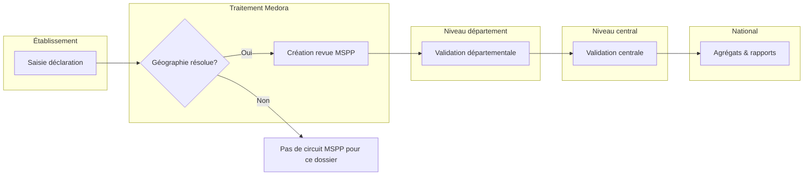
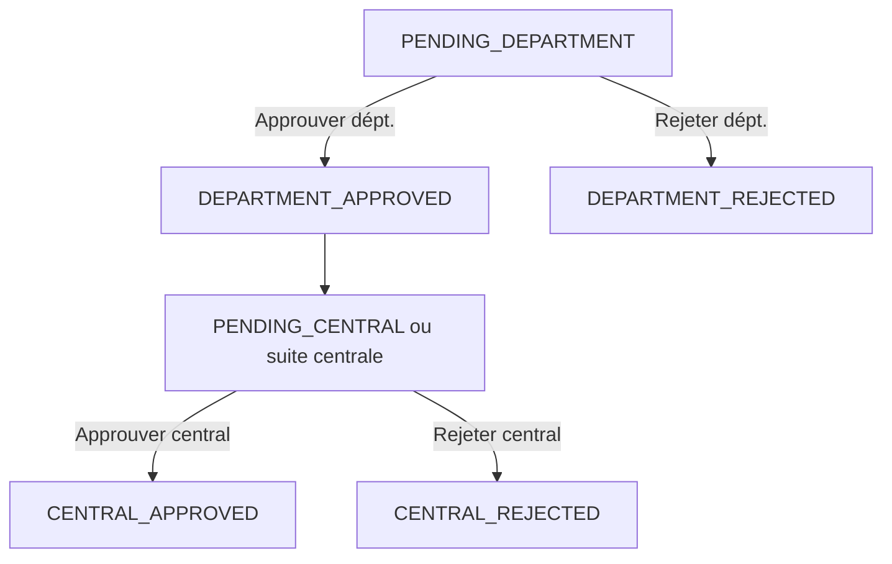
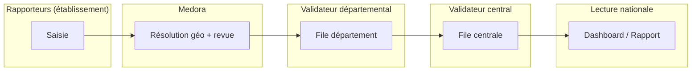

# Manuel complet — Portail MSPP national (Medora-S)

**Document type :** guide opérationnel et support de formation  
**Public :** directions MSPP, épidémiologistes, validateurs, administrateurs délégués, responsables d’établissement  
**Produit :** Medora-S (interface en français)  
**Version document :** 1.0 — alignée sur le comportement applicatif du dépôt source

---

## Table des matières

1. [Introduction et objectifs du manuel](#1-introduction-et-objectifs-du-manuel)
2. [Schéma national du circuit (vue ministérielle)](#2-schéma-national-du-circuit-vue-ministérielle)
3. [Diagramme horizontal du pipeline](#3-diagramme-horizontal-du-pipeline)
4. [Rôles, accès et pages autorisées](#4-rôles-accès-et-pages-autorisées)
5. [Chapitre A — Administration des accès MSPP](#chapitre-a--administration-des-accès-mspp)
6. [Chapitre B — Déclarations de cas (établissement)](#chapitre-b--déclarations-de-cas-établissement)
7. [Chapitre C — File de validation MSPP](#chapitre-c--file-de-validation-mspp)
8. [Chapitre D — Tableau de bord national](#chapitre-d--tableau-de-bord-national)
9. [Chapitre E — Rapport national et impression](#chapitre-e--rapport-national-et-impression)
10. [Chapitre F — Carte géographique (évolution)](#chapitre-f--carte-géographique-évolution)
11. [Annexe — Statuts techniques de la revue](#annexe--statuts-techniques-de-la-revue)
12. [Annexe — Synthèse des prérequis par fonction](#annexe--synthèse-des-prérequis-par-fonction)
13. [Module formation — scénarios](#module-formation--scénarios-pas-à-pas-8-séquences)

---

## 1. Introduction et objectifs du manuel

Ce manuel décrit **de bout en bout** l’usage du **portail MSPP** au sein de Medora-S : depuis la saisie d’une déclaration dans un **établissement** jusqu’aux **agrégats nationaux** visibles après **validation centrale**. Il est conçu pour servir de :

- **guide de déploiement** (qui fait quoi, dans quel ordre) ;
- **support de formation** (parcours pas à pas, exigences par rôle) ;
- **référence crédible** pour les autorités (chaîne de validation explicite, écrans nommés, règles de données).

**Limites déclarées :** ce document reflète les **fonctions présentes dans l’application**. Tout export vers un système externe du MSPP non branché à Medora relève d’un **processus hors logiciel** (sauf intégration future explicitement livrée).

---

## 2. Schéma national du circuit (vue ministérielle)

La chaîne officielle de lecture est :

**Établissement → Département (validation) → Central (validation) → National (agrégats)**

- **Établissement** : saisie de la **déclaration de cas** (santé publique).
- **Département** : premier niveau de **validation MSPP** (périmètre géographique Haïti).
- **Central** : **décision nationale** dans Medora pour finaliser la revue.
- **National** : **tableaux de bord et rapports** basés uniquement sur les dossiers **approuvés au central** (agrégats).

---

## 3. Diagramme horizontal du pipeline

### 3.1 Vue d’ensemble (flux principal)



**Lecture :** si la **géographie** (département Haïti) **ne peut pas être déterminée** à partir de la déclaration, **aucune revue MSPP** n’est créée : le dossier **n’apparaît pas** dans les files de validation nationales.

### 3.2 Pipeline détaillé (étapes numérotées)


### 3.3 Diagramme des décisions (validation)



> **Note nationale :** seuls les dossiers en **CENTRAL_APPROVED** alimentent les **totaux** des tableaux de bord et rapports **nationaux** (synthèses indicatives, séries mensuelles, classements).

### 3.4 Diagramme horizontal « acteurs » (swimlane)



*(Les rôles **MSPP_MINISTRE** et **MSPP_EPIDEMIOLOGIE** participent à la **lecture nationale** sans étape de validation obligatoire dans le logiciel.)*

---

## 4. Rôles, accès et pages autorisées

Les **rôles MSPP** sont **nationaux** et **distincts** des rôles d’établissement (médecin, infirmier, etc.). Ils sont stockés sous forme d’**affectations** (`MsppUserRoleAssignment`).

### 4.1 Tableau des capacités (comportement actuel)

| Rôle | Pages principales | Actions |
|------|-------------------|---------|
| **MSPP_ADMIN** | **`/app/admin/mspp-access`** | Gérer les **affectations** (courriel, rôle, département géographique pour le validateur départemental, activation). **Sans** rôle opérationnel MSPP, **pas d’accès** aux pages **`/app/mspp/*`** (tableau de bord, validation, rapport). |
| **MSPP_VALIDATOR_DEPT** | **`/app/mspp/dashboard`**, **`/app/mspp/validation`**, **`/app/mspp/rapport`** | **Approuver / rejeter** en **département** ; **listes et agrégats filtrés** sur le(s) département(s) assigné(s). |
| **MSPP_VALIDATOR_CENTRAL** | Idem | **Approuver / rejeter** au **central** ; vision **nationale** pour les listes et agrégats. |
| **MSPP_MINISTRE** | Idem | **Lecture nationale** : files, indicateurs, tendances, rapports (pas d’obligation de validation dans le logiciel). |
| **MSPP_EPIDEMIOLOGIE** | Idem | Même logique de **lecture nationale** que le ministre sur les écrans concernés. |

**Menu latéral :** la section **« MSPP (national) »** affiche notamment **Tableau de bord**, **Rapport**, **Validation** pour les rôles **MSPP_MINISTRE**, **MSPP_EPIDEMIOLOGIE**, **MSPP_VALIDATOR_DEPT**, **MSPP_VALIDATOR_CENTRAL**. L’entrée **« Accès MSPP (national) »** apparaît sous **Administration** pour les **administrateurs plateforme** ou les **MSPP_ADMIN**.

**Gouvernance :** l’**administrateur plateforme** (compte autorisé à créer des établissements) peut aussi gérer les accès MSPP ; un **MSPP_ADMIN** délégué **ne peut pas** modifier les comptes **administrateurs plateforme**.

---

## 5. Chapitre A — Administration des accès MSPP

**Route :** `/app/admin/mspp-access`  
**Intitulé interface (i18n) :** « Accès MSPP (national) »

### 5.1 À qui s’adresse cet écran ?

- **Administrateur plateforme Medora**, ou  
- **MSPP_ADMIN** (administration **déléguée** des accès nationaux uniquement).

### 5.2 Prérequis

| Prérequis | Détail |
|-----------|--------|
| Compte utilisateur | Identifiant Medora **actif**. |
| Autorisation | Compte principal plateforme (`atranchant@medora.local`, exposé comme `canCreateFacilities` dans `/auth/me`) **ou** rôle **MSPP_ADMIN** actif. |
| Référentiel géographique | Liste des **départements géographiques Haïti** chargée (sinon message d’erreur explicite sur le chargement des départements). |

### 5.3 Fonctions de la page (dans l’ordre d’usage recommandé)

#### A. Liste des accès attribués

- **Table « Accès attribués »** : utilisateur, rôle MSPP, département géographique (le cas échéant), statut **actif / inactif**, actions.
- **Actualiser** : rechargement de la liste.

#### B. Nouvel accès (compte **déjà existant**)

- **Courriel du compte** : doit correspondre à un utilisateur **déjà créé** (sinon message indiquant de créer le compte au préalable, par ex. via « Utilisateurs et accès »).
- **Rôle MSPP** : liste incluant *Ministre*, *Épidémiologie*, *Validateur départemental*, *Validateur central*, *Administrateur délégué (accès MSPP)*.
- **Département géographique** : **obligatoire uniquement** pour **Validateur départemental** ; interdit pour les autres rôles (validation côté serveur).
- **Ajouter l’accès** : crée l’affectation si pas de doublon pour la même combinaison.

#### C. Assistant « Créer un utilisateur MSPP » (parcours opérationnel)

Intitulés issus de l’interface :

- **Intégration — compte et accès MSPP**
- Champs : **Prénom**, **Nom**, **Courriel**, **Mot de passe initial** (optionnel si compte existant), **Rôle**, **Département géographique** si validateur départemental, case **Accès MSPP actif dès l’attribution**.

**Règles :**

- **Nouveau courriel** : **mot de passe obligatoire** (minimum **8 caractères**).
- **Courriel déjà enregistré** : **pas** de mot de passe requis ; le système **met à jour le nom** et **ajoute** (ou active) l’accès MSPP.

Messages de succès possibles :

- « Compte créé et accès MSPP attribué. »
- « Accès MSPP attribué au compte existant (nom mis à jour). »

#### D. Modification / désactivation

- **Modifier** une ligne : ajuster rôle ou département (conformément aux règles ci-dessus).
- **Désactiver l’accès** / **Réactiver** : l’utilisateur conserve son compte Medora ; seul l’**accès MSPP** est coupé ou rétabli.

### 5.4 Résultat après connexion (utilisateur)

- **MSPP_ADMIN seul** : arrivée sur **`/app/admin/mspp-access`** (pas sur le tableau de bord MSPP).
- **Rôle opérationnel** (ministre, épidémiologie, validateur) : **`/app/mspp/dashboard`** si l’utilisateur n’a pas un autre rôle d’établissement qui prend la priorité dans la logique d’accueil.

---

## 6. Chapitre B — Déclarations de cas (établissement)

**Route :** `/app/public-health/disease-reports`  
**Rubrique menu :** Santé publique — **Déclarations de cas** (libellé dépend de la navigation ; le titre i18n est « Déclarations de cas »).

### 6.1 À qui s’adresse cet écran ?

Personnel disposant d’un **rôle d’établissement** autorisé par la configuration actuelle pour la santé publique (typiquement **ADMIN**, **PROVIDER**, **RN** selon les règles de navigation du produit).

### 6.2 Prérequis

| Prérequis | Détail |
|-----------|--------|
| Établissement actif | Contexte d’établissement Medora sélectionné. |
| Droit « santé publique » | Variable `canViewPublicHealth` côté client — si refusé, l’écran n’est pas utilisable. |
| Données géographiques | Chargement des **départements** et **communes** Haïti pour une saisie structurée lorsque le référentiel est disponible. |

### 6.3 Bloc « Circuit Medora → MSPP » (texte d’aide à l’écran)

L’interface rappelle que :

- lorsque le **département géographique (Haïti)** est **identifié**, la déclaration peut être **rattachée** au circuit de validation MSPP (département puis central) ;
- les dossiers **approuvés au niveau central** alimentent les **agrégats nationaux** (rapports et indicateurs).

Colonne **« Revue MSPP »** dans le tableau : indique si une revue est liée ou **« Non rattachée (géographie non résolue ou hors circuit) »** lorsque ce n’est pas le cas.

### 6.4 Saisie d’une nouvelle déclaration (fonctions)

1. **Patient (optionnel)** : recherche si besoin.  
2. **Maladie / code / statut** : conformément aux listes du formulaire (ex. statuts **Suspect**, **Confirmé**, **Écarté** selon les libellés français).  
3. **Dates** : ex. début des signes, déclaration.  
4. **Lieu** :  
   - si le référentiel est chargé : choix **département** puis **commune** (recommandé pour la qualité) ;  
   - sinon ou en complément : **saisie libre** département / commune — la **résolution automatique** vers le circuit MSPP peut échouer si le système ne peut pas déduire un département national.

### 6.5 Exigence clé pour le circuit MSPP

**Sans résolution vers un département géographique national**, le produit **ne crée pas** la **revue MSPP** : pas de file nationale pour ce dossier. La formation des équipes doit insister sur le **remplissage cohérent** des champs géographiques et l’usage des listes lorsqu’elles sont disponibles.

### 6.6 Détail des champs — « Nouvelle déclaration » (référence écran)

| Zone | Champ | Obligation | Rôle pour MSPP |
|------|-------|------------|----------------|
| Patient | Recherche + liste optionnelle | Optionnel | Lien dossier patient si sélectionné |
| Maladie | Code | **Obligatoire** (sinon bouton désactivé) | Agrégats « par maladie » |
| Maladie | Nom | **Obligatoire** | Affichage validateurs / rapports |
| Statut | Suspect / Confirmé / Écarté | Obligatoire (liste) | Filtrage et sensibilisation clinique |
| Dates | Date de déclaration | Saisie date | Chronologie |
| Dates | Début des signes | Optionnel | Contexte |
| Géographie | Liste départements + communes Haïti | **Recommandé** si disponible | Meilleure chance de **rattachement** au circuit MSPP via `geoCommuneId` |
| Géographie | Département / commune **texte libre** | Si pas de listes | Dépend de la **résolution** côté serveur |
| Notes | Texte libre | Optionnel | Contexte pour les validateurs |

**Bouton d’envoi :** actif seulement si **code** et **nom de maladie** sont renseignés (comportement actuel du formulaire).

**Messages possibles après envoi :** confirmation de création ou erreur réseau / serveur (libellés `diseaseReports.createdOk` / erreurs).

### 6.7 Fiche écran — Déclarations de cas (capture logique)

```
┌──────────────────────────────────────────────────────────────────┐
│  Déclarations de cas                                    [liens] │
│  Introduction + contexte établissement                           │
├──────────────────────────────────────────────────────────────────┤
│  Encadré bleu « Circuit Medora → MSPP » (texte pédagogique)       │
├──────────────────────────────────────────────────────────────────┤
│  NOUVELLE DÉCLARATION                                              │
│  [ Recherche patient ] [ Rechercher ]                            │
│  Code maladie *    Nom maladie *    Statut    Dates               │
│  Département / commune (listes Haïti OU saisie manuelle)          │
│  Notes                                                             │
│  [ Créer la déclaration ]                                         │
├──────────────────────────────────────────────────────────────────┤
│  DÉCLARATIONS RÉCENTES — tableau (dont colonne « Revue MSPP »)    │
└──────────────────────────────────────────────────────────────────┘
Route : /app/public-health/disease-reports
```

---

## 7. Chapitre C — File de validation MSPP

**Route :** `/app/mspp/validation`  
**Titre de page affiché :** « MSPP — Validation »

### 7.1 Prérequis

| Prérequis | Détail |
|-----------|--------|
| Rôle opérationnel MSPP | **MSPP_MINISTRE**, **MSPP_EPIDEMIOLOGIE**, **MSPP_VALIDATOR_DEPT** ou **MSPP_VALIDATOR_CENTRAL**. |
| Authentification | Session valide (JWT). |

### 7.2 Structure de l’écran (deux files)

#### Panneau « Progression de la validation »

Texte d’introduction (extrait des chaînes produit) :

- chaque ligne correspond à une **revue** liée à une **déclaration d’établissement** ;
- les **validateurs départementaux** traitent d’abord la **file locale** ;
- la **file centrale** regroupe les dossiers prêts pour la **décision nationale** ;
- les dossiers **« Approuvé au central »** sont pris en compte dans les **agrégats nationaux** sans action supplémentaire.

#### File départementale (en attente)

- Filtre affiché côté interface : statut **`PENDING_DEPARTMENT`**.
- Colonnes types : identifiants revue et déclaration, **maladie**, **lieu**, **qualité géographique**, **statut**, département (identifiant technique), **actions**.

**Qualité géographique (badges réels) :**

- **Géographie incomplète**  
- **Commune référencée** (lien au référentiel)  
- **Lieu : saisie libre**

**Actions (validateur départemental uniquement) :**

- **Approuver (dépt.)** — appelle l’API `department-approve`.  
- **Rejeter (dépt.)** — appelle `department-reject`.  

Les autres rôles voient une mention du type « Réservé aux validateurs départementaux ».

**Fiche écran — Validation (structure réelle)**

```
┌──────────────────────────────────────────────────────────────────┐
│  MSPP — Validation                                               │
│  Sous-titre + encadré « Progression de la validation » (liste 2)  │
├──────────────────────────────────────────────────────────────────┤
│  FILE DÉPARTEMENTALE (EN ATTENTE)                    [ compteur ] │
│  Tableau : ID revue | ID déclaration | Maladie | Lieu | Qualité   │
│  géo | Statut | ID département | [ Approuver dépt. ] [ Rejeter ] │
├──────────────────────────────────────────────────────────────────┤
│  FILE CENTRALE (APRÈS DÉPARTEMENT)                   [ compteur ] │
│  Mêmes colonnes — actions [ Approuver central ] [ Rejeter central ] │
└──────────────────────────────────────────────────────────────────┘
Route : /app/mspp/validation
```

#### File centrale (après département)

- Statuts affichés dans cette file : **`DEPARTMENT_APPROVED`** ou **`PENDING_CENTRAL`**.
- **Actions (validateur central)** : **Approuver (central)** / **Rejeter (central)**.

### 7.3 Exigences métier par action

| Action | Qui | Condition de statut (côté serveur) |
|--------|-----|-------------------------------------|
| Approuver département | MSPP_VALIDATOR_DEPT | Revue en **PENDING_DEPARTMENT** ; département de la revue **dans** le périmètre du validateur. |
| Rejeter département | MSPP_VALIDATOR_DEPT | Idem. |
| Approuver central | MSPP_VALIDATOR_CENTRAL | Revue en **DEPARTMENT_APPROVED** ou **PENDING_CENTRAL**. |
| Rejeter central | MSPP_VALIDATOR_CENTRAL | Idem. |

---

## 8. Chapitre D — Tableau de bord national

**Route :** `/app/mspp/dashboard`

### 8.1 Prérequis

Même famille de rôles que la validation (**quatre** rôles opérationnels MSPP).

### 8.2 Contenu fonctionnel (chargement parallèle)

L’écran charge **quatre** sources d’agrégats via l’API :

- **Synthèse** (`/mspp/summary`) — totaux et répartition par département (cas **approuvés centralement**).  
- **Tendances** (`/mspp/trends`) — série mensuelle basée sur la **date de revue** (UTC).  
- **Maladies** (`/mspp/diseases`) — classement par code / nom.  
- **Géographie** (`/mspp/geography`) — volumes par département géographique.

### 8.3 Blocs d’interface (noms fonctionnels)

- **Lecture rapide** : texte narratif indicatif (voir chaînes `msppNarrative` — **cas approuvés au niveau central** uniquement).  
- **Synthèse de lecture** (« Vue nationale ») : volume national et phrases de lecture **descriptive** (hausse / baisse / stable / données limitées selon la série).  
- **Surveillance (indicateurs simples)** : panneau explicite — **indicateurs purement descriptifs**, **pas d’alerte épidémiologique ni de seuil** dans le produit actuel.  
- Graphiques : tendance, barres maladies, etc.  
- Liens de navigation vers **Validation** et **Rapport** selon la mise en page.

### 8.4 Périmètre validateur départemental

Les **agrégats** sont **restreints** aux départements géographiques assignés au validateur ; les rôles **nationaux** (ministre, épidémiologie, validateur central) voient le **périmètre national** pour ces mêmes endpoints.

### 8.5 Fiche écran — Tableau de bord MSPP (structure réelle)

```
┌──────────────────────────────────────────────────────────────────┐
│  Tableau de bord MSPP — indicateurs nationaux (agrégats)         │
│  Bandeaux : synthèse de lecture | synthèse « Vue nationale »      │
│  Panneau Surveillance (tendance, listes départements / maladies) │
│  Graphiques : tendance, barres maladies                            │
│  Liens vers Validation et Rapport                                 │
└──────────────────────────────────────────────────────────────────┘
Route : /app/mspp/dashboard
API utilisées : /mspp/summary, /mspp/trends, /mspp/diseases, /mspp/geography
```

**Disclaimer produit (à respecter en formation) :** les indicateurs de surveillance sont **descriptifs** ; le texte précise l’absence de **seuil d’alerte** épidémiologique intégré au logiciel.

---

## 9. Chapitre E — Rapport national et impression

**Route :** `/app/mspp/rapport`

### 9.1 Prérequis

Identiques au tableau de bord (rôles opérationnels MSPP).

### 9.2 Fonctions

- Même famille de données que le tableau de bord, avec **filtres** (ex. maladie, département) selon l’interface.  
- **Interprétation du rapport** : rappel que les mesures proviennent des **agrégats nationaux** de dossiers **approuvés au central** ; les filtres peuvent restreindre certains tableaux tout en laissant d’autres indicateurs sur le **total national** (texte d’aide présent à l’écran).  
- **Imprimer le rapport** : ouvre la **boîte de dialogue d’impression du navigateur** ; un **PDF** peut être produit selon l’appareil (fonction du navigateur, pas un export PDF serveur dédié).

### 9.3 En-tête d’impression (libellé produit)

« Rapport MSPP — agrégats nationaux » — généré avec **date** et mention **Medora-S**, avec rappel du **périmètre** (approuvés au central).

---

## 10. Chapitre F — Carte géographique (évolution)

### 10.1 État actuel

Le **rapport** peut inclure une **visualisation cartographique** des départements (composant carte du produit). Pour les documents institutionnels externes, un **cadre visuel** peut être utilisé.

### 10.2 Placeholder institutionnel (non navigation)

Le dépôt contient un fichier SVG de **cadre** pour supports PDF ou présentations :


*Figure : emplacement réservé — évolution prévue : carte interactive alignée sur le référentiel `GeoDepartment`.*

---

## Annexe — Statuts techniques de la revue

Libellés français affichés dans l’interface (clés `msppValidation.reviewStatus`) :

| Statut technique | Libellé affiché |
|------------------|-----------------|
| `PENDING_DEPARTMENT` | En attente (département) |
| `DEPARTMENT_APPROVED` | Approuvé au département |
| `DEPARTMENT_REJECTED` | Rejeté au département |
| `PENDING_CENTRAL` | En attente (central) |
| `CENTRAL_APPROVED` | Approuvé au central |
| `CENTRAL_REJECTED` | Rejeté au central |

**Intégrité des données :** le schéma prévoit **une seule revue** par déclaration liée lorsque la contrainte d’unicité côté base est appliquée (déploiement des migrations à jour).

---

## Annexe — Synthèse des prérequis par fonction

| Fonction | Page | Rôle / condition |
|----------|------|------------------|
| Gérer les accès MSPP | `/app/admin/mspp-access` | Plateforme ou **MSPP_ADMIN** |
| Saisir des déclarations | `/app/public-health/disease-reports` | Rôles établissement santé publique autorisés |
| Valider (dépt. / central) | `/app/mspp/validation` | Rôle opérationnel MSPP + actions selon validateur |
| Tableau de bord | `/app/mspp/dashboard` | **MSPP_MINISTRE**, **MSPP_EPIDEMIOLOGIE**, **MSPP_VALIDATOR_DEPT**, **MSPP_VALIDATOR_CENTRAL** |
| Rapport / impression | `/app/mspp/rapport` | Idem |

---

## Glossaire rapide

| Terme | Signification |
|-------|----------------|
| **Agrégats nationaux** | Totaux et classements issus des revues **CENTRAL_APPROVED**. |
| **GeoDepartment** | Département géographique Haïti dans le référentiel interne. |
| **Revue** | Enregistrement `DiseaseCaseReview` lié à une déclaration lorsque le circuit est actif. |

---

## Module formation — scénarios pas à pas (8 séquences)

| # | Public | Durée | Séquence |
|---|--------|-------|----------|
| 1 | Rapporteur | 20 min | Connexion → Santé publique → Déclarations → remplir code/nom/lieu → vérifier colonne « Revue MSPP » après enregistrement. |
| 2 | Rapporteur | 15 min | Cas **sans** liste géo : saisie manuelle + discussion des limites (pas de revue si géo non résolue). |
| 3 | Validateur dépt. | 25 min | Connexion → **Validation** → traiter **un** dossier **PENDING_DEPARTMENT** → recharger la liste. |
| 4 | Validateur central | 25 min | File centrale → approuver ou rejeter → vérifier disparition du dossier des files actives. |
| 5 | Ministre / Épidémiologie | 20 min | **Dashboard** → lire synthèses et panneau surveillance (vocable **descriptif**). |
| 6 | Ministre / Épidémiologie | 20 min | **Rapport** → filtres → **Imprimer** (aperçu PDF navigateur). |
| 7 | MSPP_ADMIN | 30 min | **Accès MSPP** → assistant compte → cas **nouveau courriel** avec mot de passe → cas **courriel existant** sans mot de passe. |
| 8 | Tous | 15 min | Rappel : **agrégats** = **CENTRAL_APPROVED** uniquement ; pas de « temps réel » type flux continu dans le produit actuel. |

---

## Équivalent pagination (impression)

Ce manuel en format Markdown fait typiquement **18 à 24 pages PDF** selon la taille de police et l’inclusion des diagrammes (recommandation : **police 11 pt**, marges normales, **imprimer les diagrammes Mermaid** via export depuis un outil compatible ou recopie des schémas).

---

## Crédits document

**Medora-S** — manuel généré pour usage MSPP et partenaires.  
Pour toute évolution des écrans, se référer à la version déployée et aux messages intégrés au produit (langue française).
